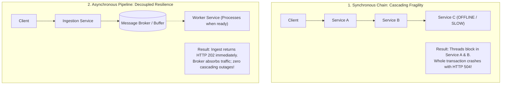
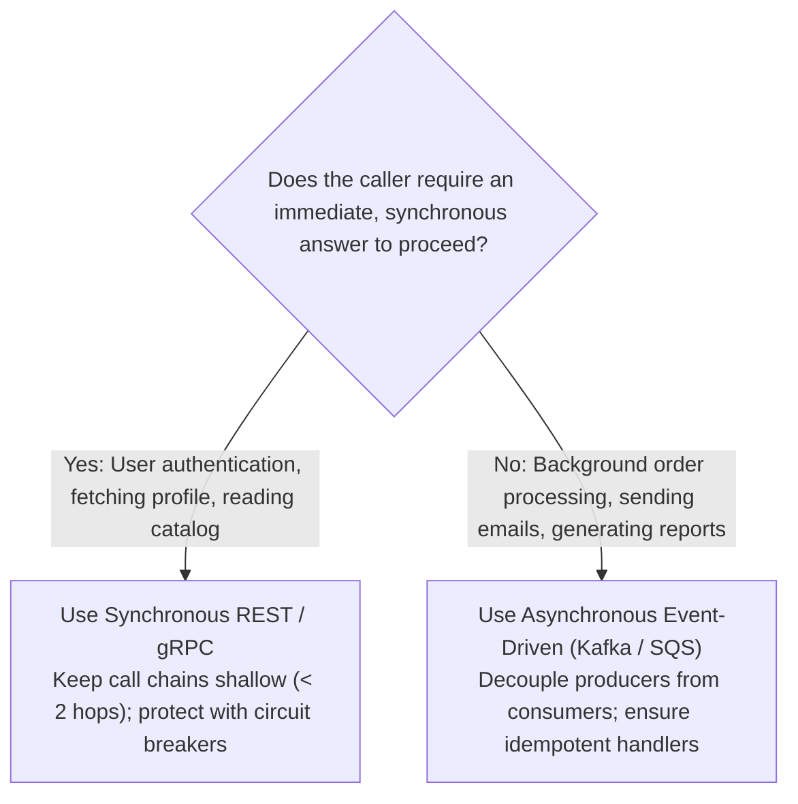

# Technology Comparison: Synchronous vs. Asynchronous Communication

## Executive Summary

Choosing between **Synchronous (Request-Response)** and **Asynchronous (Event-Driven / Message-Driven)** communication is one of the most consequential decisions in distributed systems. Synchronous communication ties the client and server together in **temporal lockstep**, whereas asynchronous communication decouples them in time and space through intermediate buffers, queues, or event logs.

---

## Detailed Comparative Matrix

| Evaluation Dimension | Synchronous Communication (REST / gRPC) | Asynchronous Communication (Kafka / RabbitMQ) |
|:---|:---|:---|
| **Execution Model** | Caller blocks or yields thread waiting for callee to finish | Fire-and-forget; producer returns immediately after queuing |
| **Temporal Coupling** | **Tightly Coupled**: Both services must be online simultaneously | **Decoupled**: Consumer can be offline; processes messages later |
| **Failure Blast Radius** | High: Cascading thread exhaustion and timeouts | Low: Messages buffer safely on broker disk |
| **Consistency Feedback** | Immediate feedback (Success / Failure returned in response) | Eventual feedback (Requires polling, webhooks, or websockets) |
| **Throughput & Load Leveling**| Poor: Surges slam backend services directly | Exceptional: Broker absorbs traffic surges and flattens load |
| **Debugging & Traceability** | High: Linear call stack; straightforward request/response | Complex: Requires correlation IDs, distributed tracing, DLQs |
| **Operational Infrastructure** | Simple: Standard load balancers and reverse proxies | Complex: Requires managing messaging clusters (Kafka, SQS, AMQP)|
| **Ideal Architectural Fit** | User login, interactive queries, immediate validations | Order processing, payment workflows, notifications, analytics |

---

## Failure Propagation Comparison

---

## The Latency Accumulation Trap

In synchronous microservice architectures, total latency is the **sum of all sequential network hops and internal processing times**:

$$\text{Total Latency}_{\text{Sync}} = \sum_{i=1}^{k} \left( \text{Network Hop}_i + \text{Processing Time}_i \right)$$

If a single user request traverses 6 internal synchronous microservices with an average latency of 40ms each:
$$\text{Total User Latency} = 6 \times 40\text{ms} = \mathbf{240\text{ms}}$$
If any single downstream dependency experiences a 2-second GC pause or database lock, the entire customer request stalls.

In asynchronous pipelines, the user experiences only the latency of the first ingestion hop:
$$\text{Total Ingress Latency}_{\text{Async}} = \text{Network Hop}_1 + \text{Queue Append Time} \approx \mathbf{15\text{ms}}$$

---

## Architectural Decision Framework

