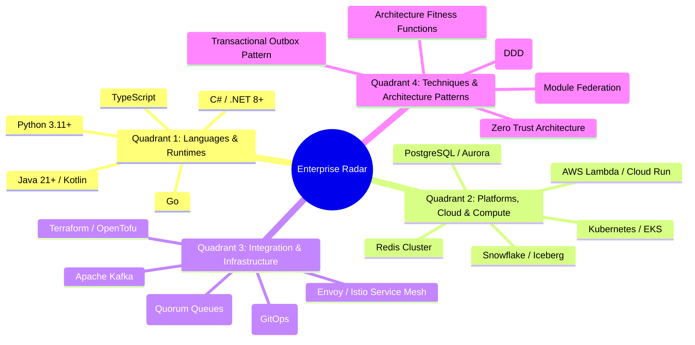

# Technology Radar Governance & Radar Framework

## 1. Architectural Overview & Context
The **Enterprise Technology Radar** is a living architecture governance instrument that tracks technologies, frameworks, runtimes, and engineering techniques across their adoption lifecycle within an enterprise.

The objective of the Technology Radar is not to stifle engineering creativity, but to:
1. **Prevent Architectural Fragmentation**: Stop squads from introducing 15 different unvetted logging libraries or 6 competing messaging brokers.
2. **Accelerate Decision Making**: Provide clear, pre-approved default technology selections for new production systems.
3. **Govern Technical Debt & Deprecation**: Explicitly signal when aging legacy technologies enter mandatory sunset phases.

```
┌─────────────────────────────────────────────────────────────────────────────┐
│                       THE 4 TECHNOLOGY RADAR RINGS                          │
├─────────────────────┬───────────────────────────────────────────────────────┤
│ ADOPT               │ Strong enterprise consensus. Production-proven at     │
│                     │ scale. Default choice for all new production systems. │
├─────────────────────┼───────────────────────────────────────────────────────┤
│ TRIAL               │ Validated in low-risk production pilots. Promising    │
│                     │ ROI and developer ergonomics. Cleared for pilot squads│
├─────────────────────┼───────────────────────────────────────────────────────┤
│ ASSESS              │ Under active technical investigation via spikes in    │
│                     │ 99-experiments/. NOT approved for production systems. │
├─────────────────────┼───────────────────────────────────────────────────────┤
│ HOLD                │ Prohibited for new workloads. Active migration and    │
│                     │ retirement roadmap required for existing footprints.  │
└─────────────────────┴───────────────────────────────────────────────────────┘
```

---

## 2. Radar Quadrants Taxonomy

Technologies are categorized across four discrete architectural quadrants:



---

## 3. Technology Transition Lifecycle & Governance Cadence

A technology does not move between rings based on individual opinion; it follows a rigorous lifecycle governed by the **Architecture Review Board (ARB)**:

```mermaid
flowchart LR
    Idea[New Technology Proposal] --> Spike[Architectural Spike in 99-experiments/]
    Spike --> Assess[Ring: ASSESS]
    Assess -->|Evidence of Value & Security Review| Trial[Ring: TRIAL (Pilot Squads)]
    Trial -->|Production Stability Proven at Scale| Adopt[Ring: ADOPT (Enterprise Standard)]
    Adopt -->|Technology Decline / Better Alternative| Hold[Ring: HOLD (Retirement Mandate)]
```

### Review Cadence:
* **Quarterly ARB Review**: The Architecture Review Board reviews active blips every 90 days.
* **Blip Movement Justification**: Any proposal to transition a blip must be backed by an **Architecture Decision Record (ADR)** citing production telemetry, security evaluation, and FinOps unit economics.

---

## 4. Current Enterprise Radar Blips
* Detailed evaluations, rationale, and status for individual technologies are published in:
  * **[`radar-blips.md`](radar-blips.md)** — Exhaustive technology matrix across all 4 quadrants.
  * **[`../../TECHNOLOGY-RADAR.md`](../../TECHNOLOGY-RADAR.md)** — Executive overview and root visualization.

---

## 5. Technology Radar Architectural Checklist
- [ ] Consult the Technology Radar before selecting libraries, frameworks, or databases for new services.
- [ ] Default to **ADOPT** technologies; obtain formal ARB approval before using **TRIAL** technologies in production.
- [ ] Strictly reject any new project proposal utilizing technologies in the **HOLD** ring.
- [ ] Conduct architectural spikes in `99-experiments/` before nominating a technology for the **ASSESS** ring.
- [ ] Review active radar blips quarterly with engineering leadership.

---

## 6. Related Modules
* [22-reference/technology-radar/radar-blips.md](radar-blips.md) — Detailed technology evaluations and blip notes.
* [01-architecture/architecture-governance/](../../01-architecture/architecture-governance/README.md) — Architecture Review Board operating model.
* [16-architecture-deliverables/](../../16-architecture-deliverables/) — Architecture Decision Records (ADRs).
