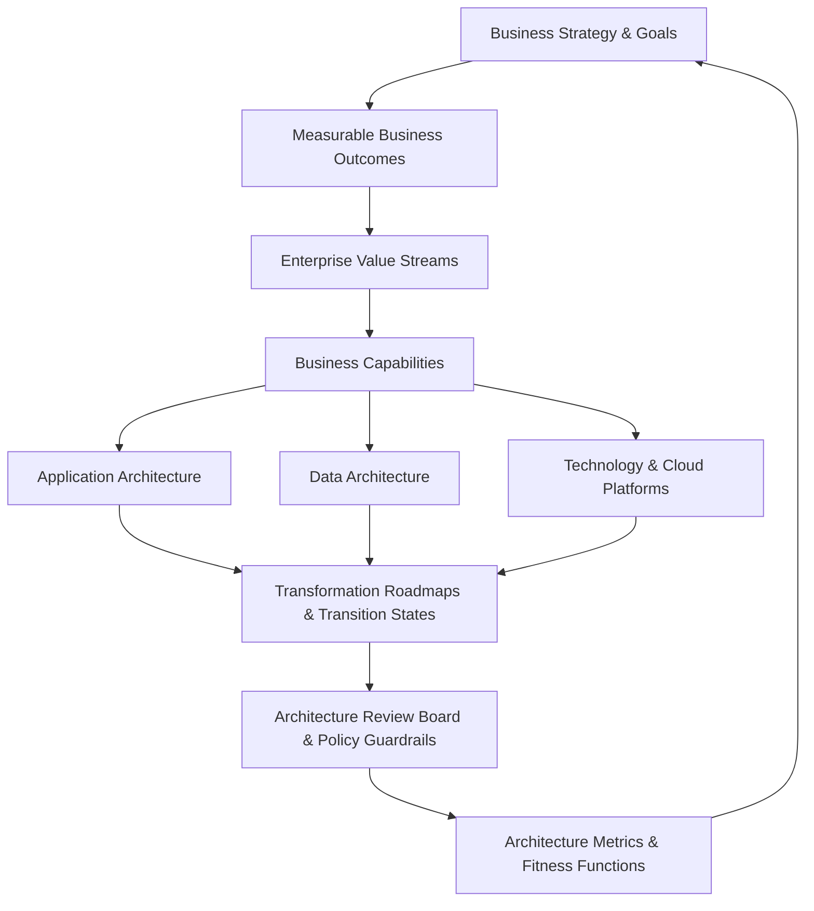

# 09. Enterprise Architecture

Enterprise Architecture (EA) is the strategic discipline that aligns business strategy, organizational operating models, and technology capabilities into a coherent, evolving enterprise transformation roadmap.

This domain establishes the **Enterprise Architecture Operating System** for Senior Solution Architects, Enterprise Architects, Technical Architects, Principal Architects, and Chief Architects operating across Global 2000, Fortune 500, and highly regulated environments.

---

## 1. The Core Enterprise Architecture Mental Model

Enterprise Architecture bridges business strategy and execution through a continuous, closed-loop value chain:



### The Bidirectional Value Flow
* **Top-Down (Strategic Alignment)**: `Strategy -> Capabilities -> Applications & Platforms -> Execution`
* **Bottom-Up (Technology Enablement)**: `Technology Innovation -> Operational Acceleration -> Enhanced Business Capabilities -> New Revenue / Market Differentiation`

---

## 2. Directory Structure & Domain Architecture

```text
23-enterprise-architecture/
├── README.md
├── foundations/               # EA definitions, boundaries, scaling, and mental models
├── roles/                     # Role profiles, career ladders, RACI, Chief Architect charter
├── operating-model/           # Business/IT alignment, product vs platform, operating cadences
├── leadership/                # Executive communication, C-suite storytelling, negotiation
├── knowledge-management/      # Git-based EA repository, catalogs, ADR integration
├── business-architecture/     # Business models, capability modeling, industry domain maps
├── capability-architecture/   # Capability decomposition, heatmaps, rationalization templates
├── value-streams/             # Value stream mapping, customer journeys, gap detection
├── application-architecture/  # Enterprise landscape, 7R rationalization, dependency modeling
├── application-portfolio/     # TIME matrix, application scorecards, health vs value
├── data-architecture/         # Enterprise data domains, MDM, governance at scale
├── integration-architecture/  # API/event governance, B2B, legacy wrappers
├── technology-architecture/   # Enterprise runtime platforms, paved roads, standard baselines
├── technology-portfolio/      # Technology lifecycle (Strategic -> Retire), debt elimination
├── cloud-architecture/        # Landing zones, FinOps governance, hybrid/multi-cloud trade-offs
├── security-architecture/     # Enterprise Zero Trust, risk acceptance, compliance guardrails
├── ai-architecture/           # Enterprise AI strategy, capability maps, model governance
├── principles/                # 20 Enterprise Architecture principles with strict 7-part format
├── governance/                # Architecture governance framework, decision authority, life-cycle
├── architecture-review-board/ # ARB charter, agenda, review criteria, compliance audit
├── architecture-exceptions/   # Exception lifecycle, compensating controls, risk acceptance
├── technology-strategy/       # Standardization vs diversification, build vs buy, OSS governance
├── vendor-strategy/           # Vendor evaluation, contract architecture, lock-in avoidance
├── financial-architecture/    # Total Cost of Ownership (TCO), unit economics, FinOps allocation
├── technical-debt/            # Enterprise technical, architectural, and organizational debt
├── enterprise-transformation/ # Transformation strategies, organizational change, simplification
├── architecture-roadmaps/     # Current, target, transition states, quantitative prioritization
├── gap-analysis/              # Multi-domain gap analysis framework and templates
├── transition-architecture/   # Architecture plateaus, risk containment, intermediate migrations
├── global-architecture/       # Multi-region, data residency, localization, central vs local
├── mergers-acquisitions/      # M&A due diligence, application overlap, platform consolidation
├── divestiture/               # System and data uncoupling, TSAs, entitlement separation
├── regulated-industries/      # 12 Industry architecture playbooks (Banking, Healthcare, Retail...)
├── frameworks/                # Pragmatic evaluation of TOGAF, Zachman, FEAF, Gartner EA
├── archimate/                 # Complete ArchiMate 3.2 layers, views, viewpoints, and examples
├── reference-models/          # 8 Reusable Enterprise Reference Models
├── reference-architectures/   # 20 Complete Enterprise Reference Blueprints
├── case-studies/              # 20 Real-world enterprise transformation post-mortems
├── decision-frameworks/       # 20 Enterprise decision scorecards with trade-off matrices
├── anti-patterns/             # 24 Fatal Enterprise Architecture anti-patterns
├── metrics/                   # Architecture KPI and measurement framework across 8 dimensions
├── fitness-functions/         # Automated enterprise architectural fitness functions
└── checklists/                # Master checklist and specialized architecture audit rubrics
```

---

## 3. Core Enterprise Architecture Tenets

1. **Architecture is a Transformation Discipline, Not Documentation**: Deliverables exist exclusively to accelerate sound decision-making, mitigate risk, and direct capital efficiently.
2. **Business Outcome Centricity**: Technology is never evaluated in a vacuum; every platform and architectural investment must trace directly to customer value, revenue generation, risk reduction, or efficiency.
3. **Transition States over Pure Target States**: While a 5-year target architecture provides directional clarity, business survival and capital constraints require architecting viable, low-risk intermediate transition plateaus.
4. **Governed Autonomy**: Replace rigid architectural ivory towers with automated fitness functions, pre-approved golden paths, and active Architecture Review Boards focusing exclusively on cross-cutting enterprise risks.

---

## 4. Cross-Phase Integration Nexus

Enterprise Architecture synthesizes all technical disciplines established across Phases 1–8:
* **[01-architecture](../01-architecture/README.md)** & **[02-system-design](../02-system-design/README.md)**: Architectural styles, distributed computing principles, scalability, and resilience.
* **[03-backend](../03-backend/README.md)**, **[04-frontend](../04-frontend/README.md)**, **[05-mobile](../05-mobile/README.md)**: Application engineering standards and runtime platforms.
* **[06-data](../06-data/README.md)** & **[07-integration](../07-integration/README.md)**: Data mesh, MDM, streaming pipelines, and API-led connectivity.
* **[08-cloud](../08-cloud/README.md)** & **[10-security](../10-security/README.md)**: Multi-region cloud foundations, landing zones, Zero Trust, and compliance.
* **[11-observability](../11-observability/README.md)**: OpenTelemetry telemetry and operational resilience.
* **[12-ai](../12-ai/README.md)**: Enterprise AI platforms, RAG, multi-agent workflows, and model governance.
* **[13-architecture-patterns](../13-architecture-patterns/README.md)** & **[15-modernization](../15-modernization/README.md)**: Composable systems, strangler-fig modernizations, and platform engineering.
