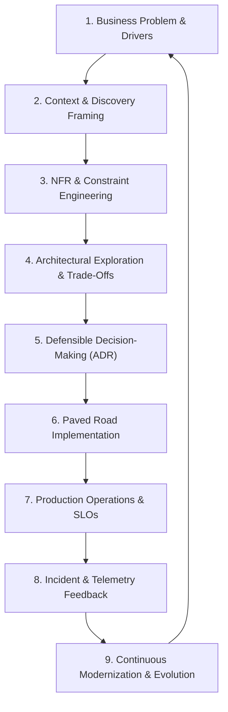

# 10. Architect Mastery: The Personal Architect Operating System

> **"An architect is paid for judgment, not diagrams."**

Welcome to **Phase 10 — Architect Mastery**, the capstone discipline of the `enterprise-architecture-handbook`.

While Phases 1–9 established authoritative domain specifications across computing foundations, software engineering, cloud infrastructure, security, distributed data, generative AI, and enterprise architecture, Phase 10 synthesizes these disciplines into the ability to **think, decide, communicate, lead, govern, and continuously evolve systems under real-world enterprise constraints**.

---

## 1. The Core Architect Mastery Mental Model



---

## 2. Directory Structure & Capstone Domains

```text
24-architect-mastery/
├── README.md
├── mindset/                    # Architecture as decision-making, constraints, and leadership
├── architecture-judgment/      # First principles, systems thinking, reversibility, known/unknowns
├── question-frameworks/        # High-impact interrogatives across business, scale, cost, and risk
├── discovery/                  # Stakeholder mapping, workshops, constraint & assumption registers
├── requirements/               # Transforming vague desires into measurable, testable NFR budgets
├── decision-making/            # 12-factor decision framework, one-way vs two-way doors
├── trade-offs/                 # Master library of 20 core architectural trade-offs
├── constraints/                # Architecting under real-world limits (budget, skills, legacy DB)
├── evolution/                  # Evolutionary architecture, runways, transition states, retirement
├── strategy/                   # Strategy hierarchy: Business -> Technology -> Architecture -> Roadmap
├── technology-strategy/        # Technology evaluation rubric, lifecycle tiers, OSS governance
├── platform-strategy/          # Platform thinking, IDPs, platform as product, golden paths
├── organizational-design/      # Conway's Law, Team Topologies, cognitive load, team boundaries
├── leadership/                 # Influence without authority, conflict resolution, mentoring
├── executive-communication/    # Communicating with Board, C-suite, and product stakeholders
├── architecture-storytelling/  # Problem-first storytelling, narrative arcs, before/after framing
├── governance/                 # Lightweight, risk-based, automated governance vs bureaucracy
├── architecture-review/        # Master review methodology across 7 architectural dimensions
├── risk/                       # Risk taxonomy, heatmaps, exposure calculations, contingencies
├── failure-analysis/           # Deep post-mortems of 20 classic architectural failure modes
├── war-stories/                # 15 realistic war stories training architectural judgment under pressure
├── incident-driven-architecture/# Incidents as architectural feedback, post-mortems, fitness functions
├── operations/                 # Production readiness, operational ownership, SLOs, runbooks
├── economics/                  # TCO, ROI, cost of delay, unit economics, cloud/AI economics
├── ai-architecture/            # Enterprise AI capstone: when to use AI, platforms vs bespoke
├── modernization/              # 8R Modernization framework, strangler execution, database decoupling
├── m-and-a/                    # M&A technical due diligence, overlap rationalization, divestitures
├── global-architecture/        # Multi-region core vs regional edge, data residency, localization
├── regulated-enterprise/       # Compliance and auditability across 8 major regulated verticals
├── portfolio-thinking/         # Thinking across System -> Product -> Domain -> Enterprise Portfolio
├── architecture-optionality/   # Preserving future choices, reversibility, exit strategies
├── simplification/             # Complexity scorecard, consolidation, de-cluttering architectures
├── obsolescence/               # Managing the technology aging lifecycle from adopt to retire
├── continuous-improvement/     # Architecture retrospectives, metrics, and closed feedback loops
├── knowledge-system/           # Operating the living architecture knowledge base in Git
├── experimentation/            # Hypothesis-driven PoCs, PoTs, spikes, failure tests, benchmarks
├── benchmarking/               # Workload-defined benchmarking across databases, queues, and models
├── system-design/              # Master end-to-end system design methodology
├── red-team/                   # Attacking your own architecture: 10x/100x scale, failure injection
├── pre-mortem/                 # "Assume the system failed 3 years from now. Why?" framework
├── post-mortem/                # Reviewing architectural decisions post-implementation
├── decision-review/            # ADR lifecycle: keep, modify, reverse, or retire
├── career/                     # Developer to Chief Architect career transition and portfolio
├── skill-matrix/               # 7-dimension competency matrix across 5 architectural roles
├── maturity-model/             # 6-level Architect Maturity Model (Specialist to Strategic)
├── cheat-sheets/               # Concise 1-page references across 17 architectural domains
├── reference-architectures/    # 20 Capstone Cross-Domain Reference Blueprints (ref-101..120)
├── case-studies/               # 20 Capstone Real-World Enterprise Case Studies (cs-101..120)
├── anti-patterns/              # Master catalog indexing cross-phase architectural anti-patterns
├── decision-journal/           # Lightweight architectural decision journaling system
├── learning-loop/              # The closed-loop architecture learning system
├── checklists/                 # Master Architect Checklist spanning all 10 phases
├── personal-operating-system.md# The Master Architect's personal operational rhythm
└── master-architecture-model.md# The final cross-phase enterprise architecture lifecycle map
```
