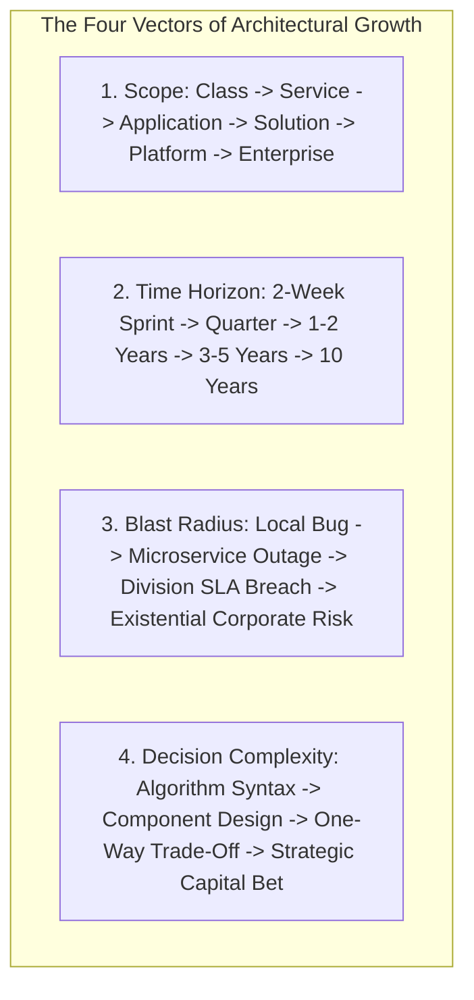

# Architect Career Paths, Growth & Role Transitions

> **"An architect is paid for judgment, foresight, and risk mitigation—not simply for drawing diagrams or collecting technologies."**

Welcome to the **Career & Role Transition Playbook** inside [`24-architect-mastery/`](../README.md). This module documents how a software engineer systematically develops the judgment, scope, business acumen, communication, and demonstrated evidence required to ascend the technical leadership ladder.

---

## 1. Master Career Map & Core Tracks

* **[Master Architect Career Map](./architect-career-map.md)** — Comprehensive navigation across Scope, Time Horizon, Blast Radius, and Decision Complexity.
* **[Architect Career Paths & Growth](./architect-career-paths-and-growth.md)** — Core tracks, executive presence, sphere of influence, and high-impact habits.

---

## 2. Role Transition Playbooks

Every transition represents a fundamental mindset shift, a 10x expansion in blast radius, and a new tier of expected architectural deliverables:

| Transition Guide | Primary Mindset Shift | Key Deliverable Required | Direct Link |
| :--- | :--- | :--- | :--- |
| **Engineer → Senior Engineer** | Task execution $\to$ Autonomous service ownership & operability | Low-Level Design (LLD), Post-Mortem | [Read Playbook](./engineer-to-senior-engineer.md) |
| **Senior Engineer → Lead Engineer** | Personal coding velocity $\to$ Team technical multiplier & design stewardship | High-Level Design (HLD), ADRs | [Read Playbook](./senior-engineer-to-lead-engineer.md) |
| **Lead Engineer → Solution Architect** | Implementation focus $\to$ End-to-end business problem decomposition & trade-offs | Solution Architecture Document (SAD), NFR Matrix | [Read Playbook](./lead-engineer-to-solution-architect.md) |
| **Solution Architect → Technical Architect** | Single solution focus $\to$ Platform reusability & enterprise ecosystem consistency | Platform Blueprint, Technology Radar | [Read Playbook](./solution-architect-to-technical-architect.md) |
| **Technical Architect → Enterprise Architect** | Technology platforms $\to$ Business capability mapping, APM, & capital allocation | Capability Map, TIME Scorecard, Roadmap | [Read Playbook](./technical-architect-to-enterprise-architect.md) |
| **Enterprise Architect → Principal Architect** | Corporate IT governance $\to$ Systemic organizational leverage & long-term tech strategy | 10-Year Tech Vision, Simplification Blueprint | [Read Playbook](./enterprise-architect-to-principal-architect.md) |

---

## 3. The 4 Essential Progression Vectors

---

## 4. Architectural Tooling & Evidence Integration

Throughout your career progression, ground all architectural proposals in the repository's native tooling and evidence standards:

* **ADR Generation**: Generate peer-reviewable decision records via `python 21-architecture-tools/generators/adr_generator.py`.
* **NFR Matrices**: Elicit measurable engineering budgets via `python 21-architecture-tools/generators/nfr_matrix_generator.py`.
* **Documentation Quality**: Lint all architecture artifacts via `python 21-architecture-tools/linters/doc_linter.py`.
* **Deliverable Templates**: Author standard packages using [`16-architecture-deliverables/`](../../16-architecture-deliverables/README.md).

---

## 5. Related Architecture Mastery Modules

* **[Architect Skill Matrix & Assessment](../skill-matrix/README.md)** — Multi-role competency evaluation grids across 16 architectural dimensions.
* **[Personal Operating System](../personal-operating-system.md)** — Weekly cadences, decision journals, and cognitive load management.
* **[Executive Communication](../executive-communication/README.md)** — Presenting trade-offs to the C-suite, Board, and non-technical stakeholders.
* **[Real-World War Stories](../war-stories/README.md)** — 15 realistic battle scenarios training judgment under pressure.
