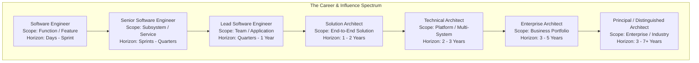
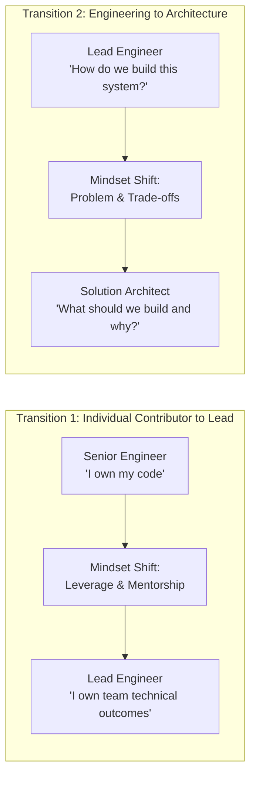

# Master Architect Career Map: From Software Engineer to Principal Architect

> **"Architects are not created by consuming more technology knowledge. They are developed through progressively broader responsibility, better decision-making, stronger systems thinking, practical architecture experience, leadership, communication, and demonstrated architectural judgment."**

---

## 1. The Architectural Sphere of Influence Progression

The journey from writing code to shaping multi-year enterprise technology strategy is defined by four expanding vectors:
1. **Scope of Impact**: From a single function or feature to the entire enterprise technology ecosystem.
2. **Time Horizon**: From a two-week sprint to a 3–7 year strategic investment horizon.
3. **Blast Radius of Mistakes**: From an isolated unit test failure to multi-million-dollar outages or business misalignments.
4. **Decision Reversibility**: From easily refactored two-way doors to high-friction, irreversible one-way architectural commitments.

---

## 2. Multi-Dimensional Role Progression Matrix

| Dimension | Software Engineer | Senior Engineer | Lead Engineer | Solution Architect | Technical Architect | Enterprise Architect | Principal Architect |
| :--- | :--- | :--- | :--- | :--- | :--- | :--- | :--- |
| **Primary Focus** | Code implementation & unit testing | Autonomous component delivery & quality | Team velocity, technical standards & HLD | End-to-end business problem solution | Cross-application platforms & ecosystem | Business capability alignment & portfolio | Long-term technical vision & org leverage |
| **Scope** | Function / Class / Module | Service / Subsystem | Multi-service Application | End-to-end Solution | Platform / Domain Ecosystem | Enterprise Portfolio | Entire Company / Industry |
| **Time Horizon** | Days to weeks | Weeks to months | Quarters | 1 to 2 years | 2 to 3 years | 3 to 5 years | 3 to 7+ years |
| **Blast Radius** | Local bug / PR reject | Microservice failure | Outage of single application | Cross-system data corruption / SLA breach | Platform-wide downtime / Tech debt trap | Strategic misalignment / Millions wasted | Existential corporate disadvantage |
| **Primary Deliverables** | Clean code, unit tests, PRs | Technical design docs, component LLDs | HLDs, sequence diagrams, ADRs | Solution Architecture Document (SAD), NFR matrix | Platform blueprints, standards, tech radars | Business capability maps, transformation roadmaps | Company-wide tech strategy, whitepapers |
| **Key Stakeholders** | Peers, Tech Lead | Tech Lead, Product Owner | Engineering Manager, Product Manager | Solution Sponsor, PM, Security, Ops | Domain Directors, Enterprise Architects, SecOps | VP of Engineering, CTO, CIO, BU Heads | CEO, Board, C-Suite, Industry Standards |
| **Decision Type** | Data structures & algorithms | Component patterns & DB schemas | Service boundaries & API contracts | Technology selection, trade-offs, NFRs | Platform foundations, cross-cutting concerns | Capital allocation, buy vs build, modernization | Strategic technology bets & company direction |

---

## 3. The Two Essential Transitions

### Transition 1: Individual Contributor $\to$ Technical Leader
* **The Trap**: Believing that being the best coder entitles one to technical leadership.
* **The Reality**: The Lead Engineer's metric is no longer personal throughput, but team delivery quality, mentorship, and dependency de-risking.

### Transition 2: Lead Engineer $\to$ Solution Architect
* **The Trap**: Treating architecture as "building a really big engineering project."
* **The Reality**: Moving from implementation details to **business problem framing**, non-functional requirement (NFR) elicitation, and explicit trade-off justification via Architecture Decision Records (ADRs).

---

## 4. Master Navigation to Role Transition Playbooks

Each stage of the journey is detailed in an authoritative, step-by-step transition playbook:

1. [`engineer-to-senior-engineer.md`](./engineer-to-senior-engineer.md) — Moving from directed task execution to autonomous service delivery and reliability.
2. [`senior-engineer-to-lead-engineer.md`](./senior-engineer-to-lead-engineer.md) — Expanding from individual ownership to team technical direction and design stewardship.
3. [`lead-engineer-to-solution-architect.md`](./lead-engineer-to-solution-architect.md) — The defining leap from code delivery to end-to-end solution design, NFR engineering, and ADR defense.
4. [`solution-architect-to-technical-architect.md`](./solution-architect-to-technical-architect.md) — Broadening from a single business solution to cross-application platforms, shared infrastructure, and enterprise ecosystems.
5. [`technical-architect-to-enterprise-architect.md`](./technical-architect-to-enterprise-architect.md) — Elevating from software systems to business capability mapping, IT portfolio strategy, and corporate governance.
6. [`enterprise-architect-to-principal-architect.md`](./enterprise-architect-to-principal-architect.md) — Reaching executive influence, organizational leverage, and shaping company-wide technology culture.

---

## 5. Core Architectural Thinking Axioms

Across all career tiers, master architects adhere to these 10 principles:

1. **Start with the Problem**: Never evaluate a technology before defining the business problem and constraints.
2. **NFRs are First-Class**: Functional requirements define what a system does; NFRs define whether it survives in production.
3. **Explicit Trade-offs**: Architecture is the art of trade-offs. If a design document does not state what is sacrificed, it is incomplete.
4. **Resist Hype Cycles**: Choose boring, battle-tested technology when viable. Novelty is an architectural liability.
5. **Design for Failure**: Assume every network link, disk, and third-party service will fail. Design recovery from Day 0.
6. **Reversibility**: Distinguish one-way doors (hard to undo) from two-way doors (easy to undo). Make reversible decisions quickly.
7. **Cost is Architecture**: In cloud environments, architecture decisions dictate operating expenditure. FinOps is an architectural competency.
8. **Communicate by Audience**: Developers need API contracts; engineering managers need delivery risk; executives need business value and ROI.
9. **Grounding in Reality**: Spend at least 10% of time reading production post-mortems, reviewing telemetry, or inspecting code.
10. **Evidence Trumps Theory**: A documented ADR validated by an empirical spike is infinitely more valuable than an ivory-tower diagram.
