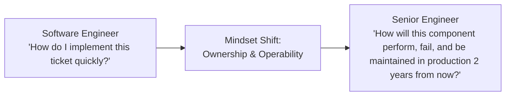

# Role Transition: Software Engineer → Senior Software Engineer

> **"The shift from executing assigned tasks to taking complete technical ownership of services, reliability, and edge cases."**

---

## 1. Current Role: Software Engineer
* **Execution Model**: Focuses on completing tickets, implementing defined features within an existing codebase, and writing unit tests.
* **Sphere of Influence**: Individual pull requests, classes, functions, and isolated bug fixes.
* **Supervision Level**: Requires architectural oversight, guidance on edge cases, and design validation from senior peers.

## 2. Target Role: Senior Software Engineer
* **Execution Model**: Autonomously delivers complex features, owns service health in production, identifies unstated requirements, and mentors junior engineers.
* **Sphere of Influence**: Entire services, subsystems, operational pipelines, and component interfaces.
* **Supervision Level**: Operates autonomously; given a problem statement, identifies technical trade-offs and delivers end-to-end without hand-holding.

---

## 3. The Fundamental Mindset Shift



The transition to Senior is not about typing faster or knowing obscure language syntax. It is the realization that **writing code is only 20% of engineering; operating, debugging, securing, and maintaining it under load is the remaining 80%**.

---

## 4. Scope Expansion

```text
From: Single class, isolated API endpoint, or assigned UI component.
To:   End-to-end service lifecycle: database schema, connection pooling, caching, error budgets, CI/CD pipelines, and on-call triage.
```

---

## 5. Responsibility Expansion

1. **Autonomous Execution**: Given an ambiguous technical requirement, decompose it into robust components without requiring continuous direction.
2. **Defensive Engineering**: Anticipate network timeouts, null values, concurrency race conditions, and poison pill messages before they reach production.
3. **Operational Ownership**: Participate actively in on-call rotations, author monitoring dashboards, and perform blameless incident post-mortems.
4. **Peer Acceleration**: Elevate team standards through thorough code reviews, architectural documentation, and active mentorship of juniors.

---

## 6. Technical Capability Requirements

* **Language Runtime Internals**: Deep understanding of garbage collection, memory allocation, thread pooling, and event loops (e.g., V8, JVM, .NET CLR).
* **Database Competency**: Query optimization, index design (B-Tree vs Hash), transaction isolation levels (ACID), and lock contention.
* **Distributed Primitives**: Idempotency, retries with exponential backoff and jitter, circuit breaking, and structured logging.
* **Security Baselines**: OWASP Top 10 mitigation, SQL injection prevention, input sanitization, and secrets management.

---

## 7. Architecture Capability Requirements

* **Component Design**: Applying SOLID principles, Clean Architecture, or Hexagonal (Ports & Adapters) boundaries to keep modules decoupled.
* **API Contract Design**: Designing backward-compatible REST, gRPC, or GraphQL APIs; handling versioning and deprecation.
* **Data Flow Modeling**: Tracing data paths through caches, queues, and databases to spot latency bottlenecks.
* **Non-Functional Requirements (NFRs)**: Translating business needs into p95/p99 latency budgets, throughput thresholds, and storage sizing.

---

## 8. Business Capability Requirements

* **Cost Awareness**: Understanding the cloud bill impact of memory leaks, unindexed queries, and excessive logging.
* **Pragmatic Delivery**: Knowing when to push for technical perfection vs when to ship an MVP to validate user demand.
* **Requirement Interrogation**: Asking *why* a feature is needed to avoid building unnecessary software.

---

## 9. Leadership & Influence Requirements

* **Code Review Leadership**: Using pull request reviews to teach architectural principles rather than just policing formatting.
* **Leading by Example**: Writing exemplary unit/integration tests and clear documentation.
* **Constructive Disagreement**: Defending engineering best practices with data and benchmarks rather than emotional opinions.

---

## 10. Communication Requirements

* **Technical Design Documents**: Authoring concise 2-4 page design memos explaining component changes before coding.
* **Cross-Functional Empathy**: Explaining technical constraints to Product Managers in clear, non-jargon language.
* **Clear Incident Communication**: Summarizing production outages clearly during active triage.

---

## 11. Required Deliverables
* **Low-Level Design (LLD)**: Documenting module interfaces, class diagrams, and sequence diagrams ([LLD Template](../../16-architecture-deliverables/LLD-TEMPLATE.md)).
* **Database Schema Migrations**: Backward-compatible migration scripts and index strategies.
* **Service Runbook**: Production troubleshooting instructions, alerting thresholds, and dependency maps.

---

## 12. Required Practical Experiences

1. **Production On-Call Rotation**: Diagnosing and resolving at least 3 live outages under pressure.
2. **Performance Optimization**: Profile a slow service, identify the CPU/memory/database bottleneck, and measurably cut p99 latency by >30%.
3. **Refactoring a Legacy Component**: Safely decomposing an entangled module without introducing regressions.

---

## 13. Architecture Decisions to Practice
* Choosing between synchronous REST and asynchronous message queuing for an internal workflow.
* Deciding between an in-memory cache (Redis) vs an in-process cache (Guava/Caffeine).
* Selecting an indexing strategy (compound vs partial index) for a high-write relational table.

---

## 14. Evidence of Readiness (The Portfolio)

To demonstrate readiness for promotion to Senior Engineer, compile:
- [ ] 2+ High-quality Technical Design Documents (LLD) delivered and reviewed by team leads.
- [ ] 1 Documented Production Incident Post-Mortem where you led root cause analysis.
- [ ] Documented evidence of mentoring at least 1 junior engineer to successful delivery.
- [ ] Measurable optimization results (e.g., query tuning, throughput increase) verified by metrics.

---

## 15. Common Gaps & Blind Spots
* **Clever Over Clean**: Writing esoteric, overly clever code that peers struggle to maintain.
* **Siloed Execution**: Building in isolation without validating that upstream/downstream services match assumptions.
* **Ignoring Operational Observability**: Shipping features without logs, metrics, or alerts, discovering bugs only when users complain.

---

## 16. Common Failure Modes
* **The "Not My Problem" Trap**: Blaming infrastructure, QA, or DevOps instead of taking end-to-end responsibility.
* **Gold-Plating**: Spending weeks over-engineering a feature that could be validated in two days.

---

## 17. 90-Day Development Focus

* **Days 1–30: Deepen Observability & Operations**: Audit your team's top 3 services. Build a Grafana/OpenTelemetry dashboard tracking p99 latency, error rates, and saturation.
* **Days 31–60: Lead a Significant Feature Design**: Author an LLD for an upcoming epic using [`16-architecture-deliverables/LLD-TEMPLATE.md`](../../16-architecture-deliverables/LLD-TEMPLATE.md). Gather feedback from your Tech Lead.
* **Days 61–90: Performance & Mentorship**: Identify a performance bottleneck or flaky test suite. Fix it, document the learnings, and run a lunch-and-learn for your team.

---

## 18. Readiness Checklist

- [ ] Can you design, build, and deploy a distributed service independently?
- [ ] Do you routinely anticipate edge cases and failure modes during design?
- [ ] Are your code reviews valued for teaching architecture and engineering hygiene?
- [ ] Have you successfully resolved a production incident and prevented recurrence?

---

## 19. Related Repository Domains
* Distributed Foundations: [`00-foundations/`](../../00-foundations/)
* Backend Runtimes: [`03-backend/`](../../03-backend/README.md)
* Database Internals: [`06-data/`](../../06-data/README.md)
* Observability & SRE: [`11-observability/`](../../11-observability/README.md)
