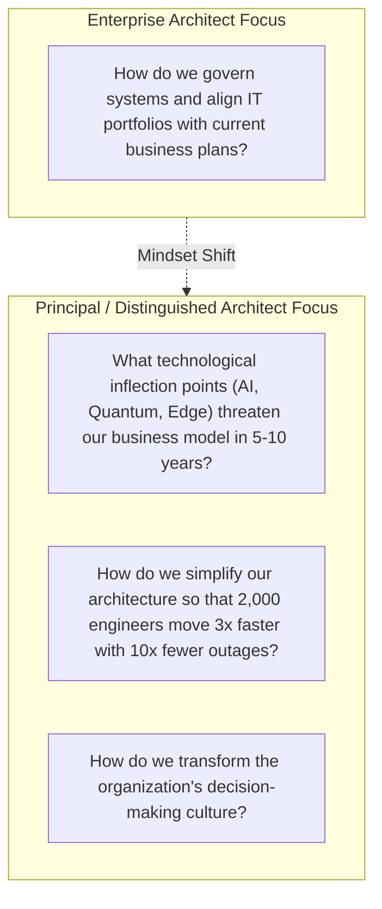

# Role Transition: Enterprise Architect → Principal / Distinguished Architect

> **"The capstone evolution from governing enterprise IT portfolios to exerting organization-wide technical leverage, shaping multi-year technological bets, advising the C-suite and Board, and cultivating a high-performance engineering culture."**

---

## 1. Current Role: Enterprise Architect (EA)
* **Execution Model**: Maps business strategy to technology portfolios, presides over Architecture Review Boards, manages application lifecycles, and rationalizes IT spend.
* **Sphere of Influence**: Business unit heads, CIO, portfolio managers, corporate governance bodies, and vendor ecosystems.
* **Primary Focus**: Business capability alignment, portfolio health, compliance, and multi-year transformation roadmaps.

## 2. Target Role: Principal / Distinguished Architect / Chief Architect
* **Execution Model**: The technical conscience and strategic visionary of the corporation. Advises the CEO, CTO, and Board on transformative technological inflection points, builds organizational learning systems, and shapes the company's technical destiny.
* **Sphere of Influence**: The entire global enterprise, Board of Directors, executive leadership, external developer communities, and industry standard bodies.
* **Primary Focus**: Existential technology strategy, radical architectural simplification, cultivating elite technical talent, and creating asymmetric business advantage through engineering.

---

## 3. The Fundamental Mindset Shift



A Principal or Distinguished Architect does not measure impact by how many governance meetings they chair. **Their leverage is systemic.** They know that imposing more rules rarely creates better architecture. Instead, they design the **incentives, paved roads, and cultural mechanisms** that allow thousands of engineers to make great architecture decisions autonomously.

---

## 4. Scope Expansion

```text
From: Corporate IT governance, portfolio rationalization matrices, and enterprise roadmaps.
To:   Company-Wide Technology Strategy, Radical Architectural Simplification, Executive Counsel to the Board/CEO, Engineering Talent Bar, and Industry Technical Eminence.
```

---

## 5. Responsibility Expansion

1. **Strategic Technology Horizon Scanning**: Identify paradigm shifts (e.g., LLMs, Autonomous Agents, Zero-Trust Cryptography) 3–5 years before they become mainstream; conduct high-risk spikes to evaluate existential threats or opportunities.
2. **Radical Architectural Simplification**: Counter the natural tendency of enterprises to accumulate catastrophic architectural complexity; champion aggressive consolidation and subtraction of systems.
3. **Executive Counsel to C-Suite & Board**: Serve as the trusted technical advisor to the CEO, CTO, and Board of Directors, providing unbiased, vendor-neutral assessments of high-stakes investments and M&A.
4. **Elevating the Organizational Talent Bar**: Mentor the next generation of Fellows, Principal Engineers, and Chief Architects; sponsor underrepresented technical talent.
5. **Architectural Culture & Blameless Learning**: Transform the corporate culture into a self-correcting engineering organization that treats production outages as valuable empirical learning.

---

## 6. Technical Capability Requirements

* **First-Principles Mastery Across the Stack**: The ability to debate kernel memory caching, optical network latencies, distributed consensus protocols, and LLM inference quantization with world-class specialists.
* **Radical Simplification Patterns**: Architecture de-cluttering, zero-dependency platforms, monolithic consolidation where microservices failed, and eliminating redundant abstraction layers.
* **Next-Generation Runtimes & Infrastructure**: Deep evaluation of emerging distributed runtimes (WebAssembly, GPU clusters, hardware accelerators, edge networks).
* **AI & Autonomous Systems Topology**: Architecting enterprise-scale foundational model training, fine-tuning, retrieval pipelines, and autonomous agent swarms.

---

## 7. Architecture Capability Requirements

* **Master Architecture Metamodeling**: Designing the company's personal architecture operating system ([24-architect-mastery](../README.md)).
* **Multi-Decade Architecture Evolution**: Designing platforms with explicit decay horizons, transition paths, and non-disruptive generational shifts.
* **Anti-Fragile System Architecture**: Architecting systems that do not merely survive chaos, but actually improve performance and reliability under stress.

---

## 8. Business & Financial Capability Requirements

* **Venture & M&A Strategy**: Evaluating technical acquisitions ($100M–$1B+ scale) for strategic intellectual property, platform synergy, and technical integration liabilities.
* **Macroeconomic Engineering Strategy**: Understanding how interest rates, energy costs, and global semiconductor supply chains influence infrastructure choices (Cloud vs Colocation vs Custom Silicon).
* **Corporate Valuation Drivers**: Understanding how technical agility, IP defensibility, and reliability metrics directly impact corporate stock valuation and credit ratings.

---

## 9. Leadership & Influence Requirements

* **Extreme Influence Without Authority**: Inspiring and aligning thousands of autonomous engineers without ever issuing a managerial command.
* **Executive Gravitas**: The poise and intellectual rigor to tell the CEO or Board: *"This $50M project is based on flawed technical assumptions and must be cancelled immediately."*
* **Intellectual Humility**: The willingness to publicly acknowledge when one's own prior architecture recommendations have reached obsolescence and must be replaced.

---

## 10. Communication Requirements

* **The Visionary Whitepaper**: Authoring profound, compelling technical whitepapers that set the engineering direction of the corporation for the next decade.
* **Public Keynotes & Industry Influence**: Representing the company at major international technical summits, open-source foundations, and regulatory advisory panels.
* **Socratic Mentoring**: Asking the single probing question that forces a team to uncover a fatal architectural flaw on their own.

---

## 11. Required Deliverables
* **Ten-Year Technology Vision & Tenets**: Foundational whitepaper establishing the company's engineering philosophy and immutable tenets.
* **Radical Simplification Blueprint**: Strategic plan eliminating 50% of unnecessary architectural tiers, middleware, and vendor dependencies across the enterprise.
* **M&A Technical Valuation Memos**: Authoritative due diligence reports assessing multi-million-dollar technology acquisitions.
* **Corporate Engineering Playbook**: Master architectural principles, decision frameworks, and operating guides ([Architect Mastery](../README.md)).

---

## 12. Required Practical Experiences

1. **Avert an Existential Corporate Outage / Crisis**: Step in during an unprecedented platform meltdown or cyber breach to re-architect the fundamental system topology under intense pressure.
2. **Lead a Generational Architecture Shift**: Successfully guide an enterprise of 1,000+ engineers from an obsolete architectural paradigm to a modern foundation over a multi-year effort.
3. **Establish an Industry Standard or Open Source Platform**: Author an open-source project, standard protocol, or patented architecture that influences the broader engineering industry.

---

## 13. Architecture Decisions to Practice
* **Cloud Repatriation vs Hyper-Cloud All-In**: Evaluating whether an enterprise spending $100M/year on AWS should repatriate core workloads to owned data centers or custom silicon.
* **Betting the Company on a New Technology Paradigm**: Deciding whether to pivot the core product architecture to generative AI agents, risking short-term cash flow for long-term survival.
* **De-Escalating Catastrophic Microservice Sprawl**: Deciding to aggressively merge 400 microservices back into 3 modular monoliths to restore developer productivity and reliability.

---

## 14. Evidence of Readiness (The Evidence Portfolio)

- [ ] Authorship of an organization-wide Technical Strategy that directly resulted in competitive business advantage or tens of millions in savings.
- [ ] Proven track record of mentoring at least 3 engineers who subsequently achieved Principal or Chief Architect titles.
- [ ] Documented leadership during a major corporate crisis or transformative M&A integration that was praised by the Board/CEO.
- [ ] Recognized technical authority across the global industry (patents, major keynote presentations, open-source leadership, standard specifications).

---

## 15. Common Gaps & Blind Spots
* **Ivory Tower Disconnection**: Retreating entirely into conceptual whitepapers while losing the ability to understand the day-to-day pain of line engineers.
* **Becoming a Technology Zealot**: Attaching one's identity to a specific technology pattern or language and defending it long after the industry has moved on.
* **Failing to Create Successors**: Becoming an indispensable single point of failure whose departure would plunge the organization into technical paralysis.

---

## 16. Common Failure Modes
* **The Cynical Oracle**: Identifying everything that is wrong with every proposal without offering actionable, pragmatic paths forward.
* **Losing Patience with Enterprise Realities**: Frustration with organizational inertia leading to disengagement rather than strategic cultural transformation.

---

## 17. 90-Day Development Focus

* **Days 1–30: Enterprise Complexity Audit**:
  - Map the entire corporate technology landscape. Identify the top 3 sources of artificial architectural complexity that slow down developers.
* **Days 31–60: Author a Simplification Whitepaper**:
  - Draft a bold, visionary whitepaper proposing the elimination of redundant middleware, libraries, or service layers. Circulate among senior leadership.
* **Days 61–90: Executive Briefing & Sponsoring Talent**:
  - Brief the CTO and engineering VPs on the strategic technology vision for the next 5 years.
  - Launch a formal mentoring cohort for 5 promising Staff/Lead Architects.

---

## 18. Readiness Checklist

- [ ] Does the C-suite consult you before making major strategic business bets or acquisitions?
- [ ] Do senior architects across the entire enterprise seek your counsel on their most intractable challenges?
- [ ] Have you demonstrated the ability to radically simplify systems rather than just adding more layers?
- [ ] Is your primary joy seeing other engineers and architects grow into leaders?

---

## 19. Related Repository Domains
* Architect Mastery Capstone: [`24-architect-mastery/`](../README.md)
* Strategic Enterprise Architecture: [`23-enterprise-architecture/`](../../23-enterprise-architecture/README.md)
* Executive Storytelling: [`24-architect-mastery/architecture-storytelling/`](../architecture-storytelling/README.md)
* Architectural Economics: [`24-architect-mastery/economics/`](../economics/README.md)
* Real-World War Stories: [`24-architect-mastery/war-stories/`](../war-stories/README.md)
