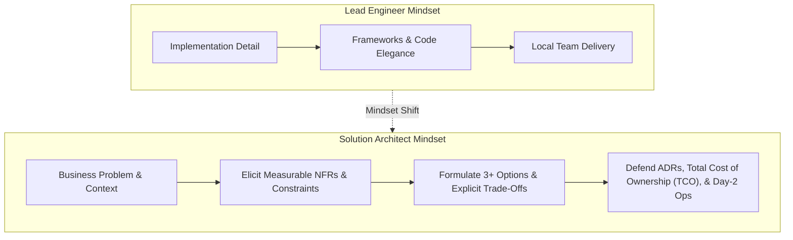

# Role Transition: Lead Engineer → Solution Architect (SA)

> **"The defining leap from 'How do we build this system?' to 'What is the business problem, which constraints govern it, and which trade-offs must we make across the entire solution?'"**

---

## 1. Current Role: Lead Software Engineer
* **Execution Model**: Leads an engineering squad in building a specific application or service subsystem. Deeply technical, hands-on, and focused on delivery.
* **Sphere of Influence**: Single application, team boundaries, immediate API contracts, and team velocity.
* **Core Question Asked**: *"How do we write the cleanest, most performant code to satisfy these requirements?"*

## 2. Target Role: Solution Architect (SA)
* **Execution Model**: Designs end-to-end technical solutions to complex business problems across multiple systems, teams, and platforms. Balances functional requirements against stringent NFRs, budgets, and operational realities.
* **Sphere of Influence**: End-to-end solution boundary (spanning multiple backend services, frontend portals, third-party SaaS, databases, and cloud infrastructure).
* **Core Question Asked**: *"What are the business constraints, what are the competing architectural options, what are the explicit trade-offs, and what will this cost to operate over 5 years?"*

---

## 3. The Fundamental Mindset Shift



A Solution Architect no longer measures success by personal commits or whiteboard aesthetics. **An architect is paid for judgment, foresight, and risk mitigation.** Knowing 50 different AWS services is irrelevant if you cannot explain why Option A is superior to Option B under the business's specific budget, regulatory, and latency constraints.

---

## 4. Scope Expansion

```text
From: Single application, internal classes, database tables, and sprint deliverables.
To:   End-to-end business capability: identity federation, data flow, synchronous vs asynchronous boundaries, third-party ERP/CRM integration, disaster recovery, regulatory compliance, and FinOps costs.
```

---

## 5. Responsibility Expansion

1. **Business Problem Framing**: Interrogate stakeholder requests to uncover actual business drivers; challenge assumptions before committing technical resources.
2. **NFR Elicitation & Budgets**: Turn vague desires (*"the system must be fast and scalable"*) into hard engineering budgets (*"p99 latency < 250ms at 15,000 QPS, 99.95% availability, RTO < 15 min, RPO < 1 min"*).
3. **Multi-Option Trade-off Evaluation**: Generate at least 3 distinct architectural options (including a simple/boring baseline) and rigorously score them using [`DECISION-MAKING-FRAMEWORK.md`](../../DECISION-MAKING-FRAMEWORK.md).
4. **Architecture Governance & ARB Defense**: Present and defend Solution Architecture Documents (SAD) before the Architecture Review Board (ARB).
5. **Cross-Pillar Harmonization**: Unify Security, Cloud, Data, DevOps, and Observability into a cohesive, operable blueprint.

---

## 6. Technical Capability Requirements

* **Distributed Systems Topologies**: CAP/PACELC trade-offs, multi-region replication models, split-brain mitigation, and distributed locking.
* **Enterprise Integration Styles**: Synchronous APIs (REST, gRPC), Asynchronous Streams (Kafka, Kinesis), Enterprise Service Buses, and iPaaS patterns.
* **Security & Identity Architecture**: OAuth2/OIDC token flows, mTLS service meshes, RBAC/ABAC models, and Zero-Trust network perimeters.
* **Polyglot Persistence**: Selecting Relational, Document, Key-Value, Columnar, or Graph stores based on write-amplification, read-latency, and query patterns.

---

## 7. Architecture Capability Requirements

* **Solution Architecture Document (SAD)**: Authoring comprehensive enterprise solution blueprints ([SAD Template](../../16-architecture-deliverables/SOLUTION-ARCHITECTURE-TEMPLATE.md)).
* **C4 Architecture Modeling**: Producing unambiguous C4 Context, Container, and Component diagrams ([C4 Standards](../../17-diagrams/README.md)).
* **NFR Matrix Engineering**: Generating formal NFR matrices using `python 21-architecture-tools/generators/nfr_matrix_generator.py`.
* **ADR Authoring**: Defending architectural decisions via `python 21-architecture-tools/generators/adr_generator.py`.

---

## 8. Business & Financial Capability Requirements

* **Total Cost of Ownership (TCO) Modeling**: Estimating cloud compute, storage, egress, software licensing, and operational maintenance costs over 3 years.
* **ROI & Unit Economics**: Calculating cost-per-transaction, cost-per-tenant, or payback periods for architectural modernization.
* **Vendor & SaaS Evaluation**: Conducting rigorous Build vs Buy vs Partner analyses using vendor evaluation scorecards.

---

## 9. Leadership & Influence Requirements

* **Boardroom to Engine Room**: Fluently translating business vision down to engineering teams, and technical risks up to non-technical executives.
* **Guiding Without Dictating**: Empowering engineering leads to make low-level design choices within the solution's guardrails (Paved Roads).
* **Consensus Building**: Aligning conflicting requirements between Security (who want total lockdown), Product (who want speed), and Finance (who want low cost).

---

## 10. Communication Requirements

* **The 1-Page Executive Memo**: Summarizing complex multi-million-dollar architectures into 1 page highlighting business value, risks, and investments.
* **Interactive Design Workshops**: Facilitating event storming, domain mapping, and architectural spike kickoffs.
* **Defending Decisions Under Pressure**: Responding calmly to tough challenges in the ARB with benchmark data and explicit trade-off analyses.

---

## 11. Required Deliverables
* **Solution Architecture Document (SAD)**: Complete end-to-end design package ([Template](../../16-architecture-deliverables/SOLUTION-ARCHITECTURE-TEMPLATE.md)).
* **Formal NFR Matrix**: Measurable SLAs, SLOs, and capacity projections ([NFR Matrix Guide](../../16-architecture-deliverables/15-nfr/README.md)).
* **Architecture Decision Records (ADRs)**: Documenting irreversible architectural commitments ([ADR Template](../../16-architecture-deliverables/ADR-TEMPLATE.md)).
* **STRIDE Threat Model**: Identifying trust boundaries and security controls ([Threat Model Template](../../21-architecture-tools/templates/threat-model-stride-template.md)).
* **Disaster Recovery Plan**: Documented RPO/RTO strategies and cross-region failover runbooks ([DR Template](../../21-architecture-tools/templates/disaster-recovery-runbook-template.md)).

---

## 12. Required Practical Experiences

1. **Lead an End-to-End Solution Across 3+ Systems**: Design an integrated solution linking user-facing frontend, core transactional backend, and external third-party services.
2. **Defend an Architecture at the ARB**: Successfully shepherd a high-impact solution through formal Architecture Review Board scrutiny.
3. **Execute a High-Scale Proof of Concept (Spike)**: Test a risky technical assumption (e.g., Kafka ingestion throughput under network jitter) in [`99-experiments/`](../../99-experiments/) to produce empirical backing for an ADR.

---

## 13. High-Stakes Architecture Decisions to Practice
* **Synchronous vs Asynchronous Checkout**: Evaluating the trade-off between instant consistency (REST/DB lock) vs high availability (Event-driven/Outbox).
* **Multi-Tenant SaaS Isolation**: Choosing between database-per-tenant (strict isolation, high cost) vs shared-schema row-level security (low cost, high blast radius).
* **Build vs Buy for Identity**: Deciding between rolling custom JWT auth vs integrating Okta/Auth0/Cognito.

---

## 14. Evidence of Readiness (The Evidence Portfolio)

- [ ] 1+ Full Solution Architecture Document (SAD) approved by Enterprise Architecture and implemented in production.
- [ ] 5+ Peer-reviewed ADRs demonstrating disciplined evaluation of competing alternatives and explicit trade-offs.
- [ ] 1 Complete NFR Matrix with validated operational metrics (telemetry showing system meets defined SLAs in production).
- [ ] 1 Completed Threat Model (STRIDE) vetted by Information Security.

---

## 15. Common Gaps & Blind Spots
* **The "Technology Collector" Fallback**: Pitching trendy technologies (e.g., microservices, vector DBs) without proving business necessity.
* **Ignoring Operational Costs**: Designing multi-region clusters that blow past cloud budgets by 400% due to cross-region data transfer fees.
* **Whiteboard Ivory Tower**: Producing diagrams that cannot actually be implemented by engineering teams within their given skills and timeline.

---

## 16. Common Failure Modes
* **The "Yes-Man" Architect**: Conceding to every unreasonable deadline from Product by quietly cutting corners on security, testing, and disaster recovery.
* **The Over-Documenter**: Authoring 90-page documents that are obsolete before the first sprint starts, rather than maintaining lightweight, living markdown artifacts.

---

## 17. 90-Day Development Focus

* **Days 1–30: Master NFRs and Decision Records**:
  - Run `python 21-architecture-tools/generators/nfr_matrix_generator.py` for your current product domain.
  - Author your first formal ADR using `python 21-architecture-tools/generators/adr_generator.py` to justify an upcoming architectural choice.
* **Days 31–60: Author an End-to-End SAD**:
  - Select a major cross-service initiative. Author a full SAD using [`16-architecture-deliverables/SOLUTION-ARCHITECTURE-TEMPLATE.md`](../../16-architecture-deliverables/SOLUTION-ARCHITECTURE-TEMPLATE.md).
  - Include C4 Context and Container diagrams and a financial TCO estimate.
* **Days 61–90: Shadow and Present at the ARB**:
  - Shadow 2 Architecture Review Board sessions.
  - Present your SAD to staff architects and incorporate their trade-off feedback.

---

## 18. Readiness Checklist

- [ ] Can you articulate the explicit business problem and financial impact of a technical proposal?
- [ ] Do you routinely formulate at least 3 distinct architectural options before choosing a solution?
- [ ] Do your designs explicitly document what is sacrificed (latency, consistency, cost, complexity)?
- [ ] Can you defend an architecture under rigorous questioning from Security, Operations, and Finance?

---

## 19. Related Repository Domains
* Master Operating Guide: [`HOW-TO-USE.md`](../../HOW-TO-USE.md)
* Architectural Principles: [`ARCHITECTURE-PRINCIPLES.md`](../../ARCHITECTURE-PRINCIPLES.md)
* Decision Framework: [`DECISION-MAKING-FRAMEWORK.md`](../../DECISION-MAKING-FRAMEWORK.md)
* Reference Architectures: [`18-reference-architectures/`](../../18-reference-architectures/README.md)
* Architecture Deliverables: [`16-architecture-deliverables/`](../../16-architecture-deliverables/README.md)
* Architecture Tools: [`21-architecture-tools/`](../../21-architecture-tools/README.md)
