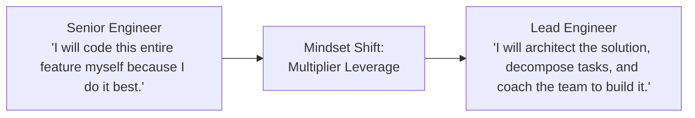

# Role Transition: Senior Software Engineer → Lead Software Engineer / Tech Lead

> **"The shift from 'I own my service' to 'I own technical outcomes, architecture alignment, and delivery excellence across my entire team.'"**

---

## 1. Current Role: Senior Software Engineer
* **Execution Model**: Top-tier individual contributor who autonomously designs, builds, and maintains complex microservices and backend pipelines.
* **Sphere of Influence**: Single service, subsystem, local codebase, and immediate squad peers.
* **Primary Metric**: Personal delivery velocity, technical precision, and operational stability of owned code.

## 2. Target Role: Lead Software Engineer (Tech Lead)
* **Execution Model**: Technical steward of a team or multidisciplinary squad. Sets architectural standards, breaks down complex initiatives, unblocks engineers, and aligns technical choices with product goals.
* **Sphere of Influence**: Entire application, multidisciplinary team, cross-team dependencies, and team-wide technical health.
* **Primary Metric**: Team delivery throughput, architectural integrity, reduction of technical debt, and team capability growth.

---

## 3. The Fundamental Mindset Shift



The greatest trap for a newly appointed Tech Lead is treating the role as "Senior Engineer who writes 80 hours of code." A Lead Engineer’s value is measured by **multiplier leverage**—making 5 to 8 other engineers significantly more productive, coherent, and technically disciplined.

---

## 4. Scope Expansion

```text
From: Single service implementation, code reviews, and individual tickets.
To:   Team-wide application architecture, cross-service contracts, CI/CD health, technical roadmap, and dependency de-risking across adjacent teams.
```

---

## 5. Responsibility Expansion

1. **Architecture Stewardship**: Define service boundaries, shared data models, and API standards within the team's domain.
2. **Decomposition & Technical Planning**: Take high-level product epics and break them into technically sequenced, dependency-mapped stories.
3. **Unblocking & Pragmatic Trade-offs**: Resolve technical deadlocks among team members; balance speed-to-market against long-term maintainability.
4. **Engineering Health & Tech Debt Management**: Maintain a prioritized technical debt backlog and negotiate dedicated engineering capacity with Product Managers.

---

## 6. Technical Capability Requirements

* **Application Architecture**: Master modular monolith vs microservices decomposition patterns (DDD Bounded Contexts).
* **Cross-Service Communication**: Event-driven vs REST/gRPC integration, distributed transactions (Saga pattern, Outbox pattern).
* **Data Consistency Models**: Eventual consistency, CQRS, idempotency guarantees, and cache invalidation strategies.
* **Testing Strategy**: Defining test pyramids (unit, component, contract, integration, end-to-end) and contract testing (Pact).

---

## 7. Architecture Capability Requirements

* **High-Level Design (HLD)**: Drafting C4 container and component diagrams; defining data flow and third-party integrations.
* **Architecture Decision Records (ADRs)**: Authoring formal, defensible decision records using `python 21-architecture-tools/generators/adr_generator.py`.
* **Resilience Engineering**: Designing bulkheads, rate limiters, fallback degradation paths, and chaos testing suites.
* **Capacity Planning**: Sizing cluster compute, storage IOPS, and network bandwidth for 3x–5x anticipated scale.

---

## 8. Business Capability Requirements

* **Product Partnership**: Establishing a tight partnership with the Product Manager; identifying technical risks early in discovery.
* **Estimation & Trade-offs**: Providing honest, risk-weighted technical estimates; explaining the "iron triangle" (scope, time, quality).
* **Business Value Articulation**: Translating refactoring and infrastructure upgrades into business metrics (churn reduction, latency boost, conversion).

---

## 9. Leadership & Influence Requirements

* **Influence Without Authority**: Leading and convincing peers through technical clarity, empathy, and data rather than managerial dictates.
* **Psychological Safety**: Fostering an engineering culture where junior engineers feel safe asking questions and admitting mistakes.
* **Conflict Resolution**: Resolving architectural arguments decisively while preserving team cohesion.

---

## 10. Communication Requirements

* **Upward Communication**: Providing clear technical risk summaries and status updates to Engineering Managers.
* **Lateral Alignment**: Negotiating API contracts and delivery timelines with Tech Leads of dependent teams.
* **RFC / Design Reviews**: Facilitating structured, respectful architecture reviews for team initiatives.

---

## 11. Required Deliverables
* **High-Level Design (HLD)**: Architecture blueprint for major team initiatives ([HLD Template](../../16-architecture-deliverables/HLD-TEMPLATE.md)).
* **Architecture Decision Records (ADRs)**: Documenting irreversible technical choices ([ADR Template](../../16-architecture-deliverables/ADR-TEMPLATE.md)).
* **Team Technical Debt Roadmap**: Prioritized ledger of technical debt items and remediation ROI.

---

## 12. Required Practical Experiences

1. **Lead a Major Multi-Month Project**: Guide a feature or system overhaul from inception to production across 3+ engineers.
2. **Cross-Team API Negotiation**: Design and align an API contract with an external team, handling versioning and backwards compatibility.
3. **Disaster Recovery / Chaos Simulation**: Run a team game-day or DR drill simulating database failover or downstream API outage.

---

## 13. Architecture Decisions to Practice
* Breaking an overloaded monolith endpoint into an asynchronous event stream with an outbox table.
* Deciding whether to adopt a new database engine (e.g., PostgreSQL to DynamoDB/Cassandra) vs tuning the existing one.
* Establishing team-wide error handling and distributed tracing standards (W3C TraceContext).

---

## 14. Evidence of Readiness (The Portfolio)

- [ ] 2+ High-Level Designs (HLD) approved by the Architecture Review Board (ARB) or staff architects.
- [ ] 3+ Documented ADRs explaining non-trivial architectural decisions and their trade-offs.
- [ ] Proven track record of delivering a multi-engineer epic on schedule with zero high-severity production regressions.
- [ ] Active technical debt reduction: Evidence of negotiating and successfully shipping an infrastructure/refactoring milestone.

---

## 15. Common Gaps & Blind Spots
* **The "Hero Coder" Fallback**: Taking all complex tasks on oneself, starving junior engineers of growth and burning out.
* **Analysis Paralysis**: Over-analyzing every minor design choice, stalling team momentum for decisions that are easily reversible.
* **Ignoring Product Context**: Designing theoretically pure systems that take 6 months to deliver when the business needed a 2-week validation.

---

## 16. Common Failure Modes
* **Becoming a Bottleneck**: Requiring personal approval for every PR and line of code, grinding team velocity to a halt.
* **Failing to Delegate**: Reluctance to let others make mistakes and learn on reversible technical choices.

---

## 17. 90-Day Development Focus

* **Days 1–30: Delegation & Team Standards**: Delegate your primary coding tasks to team peers. Audit and standardize the team's PR review guidelines and CI pipeline.
* **Days 31–60: Lead an Architecture RFC / HLD**: Author a comprehensive HLD for an upcoming quarterly epic using [`16-architecture-deliverables/HLD-TEMPLATE.md`](../../16-architecture-deliverables/HLD-TEMPLATE.md). Drive review across product and platform teams.
* **Days 61–90: Technical Debt & Product Alignment**: Partner with your PM to allocate 20% of sprint capacity to technical debt. Author an ADR justifying the highest-impact refactoring initiative.

---

## 18. Readiness Checklist

- [ ] Does your team consistently deliver complex software without you writing every line of critical code?
- [ ] Can you break down high-level business goals into well-architected, decoupled engineering components?
- [ ] Do dependent teams trust your API contracts and architectural commitments?
- [ ] Do you facilitate healthy technical debates that end in decisive, documented action?

---

## 19. Related Repository Domains
* System Design Foundations: [`02-system-design/`](../../02-system-design/README.md)
* Architecture Patterns: [`13-architecture-patterns/`](../../13-architecture-patterns/README.md)
* Architecture Deliverables: [`16-architecture-deliverables/`](../../16-architecture-deliverables/README.md)
* Diagrams & C4 Modeling: [`17-diagrams/`](../../17-diagrams/README.md)
* Architecture Tools & Generators: [`21-architecture-tools/`](../../21-architecture-tools/README.md)
