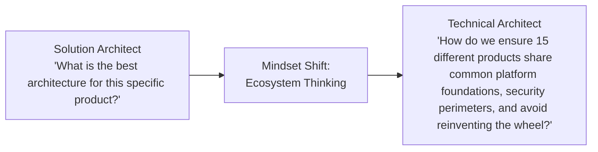

# Role Transition: Solution Architect → Technical Architect (TA) / Domain Architect

> **"The shift from designing a single isolated solution to architecting multi-application platforms, reusable foundational capabilities, and coherent enterprise technology ecosystems."**

---

## 1. Current Role: Solution Architect (SA)
* **Execution Model**: Designs an end-to-end technical solution for a specific business initiative (e.g., a new Customer Portal or Checkout Pipeline).
* **Sphere of Influence**: Single solution boundary, its direct integrations, and the specific delivery team implementing it.
* **Primary Focus**: Delivering business functionality that fulfills the specific project's NFRs and budget.

## 2. Target Role: Technical Architect (TA) / Platform Architect
* **Execution Model**: Owns the architectural integrity, technology standards, and shared platforms across an entire engineering division, domain, or ecosystem of applications.
* **Sphere of Influence**: Multiple interdependent solutions, internal developer platforms (IDPs), cross-cutting security/data backbones, and technology stacks.
* **Primary Focus**: Platform reusability, cross-solution consistency, technology lifecycle management, and enterprise-wide technical debt mitigation.

---

## 3. The Fundamental Mindset Shift



While a Solution Architect optimizes locally for *Project X*, the Technical Architect prevents organizational fragmentation. The TA asks: *"If 10 different teams build 10 different solutions, will we end up with 5 different databases, 3 logging standards, and an unmaintainable tangle of point-to-point APIs?"*

---

## 4. Scope Expansion

```text
From: Single solution architecture, local API contracts, and project-specific cloud resources.
To:   Cross-application domain: Internal Developer Platforms (Kubernetes, Service Mesh), Shared Enterprise Data Backbone (Kafka, Lakehouse), Technology Standards (Technology Radar), and Cross-Domain Integration Topology.
```

---

## 5. Responsibility Expansion

1. **Platform Strategy & Golden Paths**: Architect self-service developer platforms that make the secure, compliant, and scalable way the easiest way (Paved Roads).
2. **Technology Governance & Radar Stewardship**: Curate the organization's [Technology Radar](../../TECHNOLOGY-RADAR.md); establish policies for Adopt, Trial, Assess, and Hold.
3. **Cross-Solution Architectural Review**: Chair review sessions across multiple solution architectures to identify duplicate efforts and anti-patterns.
4. **Technology Lifecycle & Obsolescence**: Plan the multi-year phase-out of deprecated runtimes, vulnerable libraries, and end-of-life cloud services across hundreds of repositories.
5. **Standardized Reference Architectures**: Produce reusable architectural blueprints that 80% of new projects can adopt out-of-the-box.

---

## 6. Technical Capability Requirements

* **Platform Engineering & Infrastructure as Code**: Terraform/OpenTofu module architecture, Kubernetes operator design, and GitOps workflows (ArgoCD).
* **Cross-Cutting Service Mesh & Zero Trust**: Envoy/Istio service mesh topologies, mTLS enforcement, centralized API Gateways (Kong, Apigee), and global ingress.
* **Enterprise Event Backbone Topology**: Kafka cluster sizing, topic naming conventions, schema registries (Avro/Protobuf), and dead-letter queue governance.
* **Enterprise Data Integration**: Lakehouse patterns (Iceberg, Delta Lake), Change Data Capture (Debezium), and centralized data cataloging.

---

## 7. Architecture Capability Requirements

* **Platform Architecture Blueprints**: Defining shared service ecosystems and developer experience (DevEx) foundations ([Platform Strategy](../platform-strategy/README.md)).
* **Cross-Solution Reference Architectures**: Authoring standard templates for microservices, event-driven pipelines, and web platforms ([Reference Architectures](../../18-reference-architectures/README.md)).
* **Architecture Governance Frameworks**: Designing automated architecture fitness functions and CI/CD linting gates ([Linters](../../21-architecture-tools/linters/README.md)).
* **Technical Debt Valuation**: Quantifying cross-system technical debt in financial and risk terms to secure platform modernization funding.

---

## 8. Business Capability Requirements

* **Platform Economics & Unit Cost Reduction**: Demonstrating how centralized platforms reduce per-team engineering overhead and cloud infrastructure spend.
* **Developer Productivity Metrics (DORA & SPACE)**: Measuring how architectural standards improve deployment frequency, lead time for changes, and MTTR.
* **Vendor Ecosystem Negotiation**: Partnering with procurement to evaluate enterprise-wide software licenses (e.g., Datadog, Snowflake, AWS Enterprise Agreements).

---

## 9. Leadership & Influence Requirements

* **Leading Other Architects**: Mentoring and reviewing Solution Architects; guiding their design choices toward platform alignment without disempowering them.
* **Building Consensus Across Silos**: Persuading competing engineering squads to migrate from custom frameworks to shared platform standards.
* **Executive Technical Evangelism**: Presenting the multi-year platform roadmap to Directors and VPs of Engineering.

---

## 10. Communication Requirements

* **Request for Comments (RFC) Process**: Driving structured, transparent engineering consensus on company-wide technical standards.
* **Paved Road Documentation**: Authoring crystal-clear developer documentation and quickstart boilerplates that developers actually enjoy using.
* **Incident Post-Mortem Synthesis**: Analyzing recurring production failure patterns across different teams to identify systemic architectural flaws.

---

## 11. Required Deliverables
* **Domain Platform Blueprint**: Comprehensive architecture for shared platform infrastructure ([Platform Blueprint](../../18-reference-architectures/README.md)).
* **Living Technology Radar**: Updated portfolio of corporate technology standards ([Technology Radar](../../TECHNOLOGY-RADAR.md)).
* **Domain Integration Architecture**: Centralized asynchronous and synchronous API standards ([07-integration](../../07-integration/README.md)).
* **Automated Architectural Fitness Functions**: CI-driven rules preventing architectural drift (e.g., ArchUnit, custom linters).

---

## 12. Required Practical Experiences

1. **Design and Deploy an Internal Platform**: Lead the architecture of a company-wide capability (e.g., central auth service, telemetry pipeline, or API gateway).
2. **Decommission an Enterprise Technology**: Lead the multi-team migration away from a legacy system (e.g., migrating 20 microservices off an unmaintained message broker).
3. **Establish an Organization-Wide RFC Process**: Institute a formal RFC and ADR repository adopted by 50+ engineers across multiple teams.

---

## 13. Architecture Decisions to Practice
* **Centralized vs Decentralized API Gateway**: Balancing centralized security policy enforcement against team autonomy and blast radius.
* **Monorepo vs Polyrepo for Enterprise Microservices**: Evaluating build tooling, dependency management, and code sharing across 100+ services.
* **Standardizing on a Global Event Schema**: Choosing Protobuf vs JSON Schema vs Avro for enterprise-wide event interoperability.

---

## 14. Evidence of Readiness (The Evidence Portfolio)

- [ ] 1+ Approved Domain Reference Architecture adopted by 3 or more independent project teams.
- [ ] Documented leadership of a cross-system modernization or platform engineering initiative.
- [ ] Published updates to the corporate Technology Radar with defensible ADR backing.
- [ ] Measurable improvement in organizational metrics (e.g., 40% reduction in time-to-market for new microservices via golden path templates).

---

## 15. Common Gaps & Blind Spots
* **Platform Authoritarianism**: Mandating rigid, difficult-to-use platforms that drive engineering teams toward "shadow IT."
* **Disconnect from Developer Reality**: Specifying abstract platform architectures without testing whether local developer environments actually work.
* **Ignoring Migration Paths**: Announcing a new platform without providing automated migration tools, documentation, or hands-on migration support.

---

## 16. Common Failure Modes
* **The "One Architecture to Rule Them All" Trap**: Attempting to force every single workload into an identical architecture pattern regardless of fitness.
* **Neglecting Platform Operations**: Treating the platform as a project that ends at launch, rather than an internal product requiring dedicated maintenance.

---

## 17. 90-Day Development Focus

* **Days 1–30: Cross-System Technical Audit**:
  - Review 5 different solution architectures across your domain. Identify duplications in auth, logging, database tooling, and CI pipelines.
* **Days 31–60: Author a Domain Reference Architecture**:
  - Author a "Paved Road" reference blueprint for standard cloud-native microservices in [`18-reference-architectures/`](../../18-reference-architectures/README.md).
  - Include automated linting rules using [`21-architecture-tools/linters/doc_linter.py`](../../21-architecture-tools/linters/doc_linter.py).
* **Days 61–90: Drive a Cross-Team RFC**:
  - Run a formal RFC process to standardize a contentious technical domain (e.g., event streaming conventions or distributed tracing). Achieve consensus across 3+ team leads.

---

## 18. Readiness Checklist

- [ ] Do engineering teams seek your advice when designing cross-system integrations?
- [ ] Have you designed shared platform capabilities that accelerated multiple independent project teams?
- [ ] Can you evaluate and govern technology lifecycles across a large multi-repo portfolio?
- [ ] Do you prioritize developer experience and adoption over bureaucratic architectural mandates?

---

## 19. Related Repository Domains
* Platform Engineering: [`09-devops/`](../../09-devops/README.md)
* Integration Architecture: [`07-integration/`](../../07-integration/README.md)
* Cloud Topologies: [`08-cloud/`](../../08-cloud/README.md)
* Architecture Governance: [`01-architecture/architecture-governance/`](../../01-architecture/architecture-governance/README.md)
* Platform Strategy Capstone: [`24-architect-mastery/platform-strategy/`](../platform-strategy/README.md)
