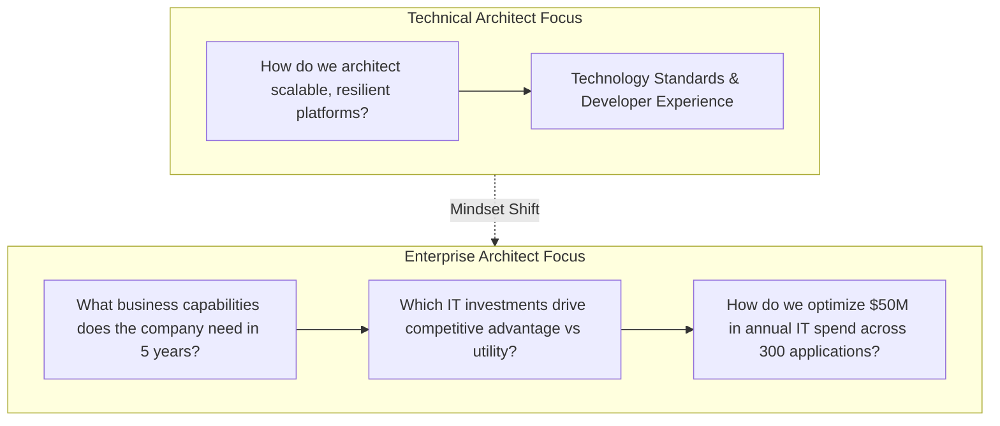

# Role Transition: Technical Architect → Enterprise Architect (EA)

> **"The strategic elevation from technology platforms and software systems to business capability mapping, IT portfolio rationalization, capital allocation, and enterprise-wide digital transformation."**

---

## 1. Current Role: Technical Architect (TA) / Domain Architect
* **Execution Model**: Owns technical stacks, platforms, reference architectures, and technology standards across multiple engineering teams.
* **Sphere of Influence**: Engineering organizations, shared platforms, infrastructure ecosystems, and developer tooling.
* **Primary Focus**: Technical excellence, platform reuse, cross-solution consistency, and engineering velocity.

## 2. Target Role: Enterprise Architect (EA)
* **Execution Model**: Aligns the entire corporate technology portfolio with long-term enterprise business strategy, capability models, regulatory mandates, and financial objectives.
* **Sphere of Influence**: C-Suite (CIO, CTO, CFO, CEO), Business Unit Heads, Enterprise Architecture Review Boards, and multi-year transformation budgets ($10M–$100M+).
* **Primary Focus**: Business capability optimization, IT portfolio rationalization, M&A integration, corporate risk mitigation, and strategic capital allocation.

---

## 3. The Fundamental Mindset Shift



An Enterprise Architect does not care what programming language a service is written in. The EA asks: *"Does this technology asset generate differentiated revenue, reduce regulatory exposure, or automate a core business value stream? If not, why are we spending $5M maintaining it instead of buying a commodity SaaS solution?"*

---

## 4. Scope Expansion

```text
From: Platforms, Kubernetes clusters, service meshes, Kafka backbones, and CI/CD pipelines.
To:   Business Architecture (Capability Maps, Value Streams), Application Portfolio Management (APM), Technology Portfolio Rationalization, Multi-Year Modernization Roadmaps, M&A Technical Due Diligence, and Global Regulatory Governance.
```

---

## 5. Responsibility Expansion

1. **Business Capability Mapping**: Translate corporate business strategy into structured, hierarchical Business Capability Models (Level 1–3).
2. **Application Portfolio Management (APM)**: Classify hundreds of enterprise applications using the TIME model (Tolerate, Invest, Migrate, Eliminate) to cut waste.
3. **Enterprise Architecture Governance**: Establish and preside over the Enterprise Architecture Review Board (EARB); define enterprise architecture principles.
4. **Strategic Capital Allocation**: Partner with the CIO and CFO to evaluate technology business cases, ROI projections, and multi-year capital expenditure (CapEx) vs operational expenditure (OpEx).
5. **M&A Technical Due Diligence**: Audit the technology, architectural debt, and licensing compliance of acquired target companies; design post-merger integration blueprints.
6. **Global Regulatory & Compliance Architecture**: Ensure system landscapes comply with cross-border data residency (GDPR, CCPA), banking rules (PCI-DSS, Basel III), and healthcare standards (HIPAA).

---

## 6. Technical Capability Requirements

* **Enterprise Integration Fabrics**: Modern integration topologies (iPaaS, ESB, EDA, API-led) connecting legacy mainframe, SAP ERP, Salesforce CRM, and cloud platforms.
* **Legacy Modernization Strategies**: 8R Modernization framework (Rehost, Replatform, Refactor, Rearchitect, Rebuild, Replace, Retain, Retire).
* **Data Sovereignty & Global Topology**: Multi-jurisdiction data residency architecture, sovereign clouds, and cross-border encryption keys.
* **Enterprise Security & Zero Trust**: Identity Governance and Administration (IGA), Enterprise IAM, privileged access, and corporate security posture.

---

## 7. Architecture Capability Requirements

* **Business Architecture & Capability Modeling**: Authoring business capability maps and value stream heatmaps ([23-enterprise-architecture](../../23-enterprise-architecture/README.md)).
* **Application Portfolio Rationalization**: Formulating TIME scorecards and application retirement roadmaps ([APM Calculator](../../21-architecture-tools/application-tco-calculator.md)).
* **TOGAF / ArchiMate Frameworks**: Applying enterprise architecture metamodels across Business, Data, Application, and Technology (BDAT) layers.
* **Enterprise Technology Roadmap**: Defining current state, target state (3–5 year horizon), and sequenced transition architectures.

---

## 8. Business & Financial Capability Requirements

* **Financial Modeling & TCO**: Calculating 5-year Total Cost of Ownership including software licensing, cloud hosting, integration, labor, and depreciation.
* **Business Case Justification**: Writing compelling capital allocation proposals demonstrating Net Present Value (NPV), Internal Rate of Return (IRR), and payback horizons.
* **Vendor Ecosystem Strategy**: Managing relationships with multi-million-dollar technology vendors (Microsoft, AWS, SAP, Salesforce, Oracle); negotiating enterprise agreements.

---

## 9. Leadership & Influence Requirements

* **Executive Presence & Boardroom Communication**: Communicating comfortably with non-technical executives using business terminology rather than acronyms.
* **Strategic Consensus Building**: Unifying disparate business unit leaders who have conflicting priorities, departmental budgets, and proprietary tool preferences.
* **Governing Without Bureaucracy**: Shifting governance from slow, adversarial gatekeeping to automated, value-driven architectural enablement.

---

## 10. Communication Requirements

* **Executive Summary Dashboards**: Condensing complex enterprise IT landscapes into clear heatmaps and investment matrices.
* **Strategic Roadmaps**: Communicating multi-year transitions through visual roadmaps that business leaders understand.
* **Change Management**: Championing digital transformation across hundreds of engineers and business analysts.

---

## 11. Required Deliverables
* **Business Capability Map**: Hierarchical catalog of enterprise business capabilities and technical maturity ([Capability Worksheet](../../21-architecture-tools/capability-mapping-worksheet.md)).
* **Application Portfolio TIME Scorecard**: Rationalization analysis classifying enterprise software ([APM Guide](../../23-enterprise-architecture/README.md)).
* **Enterprise Target Architecture (3–5 Year Horizon)**: Strategic blueprint defining the desired corporate IT landscape.
* **Technology Modernization Roadmap**: Sequenced transition states from legacy monolith to cloud-native platforms ([15-modernization](../../15-modernization/README.md)).
* **Enterprise Architecture Principles**: 10–15 non-negotiable axioms governing all corporate technology investments ([Principles](../../ARCHITECTURE-PRINCIPLES.md)).

---

## 12. Required Practical Experiences

1. **Lead an Application Rationalization Initiative**: Audit a portfolio of 50+ applications, identify redundant tools, and retire at least 3 systems to save $1M+ annually.
2. **Conduct M&A Technical Due Diligence**: Assess an acquisition target's technology architecture, code quality, technical debt, and cybersecurity posture.
3. **Author a Multi-Year Enterprise Modernization Plan**: Design the phased migration and replacement of a core enterprise system (e.g., Core Banking, Billing, or ERP).

---

## 13. Architecture Decisions to Practice
* **SAP S/4HANA Cloud Migration**: Clean Core vs Side-by-Side Extensibility via BTP vs custom extensions.
* **Consolidating Duplicate CRM Systems**: Deciding whether to migrate 3 acquired business units into a single global Salesforce instance vs federated instances.
* **In-House GenAI Platform vs Commercial Enterprise Copilots**: Deciding whether to build an internal RAG platform or license Microsoft 365 Copilot across 10,000 employees.

---

## 14. Evidence of Readiness (The Evidence Portfolio)

- [ ] 1+ Comprehensive Business Capability Map validated by business executive sponsors.
- [ ] 1+ Application Portfolio Rationalization analysis that achieved executive signoff and resulted in measurable CapEx/OpEx savings.
- [ ] Proven authorship of enterprise-wide Architecture Principles formally adopted across multiple business units.
- [ ] Documented leadership of a major enterprise system transition (e.g., ERP, Core Banking, or enterprise cloud migration).

---

## 15. Common Gaps & Blind Spots
* **Treating EA as Academic Ivory Tower**: Producing hundreds of pages of TOGAF diagrams that business leaders ignore and engineers bypass.
* **Over-Standardization**: Attempting to force every business unit into identical technologies, destroying organizational agility in fast-moving product teams.
* **Losing Touch with Technical Reality**: Mandating architectural strategies that are impossible to implement due to legacy data constraints or lack of engineering skills.

---

## 16. Common Failure Modes
* **The "Department of No"**: Operating as a bureaucratic roadblock that slows down delivery, driving engineering teams into covert shadow IT.
* **Falling for Vendor Marketing**: Buying expensive enterprise software suites based on slick vendor presentations without validating integration feasibility.

---

## 17. 90-Day Development Focus

* **Days 1–30: Map Business Capabilities**:
  - Select one major business unit. Model its Level 1 and Level 2 business capabilities using [`21-architecture-tools/capability-mapping-worksheet.md`](../../21-architecture-tools/capability-mapping-worksheet.md).
* **Days 31–60: Conduct an Application Portfolio Audit**:
  - Audit 10–15 applications supporting that business unit. Score them on business fit, technical health, and TCO using the TIME model.
* **Days 61–90: Formulate a 3-Year Target Architecture**:
  - Present a strategic target architecture and rationalization proposal to the domain VP, showing quantifiable cost savings and capability enhancements.

---

## 18. Readiness Checklist

- [ ] Can you hold a 30-minute strategic conversation with a CFO or Business Unit President without mentioning a technical framework?
- [ ] Can you evaluate technology investments in terms of NPV, ROI, and business risk?
- [ ] Have you successfully led cross-business-unit governance that eliminated redundant technology spend?
- [ ] Do you view technology as an enabler of business capability rather than an end in itself?

---

## 19. Related Repository Domains
* Enterprise Architecture Core: [`23-enterprise-architecture/`](../../23-enterprise-architecture/README.md)
* Modernization Frameworks: [`15-modernization/`](../../15-modernization/README.md)
* Enterprise Integration (ERP/CRM/Banking): [`14-enterprise-integration/`](../../14-enterprise-integration/README.md)
* Architecture Governance: [`01-architecture/architecture-governance/`](../../01-architecture/architecture-governance/README.md)
* EA Calculators & Tools: [`21-architecture-tools/`](../../21-architecture-tools/README.md)
