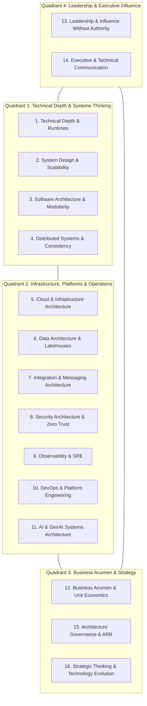
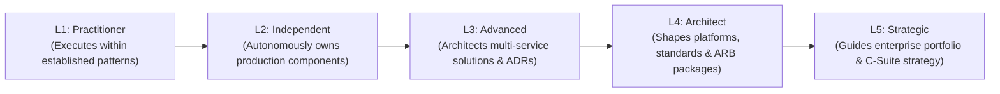

# The Master Architect Competency Model: Synthesizing Depth, Systems, Business & Leadership

> **"Architects are not created by consuming more technology knowledge. They are developed through progressively broader responsibility, better decision-making, stronger systems thinking, practical architecture experience, leadership, communication, and demonstrated architectural judgment."**

---

## 1. The 4-Quadrant Architecture Synthesis

The Master Architect Competency Model organizes the 16 core architectural disciplines into four mutually reinforcing quadrants:

* **Quadrant 1 (Core Foundations)**: The physics of computing—memory models, network latency, CAP theorem, and modular domain design.
* **Quadrant 2 (Engineering Platforms)**: The enterprise execution machinery—cloud topologies, data backbones, integration fabrics, security perimeters, and SRE operability.
* **Quadrant 3 (Business Strategy)**: The economic justification—TCO modeling, business capability mapping, IT portfolio rationalization, and capital allocation.
* **Quadrant 4 (Leadership & Influence)**: The organizational multiplier—executive presence, boardroom storytelling, mentoring, and influencing without managerial authority.

---

## 2. The 5-Tier Behavioral Capability Scale (L1 – L5)

Each competency deep dive in this directory is evaluated against this standardized behavioral scale:

---

## 3. Directory Navigation to the 16 Competency Playbooks

Each competency is detailed in an authoritative, standalone playbook:

| Quadrant | Competency Discipline | Key Focus Area | Direct Link |
| :--- | :--- | :--- | :--- |
| **Q1: Systems** | **1. Technical Depth** | Runtime memory models, garbage collection, and CPU/IO efficiency | [Read Playbook](./technical-depth.md) |
| **Q1: Systems** | **2. System Design** | High-scale availability, multi-region active-active, and capacity planning | [Read Playbook](./system-design.md) |
| **Q1: Systems** | **3. Software Architecture** | Domain-Driven Design (DDD), Clean Architecture, and modular boundaries | [Read Playbook](./software-architecture.md) |
| **Q1: Systems** | **4. Distributed Systems** | CAP/PACELC trade-offs, consensus (Raft), Sagas, and split-brain resolution | [Read Playbook](./distributed-systems.md) |
| **Q2: Platforms**| **5. Cloud Architecture** | Multi-cloud landing zones, FinOps unit economics, and cloud repatriation | [Read Playbook](./cloud-architecture.md) |
| **Q2: Platforms**| **6. Data Architecture** | Polyglot persistence, Lakehouses (Iceberg/Delta), CDC, and Data Mesh | [Read Playbook](./data-architecture.md) |
| **Q2: Platforms**| **7. Integration Architecture**| API-led connectivity, Kafka event backbones, and ERP/CRM integration fabrics | [Read Playbook](./integration-architecture.md) |
| **Q2: Platforms**| **8. Security Architecture** | Zero Trust perimeters, STRIDE threat modeling, mTLS, and corporate IAM | [Read Playbook](./security-architecture.md) |
| **Q2: Platforms**| **9. Observability & SRE** | OpenTelemetry tracing, SLO error budgets, and blameless incident post-mortems | [Read Playbook](./observability-and-sre.md) |
| **Q2: Platforms**| **10. DevOps & Platforms** | Internal Developer Platforms (IDPs), GitOps, paved roads, and DORA metrics | [Read Playbook](./devops-and-platform-engineering.md) |
| **Q2: Platforms**| **11. AI Architecture** | Production LLM serving (vLLM/Triton), PagedAttention, and enterprise RAG | [Read Playbook](./ai-architecture.md) |
| **Q3: Business** | **12. Business Acumen** | Total Cost of Ownership (TCO), unit economics, and capital allocation (NPV/ROI) | [Read Playbook](./business-acumen.md) |
| **Q4: Leadership**| **13. Leadership & Influence**| Influence without authority, technical conflict resolution, and talent mentorship | [Read Playbook](./leadership.md) |
| **Q4: Leadership**| **14. Communication** | 1-page executive memos, C4 visual modeling, and boardroom presentations | [Read Playbook](./communication.md) |
| **Q3: Business** | **15. Architecture Governance**| Lightweight risk-based governance, ARB charters, and automated fitness linters | [Read Playbook](./governance.md) |
| **Q3: Business** | **16. Strategic Thinking** | 5–10 year horizon scanning, radical simplification, and M&A technical diligence | [Read Playbook](./strategic-thinking.md) |

---

## 4. How to Use These Competency Playbooks

1. **For Career Self-Assessment**: Use the L1–L5 behavioral anchors in each document to identify your current level and target promotion level.
2. **For Evidence Compilation**: Check the *Evidence of Capability* section to determine what concrete artifacts you must place in your Git portfolio.
3. **For Interview & Review Preparation**: Practice answering the *Diagnostic Assessment Questions* before presenting to the ARB or interview panels.
