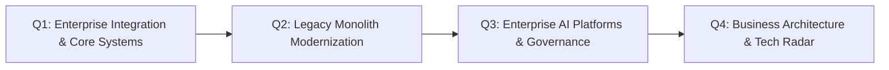

# 12-Month Architect Development Plan: Enterprise Integration, Modernization & AI

> **"Bridging core enterprise business systems, legacy monolith modernization, production GenAI platforms, and executive stakeholder alignment."**

---

## 1. Plan Overview & Target Outcomes

* **Target Audience**: Senior Solution Architects preparing for Technical Architect or Enterprise Architect roles.
* **Core Objective**: Master legacy system modernization, enterprise integration fabrics (SAP, Salesforce, Core Banking), production AI serving topologies, and business capability modeling.
* **Primary Deliverable**: 1 Multi-year enterprise modernization strategy, 1 enterprise GenAI platform specification, and 1 corporate Technology Radar release.

---

## 2. Quarterly Breakdown

### Quarter 1: Enterprise Integration & Core Systems
* **Focus**:
  * Master deep industry integration patterns in [`14-enterprise-integration/`](../../14-enterprise-integration/README.md) (SAP S/4HANA OData, Salesforce CDC/CometD, Core Banking ISO 20022).
  * Design hybrid integration architectures bridging on-premise mainframes to cloud-native microservices via API-led connectivity.
* **Deliverable**: Author an end-to-end integration architecture document linking an enterprise CRM/ERP to modern customer-facing apps.

### Quarter 2: Legacy Monolith Modernization & Data Decomposition
* **Focus**:
  * Study the 8R Modernization Framework and Strangler Fig patterns in [`15-modernization/`](../../15-modernization/README.md).
  * Master database decoupling techniques: dual writes, Change Data Capture (CDC), and reconciliation scripts.
  * Plan non-disruptive cutover procedures and fallback rollback strategies.
* **Deliverable**: Formulate a comprehensive 18-month modernization roadmap for a core legacy monolith, including financial ROI and risk mitigations.

### Quarter 3: Enterprise AI Systems & LLM Serving
* **Focus**:
  * Study high-throughput model serving (vLLM, TensorRT-LLM, Triton) and PagedAttention in [`12-ai/model-serving/`](../../12-ai/model-serving/README.md).
  * Design enterprise RAG architectures with hybrid search (BM25 + HNSW Vector), semantic caching, and prompt injection defense.
  * Evaluate build vs buy for enterprise AI platforms.
* **Deliverable**: Author an Enterprise GenAI Serving & Security Specification detailing latency budgets, GPU cluster sizing, and data loss prevention (DLP).

### Quarter 4: Business Capability Architecture & Technology Radar
* **Focus**:
  * Master business capability modeling and value stream mapping in [`23-enterprise-architecture/`](../../23-enterprise-architecture/README.md).
  * Curate and publish a corporate Technology Radar update ([`TECHNOLOGY-RADAR.md`](../../TECHNOLOGY-RADAR.md)).
  * Master executive communication and storytelling ([`24-architect-mastery/executive-communication/`](../executive-communication/README.md)).
* **Deliverable**: Present a Business Capability Map and Application TIME scorecard to business unit executives; publish corporate Tech Radar blips.

---

## 3. Quarterly Review Gates

| Quarter | Milestone Output | Approving Stakeholders |
| :---: | :--- | :--- |
| **Q1 Gate** | Enterprise Core System Integration Blueprint | Domain Architecture Director |
| **Q2 Gate** | Legacy Monolith Strangler Modernization Plan | VP of Engineering & Product Lead |
| **Q3 Gate** | Enterprise GenAI Architecture & Security Spec | Chief Information Security Officer (CISO) |
| **Q4 Gate** | Business Capability Map & Technology Radar Release | Chief Technology Officer (CTO) / Chief Architect |
