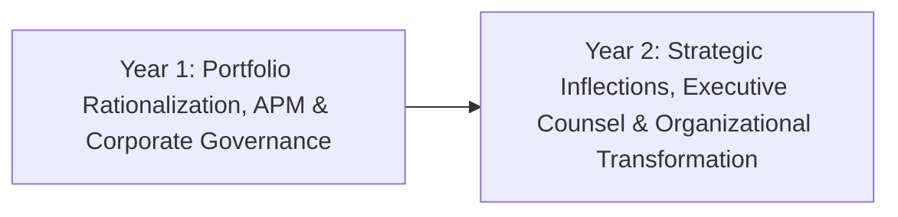

# 2-Year Enterprise Strategy & Leadership Plan: Transforming Portfolios & Influencing C-Suite

> **"The multi-year roadmap to transition from technical domain leadership to executive technology strategy, enterprise capital allocation, portfolio rationalization, and organizational leverage."**

---

## 1. Plan Overview & Strategic Objectives

* **Target Audience**: Technical Architects and Enterprise Architects advancing toward Principal Architect, Fellow, or Chief Architect rank.
* **Core Objective**: Master macroeconomic technical strategy, multi-million dollar capital allocation, enterprise portfolio rationalization, M&A due diligence, and advising the C-Suite and Board of Directors.
* **Primary Deliverable**: 1 Corporate Technology Vision & Simplification Blueprint, 1 M&A Technical Valuation, and a formal leadership mentoring cohort.

---

## 2. Year-by-Year Strategic Progression

### Year 1: Application Portfolio Management & Corporate Governance
* **Semester 1 (Months 1–6): Portfolio Rationalization & Cost Optimization**
  * Audit an enterprise portfolio of 50–100 applications using the TIME framework (Tolerate, Invest, Migrate, Eliminate) in [`23-enterprise-architecture/`](../../23-enterprise-architecture/README.md).
  * Calculate 5-year Total Cost of Ownership (TCO) across software licenses, infrastructure, and maintenance labor using [`21-architecture-tools/application-tco-calculator.md`](../../21-architecture-tools/application-tco-calculator.md).
  * Build an executive business case demonstrating $2M+ in annual recurring cost reductions through application consolidation.
* **Semester 2 (Months 7–12): Enterprise Architecture Governance & M&A Due Diligence**
  * Restructure the Enterprise Architecture Review Board (EARB) to eliminate bureaucratic friction and institute automated architectural fitness functions ([`Linters`](../../21-architecture-tools/linters/README.md)).
  * Lead technical due diligence on a potential M&A target; evaluate technical debt, open-source license compliance, cybersecurity liabilities, and platform synergies.
  * Define non-negotiable enterprise architecture principles formally adopted across all business divisions ([`ARCHITECTURE-PRINCIPLES.md`](../../ARCHITECTURE-PRINCIPLES.md)).

### Year 2: Strategic Horizon Scanning, Simplification & Executive Counsel
* **Semester 3 (Months 13–18): Radical Architectural Simplification**
  * Identify sources of catastrophic complexity across the enterprise (e.g., redundant middleware, microservice sprawl, uncoordinated SaaS contracts).
  * Author a corporate Radical Simplification Blueprint proposing the aggressive subtraction and consolidation of systems.
  * Pilot a major architectural consolidation, proving that reducing system tiers increases developer velocity while slashing outages.
* **Semester 4 (Months 19–24): Executive Counsel, Talent Sponsorship & Industry Eminence**
  * Serve as a direct technical counsel to the CEO, CTO, and Board on transformative technical inflection points (e.g., custom AI silicon, cloud repatriation, sovereign data regulations).
  * Launch an architect sponsorship initiative, personally mentoring at least 3 senior architects toward Staff/Principal readiness.
  * Author an authoritative 10-year corporate technology vision whitepaper; represent the company at international industry summits or standards bodies.

---

## 3. Major Milestone Review Gates

| Milestone | Strategic Output | Executive Signoff |
| :---: | :--- | :--- |
| **Month 6 Gate** | Enterprise Application TIME Portfolio Analysis ($2M+ savings) | Chief Information Officer (CIO) |
| **Month 12 Gate** | M&A Technical Valuation Memo & Enterprise Governance Charter | VP of Corporate Development & CTO |
| **Month 18 Gate** | Corporate Radical Simplification Blueprint | Executive Architecture Council |
| **Month 24 Gate** | 10-Year Technology Vision Whitepaper & Mentorship Cohort | Chief Executive Officer (CEO) & Board |
