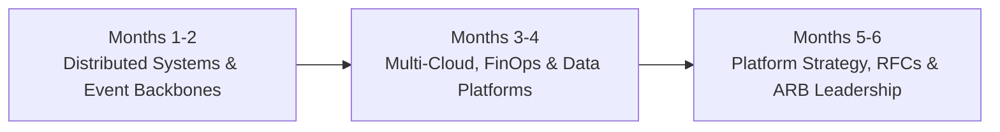

# 6-Month Architect Development Plan: Distributed Systems, Cloud & ARB Mastery

> **"Expanding architectural breadth from single applications to multi-system distributed topologies, FinOps economics, and cross-team architectural governance."**

---

## 1. Plan Overview & Target Outcomes

* **Target Audience**: Mid-level Solution Architects and aspiring Technical Architects.
* **Core Objective**: Master distributed systems resilience, asynchronous event backbones, multi-cloud landing zones, and cloud unit economics.
* **Primary Deliverable**: 2 End-to-end production solutions deployed, 1 cross-team platform RFC, and active participation as an ARB voting member.

---

## 2. Bi-Monthly Breakdown

### Months 1–2: Distributed Systems, Sagas & Resilience
* **Curriculum & Practice**:
  * Deep study of [`02-system-design/`](../../02-system-design/README.md) (fault tolerance, CAP/PACELC, active-active topologies).
  * Study distributed transactions in [`13-architecture-patterns/`](../../13-architecture-patterns/README.md): Orchestration vs Choreography Saga, Transactional Outbox, and Idempotent Consumers.
  * Practice designing an event-driven integration backbone using [`07-integration/`](../../07-integration/README.md) (Kafka topic partitions, schema registry, DLQs).
* **Deliverable**: Architect a distributed saga workflow for a critical business transaction; author ADR justifying choreography vs orchestration.

### Months 3–4: Cloud Topologies, FinOps & Data Architecture
* **Curriculum & Practice**:
  * Study multi-cloud landing zones, VPC transit gateways, and hybrid connectivity in [`08-cloud/`](../../08-cloud/README.md).
  * Implement FinOps unit cost modeling using [`08-cloud/cloud-cost-optimization/`](../../08-cloud/cloud-cost-optimization/README.md); calculate cost-per-transaction.
  * Study lakehouse architectures (Apache Iceberg, Delta Lake) and CDC pipelines in [`06-data/`](../../06-data/README.md).
* **Deliverable**: Conduct a cloud cost optimization audit across 5 production services; model 3-year TCO and identify $50k+ in annual savings.

### Months 5–6: Platform Engineering, RFCs & ARB Governance
* **Curriculum & Practice**:
  * Study Internal Developer Platforms (IDPs) and self-service paved roads in [`09-devops/`](../../09-devops/README.md) and [`24-architect-mastery/platform-strategy/`](../platform-strategy/README.md).
  * Study real-world production outages in [`19-case-studies/`](../../19-case-studies/README.md); extract defensive architecture rules.
  * Serve as an active reviewer on the Architecture Review Board (ARB).
* **Deliverable**: Author an organization-wide RFC standardizing a technical domain (e.g., telemetry schemas or API pagination); drive consensus across 3+ teams.

---

## 3. Milestone Review Gates

| Milestone | Key Output | Review Gate |
| :---: | :--- | :--- |
| **Month 2 Gate** | Distributed Saga Architecture + 2 ADRs | Staff / Principal Architect Signoff |
| **Month 4 Gate** | Cloud FinOps Audit & Data Pipeline Design | Cloud FinOps Lead & Engineering VP |
| **Month 6 Gate** | Approved Cross-Team RFC + Active ARB Review Portfolio | ARB Chair Signoff |
