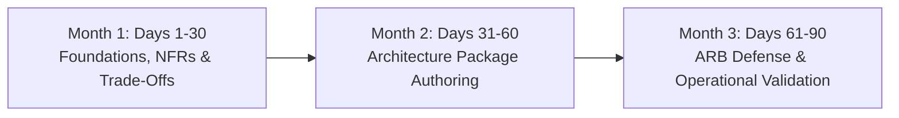

# 90-Day Architect Development Plan: Foundations, NFRs & First Decision Package

> **"A fast-paced, high-impact sprint designed to transition a strong senior engineer or tech lead into the disciplined habits of solution architecture."**

---

## 1. Plan Overview & Target Outcomes

* **Target Audience**: Senior Software Engineers, Tech Leads, and new Solution Architects.
* **Core Objective**: Shift from purely functional implementation thinking to **problem framing, NFR elicitation, and defensible trade-off documentation**.
* **Primary Deliverable**: 1 Complete Architecture Decision Package (1 SAD, 2 ADRs, 1 NFR Matrix, 1 Threat Model) reviewed by senior architects.

---

## 2. Phase Breakdown

### Month 1 (Days 1–30): First Principles, NFRs & Decision Rigor
* **Weekly Focus**:
  * **Week 1**: Study [`ARCHITECTURE-PRINCIPLES.md`](../../ARCHITECTURE-PRINCIPLES.md) and [`HOW-TO-USE.md`](../../HOW-TO-USE.md). Read [`00-foundations/`](../../00-foundations/) on distributed system primitives.
  * **Week 2**: Study [`02-system-design/availability/`](../../02-system-design/availability/README.md) and [`02-system-design/consistency/`](../../02-system-design/consistency/README.md). Practice translating a vague business goal into hard engineering budgets.
  * **Week 3**: Run `python 21-architecture-tools/generators/nfr_matrix_generator.py` for an upcoming team epic. Identify availability, p99 latency, and storage growth targets.
  * **Week 4**: Study [`DECISION-MAKING-FRAMEWORK.md`](../../DECISION-MAKING-FRAMEWORK.md). Author your first formal ADR using `python 21-architecture-tools/generators/adr_generator.py` justifying a database or caching choice.

### Month 2 (Days 31–60): The Complete Architecture Package
* **Weekly Focus**:
  * **Week 5**: Select a real cross-system initiative. Frame the business problem and constraints with the Product Manager.
  * **Week 6**: Author the Solution Architecture Document (SAD) using [`16-architecture-deliverables/SOLUTION-ARCHITECTURE-TEMPLATE.md`](../../16-architecture-deliverables/SOLUTION-ARCHITECTURE-TEMPLATE.md). Draw C4 Context and Container diagrams following [`17-diagrams/`](../../17-diagrams/README.md).
  * **Week 7**: Conduct a STRIDE Threat Model using [`21-architecture-tools/templates/threat-model-stride-template.md`](../../21-architecture-tools/templates/threat-model-stride-template.md); review with Information Security.
  * **Week 8**: Draft a Disaster Recovery Runbook using [`21-architecture-tools/templates/disaster-recovery-runbook-template.md`](../../21-architecture-tools/templates/disaster-recovery-runbook-template.md); calculate RTO/RPO targets.

### Month 3 (Days 61–90): ARB Review, Defense & Production Readiness
* **Weekly Focus**:
  * **Week 9**: Audit your complete architecture package against [`21-architecture-tools/checklists/solution-architecture-checklist.md`](../../21-architecture-tools/README.md). Fix any identified gaps.
  * **Week 10**: Shadow an Architecture Review Board (ARB) session; observe how senior architects interrogate trade-offs and risks.
  * **Week 11**: Submit and present your architecture package to the ARB. Defend trade-offs, capture feedback, and update ADRs accordingly.
  * **Week 12**: Review the production deployment plan; verify that OpenTelemetry traces, Grafana dashboards, and error budget alert rules are in place.

---

## 3. Weekly Milestones & Verification Gates

| Milestone | Target Deliverable | Evaluation Gate |
| :---: | :--- | :--- |
| **Day 30 Gate** | 1 Validated NFR Matrix + 1 Formal ADR | Tech Lead or Staff Architect signoff |
| **Day 60 Gate** | Draft Solution Architecture Document (SAD) + STRIDE Model | InfoSec & Product Manager review |
| **Day 90 Gate** | Formal ARB Approval of Complete Package | ARB Chair & Enterprise Architect signoff |

---

## 4. Remediation Check
If at Day 60 your SAD lacks depth or trade-off analysis:
* Conduct a 3-day architectural spike in [`99-experiments/`](../../99-experiments/) to benchmark your top 2 competing technical options.
* Use hard performance and cost numbers to justify the chosen design.
