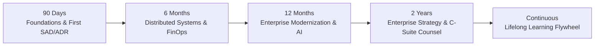

# Architecture Development Plans & Strategic Roadmaps

> **"Architectural career growth does not happen by accident. It requires deliberate, time-boxed progression roadmaps that balance technical depth, system design, business acumen, and executive leadership."**

Welcome to the **Development Plans** directory inside [`24-architect-mastery/`](../README.md). This module provides structured, multi-horizon roadmaps tailored to different stages of the architectural journey.

---

## 1. Master Development Plans

* **[90-Day Architect Development Plan](./90-day-architect-development-plan.md)** — Foundations, NFR engineering, ADR authoring, and delivering your first approved solution package.
* **[6-Month Architect Development Plan](./6-month-architect-development-plan.md)** — Distributed systems resilience, multi-cloud landing zones, FinOps cost optimization, and ARB review mastery.
* **[12-Month Architect Development Plan](./12-month-architect-development-plan.md)** — Enterprise core system integration, legacy monolith modernization (Strangler Fig), production GenAI serving, and Technology Radar curation.
* **[2-Year Enterprise Strategy Plan](./2-year-enterprise-strategy-plan.md)** — Application portfolio rationalization, M&A technical due diligence, radical simplification, and advising the C-Suite and Board.
* **[Continuous Development & Lifelong Habits](./continuous-development.md)** — The architectural learning flywheel: decision journaling, reading post-mortems, and staying grounded in production reality.

---

## 2. Multi-Horizon Progression Model

---

## 3. Related Architecture Mastery Modules

* **[Career Progression & Transition Playbooks](../career/README.md)** — Navigating role transitions from Engineer to Principal Architect.
* **[Readiness Assessment Gates](../readiness/README.md)** — Multi-pillar evaluation checklists for promotion readiness.
* **[Competency Models & Matrices](../skill-matrix/README.md)** — 16-competency diagnostic rubric.
* **[Practical Experience & Evidence](../practical-experience/README.md)** — Real-world apprentice projects and decision dilemmas.
