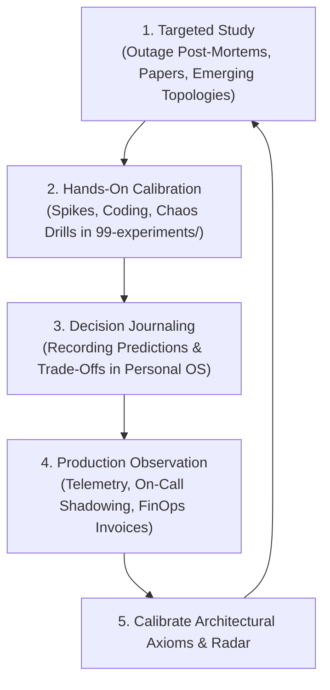

# Continuous Architecture Development: Lifelong Operating Habits

> **"Architecture is not a static destination reached at promotion; it is an active discipline of deliberate learning, continuous calibration, and empirical feedback."**

---

## 1. The Architectural Learning Flywheel

Master architects stay sharp not by collecting more trivia, but by running an uninterrupted feedback loop between production reality and architectural mental models:

---

## 2. The 4 Essential Weekly Habits

1. **Read One Major Production Post-Mortem Every Week**:
   * Study post-mortems from AWS, Cloudflare, GitHub, Netflix, and [`19-case-studies/`](../../19-case-studies/README.md).
   * Ask: *"Under what exact conditions would our current architecture suffer this identical failure mode?"*
2. **Maintain a Personal Architecture Decision Journal**:
   * For every major ADR you author or review, record your prediction: *"I expect this design to handle 10,000 QPS at $5,000/month with zero data loss."*
   * Revisit the journal 12 months later. Compare prediction against telemetry reality to systematically eliminate personal cognitive biases.
3. **Spend 10% of Time Grounded in Reality**:
   * Spend at least 4 hours every sprint reading production code, inspecting telemetry dashboards, or pairing with an on-call engineer.
   * Architects who do not touch production drift into ivory-tower irrelevance within 24 months.
4. **Prune and Simplify the Architecture**:
   * Schedule a quarterly "Architecture Subtraction Day." Identify dead API endpoints, zombie databases, and unneeded microservices and coordinate their safe decommissioning.

---

## 3. Recommended Annual Learning Rhythm

* **Q1: Foundational Deep Dive**: Re-read a classic foundational text or RFC (e.g., Raft paper, Dynamo paper, TCP/IP fundamentals) to re-anchor on first principles.
* **Q2: Emerging Paradigm Spike**: Build a hands-on proof-of-concept in [`99-experiments/`](../../99-experiments/) exploring an unfamiliar paradigm (e.g., WebAssembly runtimes, GPU inference quantization, eBPF network observability).
* **Q3: Corporate Technology Radar Refresh**: Review and update the corporate Technology Radar ([`TECHNOLOGY-RADAR.md`](../../TECHNOLOGY-RADAR.md)); assess technologies moving from Trial to Adopt or Hold.
* **Q4: Peer Mentorship & Knowledge Synthesis**: Author an internal engineering whitepaper or lead a masterclass teaching junior architects how to author and defend ADRs.
