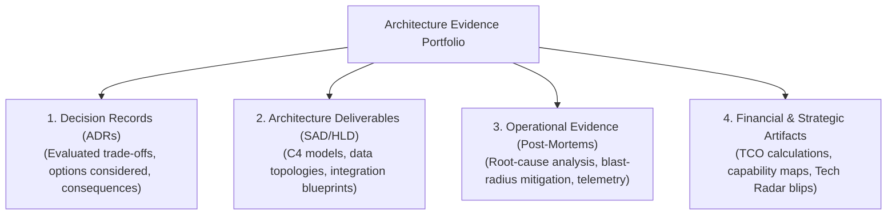

# The Architecture Evidence Portfolio: Demonstrating Defensible Capability

> **"In technical leadership interviews, board reviews, and promotion committees, talk is cheap. A documented, peer-reviewed portfolio of real architectural artifacts in Git is unassailable proof of competence."**

---

## 1. What is an Architecture Evidence Portfolio?

An **Architecture Evidence Portfolio** is a curated, version-controlled collection of real architectural artifacts authored or led by an engineer. It replaces vague resume bullet points (*"architected cloud systems"*) with tangible, inspectable proof of engineering rigor, trade-off analysis, and production success.



---

## 2. Core Portfolio Artifacts & Acceptance Criteria

To serve as valid evidence for readiness gates and promotion committees, each artifact must satisfy strict criteria:

| Artifact Type | What It Proves | Mandatory Quality Acceptance Criteria |
| :--- | :--- | :--- |
| **Architecture Decision Record (ADR)** | Ability to evaluate trade-offs and justify choices objectively. | Generated with standard schema; must evaluate at least 3 distinct options; explicitly states what is sacrificed; peer-reviewed in Git. |
| **Solution Architecture Document (SAD)** | Ability to design end-to-end multi-tier systems. | Follows [`16-architecture-deliverables/SOLUTION-ARCHITECTURE-TEMPLATE.md`](../../16-architecture-deliverables/SOLUTION-ARCHITECTURE-TEMPLATE.md); includes C4 Context & Container diagrams; approved by ARB. |
| **Non-Functional Requirements (NFR) Matrix** | Ability to engineer quantifiable production budgets. | Generated with `nfr_matrix_generator.py`; specifies p99 latency, throughput QPS, availability %, and RTO/RPO targets. |
| **STRIDE Threat Model** | Ability to anticipate security attack vectors. | Follows [`threat-model-stride-template.md`](../../21-architecture-tools/templates/threat-model-stride-template.md); defines trust boundaries and encryption in transit/rest; vetted by InfoSec. |
| **Disaster Recovery Runbook** | Operational foresight and business continuity planning. | Documented cross-region failover steps, database promotion commands, and rollback verification criteria. |
| **Blameless Incident Post-Mortem** | Ability to learn from failure and remediate systemic flaws. | Detailed timeline, root cause analysis (5 Whys), contributing factors, and permanent architectural preventative measures. |
| **Total Cost of Ownership (TCO) Model** | Financial acumen and FinOps stewardship. | 3–5 year spreadsheet or markdown model estimating cloud compute, storage, egress, software licensing, and operational labor. |

---

## 3. Recommended Portfolio Structure in Git

Organize your personal or team architecture portfolio in your project repository:

```text
my-architecture-portfolio/
├── 01-adrs/
│   ├── ADR-001-adopt-event-driven-fulfillment.md
│   ├── ADR-002-postgresql-vs-dynamodb-for-orders.md
│   └── ADR-003-self-hosted-vllm-vs-openai-api.md
├── 02-designs/
│   ├── SAD-global-payment-gateway.md
│   ├── HLD-checkout-saga-orchestrator.md
│   └── LLD-catalog-cache-invalidation.md
├── 03-governance-and-security/
│   ├── NFR-matrix-payment-gateway.md
│   ├── STRIDE-threat-model-identity-broker.md
│   └── DR-runbook-cross-region-failover.md
├── 04-operational-evidence/
│   ├── post-mortem-2026-04-12-redis-cache-avalanche.md
│   └── benchmark-report-kafka-vs-pulsar-throughput.md
└── 05-strategic-artifacts/
    ├── business-capability-map-fulfillment.md
    └── tco-model-cloud-modernization.md
```

---

## 4. How to Present Your Portfolio in Interviews & Reviews

When presenting your portfolio to hiring committees or the Architecture Review Board:

1. **Lead with the Business Problem**: Never open with *"I built a Kafka pipeline."* Open with *"The company was losing $200k/hour due to database deadlocks during flash sales; here is the business context."*
2. **Highlight the Sacrifices**: Walk through the ADR and explain what options you rejected and why. Committees value architects who know what **not** to build.
3. **Show Production Telemetry**: Present the Grafana chart or metrics proving that the system achieved the target p99 latency or survived an availability zone outage in production.
4. **Demonstrate Evolution**: Share an excerpt from your decision journal showing how you adjusted the architecture when new operational constraints emerged.
