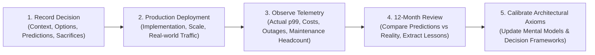

# The Architecture Experience Journal: Personal Decision Journaling & Reflection

> **"Experience is not what happens to an architect; it is what an architect does with what happens. A personal decision journal systematically eliminates hindsight bias, calibrates intuition, and turns production realities into permanent architectural wisdom."**

---

## 1. The Architecture Decision Journal Framework

The greatest impediment to developing architectural judgment is **hindsight bias**—the human tendency to believe, after an outcome occurs, that one predicted it all along. The Architecture Decision Journal forces an architect to record assumptions, predictions, and trade-offs *at the moment of decision*, and review them 6–12 months later against production telemetry.



---

## 2. Standard Architecture Experience Journal Template

Copy and use this standard markdown template for every major architectural initiative:

```markdown
# Architecture Experience Journal Entry: [Project Name]

## 1. Context & Metadata
* **Date**: [YYYY-MM-DD]
* **Role**: [Solution Architect / Tech Lead / Enterprise Architect]
* **Project Name**: [Project Name]
* **Business Sponsor**: [Business Unit / Stakeholder]
* **Related ADR**: [Link to ADR]

## 2. Business Problem & Drivers
* What was the core business problem being solved?
* Why was the existing architecture insufficient?
* What was the financial or strategic impact of inaction?

## 3. Constraints & NFR Budgets
* Hard constraints (Budget, deadline, regulatory, team skill limitations):
* Target NFRs (p99 latency, availability %, QPS, RTO/RPO):

## 4. Architecture Options Considered
* Option A (Chosen): [Description & Rationale]
* Option B (Rejected): [Description & Why Rejected]
* Option C (Rejected): [Description & Why Rejected]

## 5. Explicit Trade-Offs & Sacrifices
* What did we intentionally sacrifice to gain this solution (e.g., consistency for availability, simplicity for scale)?

## 6. Predictions at Time of Decision
* Expected p99 latency under peak load:
* Expected monthly cloud infrastructure cost:
* Expected time to first production release:
* What I predicted was the highest risk failure mode:

---

## 7. Retrospective Review (12 Months Later)

### Production Reality vs Predictions
* **Actual p99 Latency**: [Telemetry metric vs prediction]
* **Actual Monthly Infrastructure Spend**: [FinOps invoice vs prediction]
* **Actual Time to Market**: [Actual release date vs prediction]
* **Did the Predicted Failure Mode Occur?**: [Yes/No and details]

### What Went Exceptionally Well
* [Key technical or team victories]

### What Went Wrong / Unforeseen Failures
* [Unexpected production incidents, scaling limits, or friction points]

### Lessons Learned & What I Would Change Today
* What did I misunderstand about the system or user behavior?
* If I had to redesign this system today from scratch, what would I do differently?
```

---

## 3. Real-World Experience Journal Case Studies

### Entry 1: High-Scale E-Commerce Flash Sale Architecture
* **Context**: Peak Black Friday flash sale expecting 30,000 checkout requests per minute.
* **Problem**: Monolithic SQL database deadlocked during previous holiday promotions when inventory decrements locked the `items` table.
* **Decision**: Adopted an asynchronous reservation queue (Redis Lua scripts for atomic stock decrement) with an Outbox pattern publishing to Kafka.
* **Prediction**: System will handle 40,000 QPS with p99 < 150ms; cloud spend will increase by $3,500/month.
* **12-Month Review Reality**: Handled 48,000 QPS with zero database deadlocks. However, Redis memory utilization was 3x higher than modeled due to long session reservation timeouts.
* **Lesson Learned**: Always model TTL expiration cleanup overhead under bursty traffic. Redis Lua scripts solved the database lock, but created an operational dependency requiring dedicated monitoring.

### Entry 2: Core Banking Monolith to Cloud-Native Modernization
* **Context**: 20-year-old COBOL/DB2 core banking platform impeding mobile app feature releases.
* **Problem**: Batch account processing took 8 hours every night, preventing 24/7 real-time transaction history.
* **Decision**: Implemented an Event-Driven Strangler Fig with an Anti-Corruption Layer (ACL) and Kafka CDC streaming account events into a cloud PostgreSQL read-model.
* **Prediction**: Mobile read traffic will be 100% decoupled from mainframe batch window within 9 months.
* **12-Month Review Reality**: Decoupling succeeded, reducing mainframe MIPS usage by 40% (saving $1.2M in licensing). However, reconciling eventual consistency discrepancies between the mainframe and cloud read-model required 3 months of unexpected engineering effort.
* **Lesson Learned**: In financial systems, building automated bidirectional reconciliation tools is 50% of the project scope. Never underestimate eventual consistency audit friction with banking regulators.

### Entry 3: Enterprise GenAI RAG Deployment with DLP Guardrails
* **Context**: Deploying an internal customer support assistant over 500,000 policy documents.
* **Problem**: Customer service reps spending 15 minutes searching disparate SharePoint wikis to answer customer inquiries.
* **Decision**: Built a hybrid search RAG pipeline (Elasticsearch BM25 + Milvus HNSW) powered by self-hosted vLLM Llama-3-70B on 4x H100 GPUs with Presidio PII sanitization.
* **Prediction**: Average handle time cut from 15 min to 3 min; self-hosted GPUs will cost $4,200/month vs $12,000/month in commercial OpenAI API tokens.
* **12-Month Review Reality**: Average handle time dropped to 3.5 minutes. GPU utilization was only 18% during off-peak hours, making self-hosting more expensive than modeled until dynamic auto-scaling to zero was implemented.
* **Lesson Learned**: Self-hosting open-weights LLMs requires factoring in GPU idle duty cycles. Without dynamic GPU scale-down, token-based SaaS APIs can be cheaper for bursty enterprise workloads.
