# 15 Architectural Trade-Off Dilemmas to Master

> **"There are no solutions in software architecture, only trade-offs. The hallmark of architectural mastery is the ability to navigate these 15 classic dilemmas with objective criteria rather than emotional dogma."**

---

## 1. The 15 Classic Architectural Dilemmas

Every practicing architect must be prepared to rigorously evaluate and defend both sides of these 15 dilemmas:

```mermaid
flowchart LR
    subgraph Dilemmas ["The 15 Trade-Off Battles"]
        D1["1. Monolith vs Microservices"]
        D2["2. Sync REST vs Async Events"]
        D3["3. Kafka vs Message Queue"]
        D4["4. SQL vs NoSQL"]
        D5["5. Cache vs No Cache"]
        D6["6. Managed vs Self-Hosted"]
        D7["7. K8s vs Serverless"]
        D8["8. Single-Region vs Multi-Region"]
        D9["9. DB-per-Tenant vs Shared RLS"]
        D10["10. Strong vs Eventual Consistency"]
        D11["11. Build vs Buy SaaS"]
        D12["12. Central Gateway vs Service Mesh"]
        D13["13. Batch ETL vs Stream Processing"]
        D14["14. Self-Hosted LLM vs SaaS API"]
        D15["15. Monorepo vs Polyrepo"]
    end
```

---

## 2. Deep Dilemma Scorecards & Evaluation Criteria

### 1. Monolith vs Modular Monolith vs Microservices
* **Core Trade-off**: Operational simplicity & fast local refactoring vs independent team deployability & fault isolation.
* **Choose Monolith / Modular Monolith When**: Small team (<30 engineers), single domain, high transactional coupling, low operational maturity.
* **Choose Microservices When**: Multiple autonomous engineering squads (>50 engineers) bottlenecked on release schedules; distinct scaling/compliance requirements per service.
* **The Fatal Anti-Pattern**: Adopting microservices to "fix bad code organization" resulting in a distributed monolith with network latency and distributed data corruption.

### 2. Synchronous (REST/gRPC) vs Asynchronous (Messaging/Events)
* **Core Trade-off**: Immediate caller feedback & simple mental model vs temporal decoupling & high availability under downstream outage.
* **Choose Synchronous When**: The user interface is blocked waiting for an immediate authoritative response (e.g., credit card auth token).
* **Choose Asynchronous When**: The operation spans multiple background steps (e.g., order fulfillment, invoice generation, email dispatch) or downstream services experience variable latency.
* **The Fatal Anti-Pattern**: Deep chains of synchronous HTTP calls (Service A $\to$ B $\to$ C $\to$ D), where any single timeout brings down the entire user transaction.

### 3. Kafka (Distributed Log) vs RabbitMQ / AWS SQS (Message Queue)
* **Core Trade-off**: Replayability, ordered partition streams, and massive read throughput vs flexible routing, dead-letter retries, and per-message acknowledgement.
* **Choose Kafka When**: Multiple independent consumers need to replay events from history; event sourcing; high-throughput telemetry streams (>100k events/sec).
* **Choose RabbitMQ / SQS When**: Work-distribution queues where individual tasks must be acknowledged, retried, or routed to dead-letter queues independently.
* **The Fatal Anti-Pattern**: Using Kafka as a simple task queue, struggling with partition rebalancing storms when individual message processing times vary wildly.

### 4. Relational SQL vs NoSQL vs Polyglot Persistence
* **Core Trade-off**: Strict ACID constraints, rich relational joins, and schema guarantees vs horizontal scale, flexible document schemas, and predictable key-value latency.
* **Choose Relational (PostgreSQL) When**: Complex relational entities, financial ledgers, transactional consistency, and unpredictable ad-hoc reporting.
* **Choose NoSQL (DynamoDB/Cassandra) When**: Predictable single-key read/write access patterns, horizontal petabyte scale, and high-concurrency writes.
* **The Fatal Anti-Pattern**: Choosing NoSQL without knowing the query access patterns upfront, resulting in full-table scans and catastrophic AWS cost spikes.

### 5. In-Memory Cache (Redis) vs No Cache
* **Core Trade-off**: Sub-millisecond read latency & database protection vs cache invalidation complexity, stale data, and dual-system operational overhead.
* **Choose Caching When**: Read-to-write ratio exceeds 20:1, database CPU is saturated by repeated identical queries, or data change frequency is predictable.
* **Choose No Cache When**: Queries are unique/ad-hoc, data is rapidly mutating, or stale data causes financial/compliance damage.
* **The Fatal Anti-Pattern**: Adding Redis to mask unindexed database queries instead of adding an index or tuning the database engine.

### 6. Managed Cloud Service vs Self-Hosted Open Source
* **Core Trade-off**: Zero infrastructure maintenance labor & automated backups vs cloud vendor lock-in, high unit margins, and limited deep kernel tuning.
* **Choose Managed (e.g., AWS RDS/Aurora) When**: Engineering labor is expensive, team operational maturity is low, and focus must remain on business logic.
* **Choose Self-Hosted When**: Workload scale makes cloud margins exorbitant ($10M+ annual spend), or specialized kernel/hardware extensions are strictly required.
* **The Fatal Anti-Pattern**: Spending 6 months of senior engineering labor self-hosting a Kafka cluster to save $500/month on managed service fees.

### 7. Kubernetes (K8s) vs Serverless Containers (Cloud Run / AWS Fargate)
* **Core Trade-off**: Complete control over networking, ingress, daemonsets, and multi-cloud portability vs zero control plane management and auto-scaling to zero.
* **Choose Serverless Containers When**: Unpredictable or bursty traffic, small operations team, standard HTTP stateless microservices.
* **Choose Kubernetes When**: Complex stateful workloads, custom operators, service meshes, specialized GPUs, or hybrid/multi-cloud requirements.
* **The Fatal Anti-Pattern**: Adopting Kubernetes for a team of 4 engineers with 3 microservices, spending 40% of their time managing cluster upgrades and Ingress YAML.

### 8. Single-Region with Backups vs Multi-Region Active-Active
* **Core Trade-off**: Low financial cost, simple data consistency, and low latency vs near-zero RTO during catastrophic cloud provider region outages.
* **Choose Single-Region (Multi-AZ) When**: 99.9% availability is acceptable; RTO of 1–2 hours from automated backups satisfies business requirements.
* **Choose Multi-Region Active-Active When**: True 99.999% availability is an existential regulatory requirement (e.g., global credit card processing); business can absorb multi-million dollar cross-region replication fees.
* **The Fatal Anti-Pattern**: Building active-active multi-region before solving cross-region data consistency, causing write conflicts and split-brain corruption.

### 9. Database-per-Tenant vs Shared-Schema with Row-Level Security (RLS)
* **Core Trade-off**: Total data isolation, compliance simplicity, and zero noisy-neighbor risk vs operational cost efficiency and simple global schema migrations.
* **Choose Database-per-Tenant When**: Strict healthcare/banking regulatory compliance requires physical database separation or customer-managed encryption keys.
* **Choose Shared-Schema RLS When**: High-volume B2B SaaS serving thousands of small-to-midsize tenants with tight cost-per-tenant margins.
* **The Fatal Anti-Pattern**: Managing 1,000 separate database instances with custom connection pools, crashing when running a single database schema migration.

### 10. Strong Consistency (2PC / Distributed Lock) vs Eventual Consistency (Saga)
* **Core Trade-off**: Guaranteed instantaneous correctness across nodes vs high availability and throughput under network partitions (CAP theorem).
* **Choose Strong Consistency When**: Financial ledger updates where double-spending cannot be resolved through compensation.
* **Choose Eventual Consistency When**: Global scale systems where high availability and low write latency outweigh temporary inconsistencies (e.g., inventory reservation with compensation).
* **The Fatal Anti-Pattern**: Implementing distributed Two-Phase Commit (2PC) over wide-area networks, resulting in locking deadlocks when any single node lags.

### 11. Build Custom Software vs Buy SaaS vs Partner
* **Core Trade-off**: Bespoke competitive differentiation and total customization vs rapid time-to-market and outsourced maintenance labor.
* **Choose Build When**: The software capability is the core intellectual property that defines the company's competitive advantage.
* **Choose Buy (SaaS) When**: The capability is commodity business infrastructure (e.g., HR, billing, CRM, authentication, email delivery).
* **The Fatal Anti-Pattern**: Building a proprietary custom ticketing or auth system instead of licensing an off-the-shelf solution.

### 12. Centralized API Gateway vs Decentralized Service Mesh
* **Core Trade-off**: Centralized policy enforcement, rate limiting, and public ingress governance vs zero-trust internal mTLS and transparent service-to-service routing.
* **Choose Centralized Gateway When**: Governing public-facing edge traffic, client authentication, and external partner monetization.
* **Choose Service Mesh When**: Complex internal polyglot microservice communication requiring automatic mTLS encryption and fine-grained traffic shifting (canary).
* **The Fatal Anti-Pattern**: Routing internal microservice-to-microservice traffic back out through the public edge API gateway.

### 13. Batch ETL vs Real-Time Streaming
* **Core Trade-off**: Simple scheduled processing, high data throughput, and low cost vs sub-second data freshness and complex stateful stream management.
* **Choose Batch When**: Reporting dashboards, daily financial reconciliations, or ML model training where 24-hour freshness is completely acceptable.
* **Choose Streaming When**: Fraud detection, real-time alerting, or instantaneous logistics dispatch where data value decays within seconds.
* **The Fatal Anti-Pattern**: Building a complex Flink streaming pipeline for a monthly executive report that is only viewed on the 1st of every month.

### 14. Self-Hosted Open-Weights LLM (vLLM) vs Commercial API (OpenAI)
* **Core Trade-off**: Data privacy, zero token egress fees at high volume, and deterministic weights vs state-of-the-art reasoning quality and zero GPU infrastructure management.
* **Choose Commercial SaaS API When**: Prototyping, low-to-medium query volume, or when task requires frontier-tier reasoning (GPT-4o/Claude 3.5 Sonnet).
* **Choose Self-Hosted (vLLM) When**: Processing billions of tokens over sensitive proprietary data (healthcare/finance) where SaaS token bills exceed GPU cluster TCO.
* **The Fatal Anti-Pattern**: Purchasing expensive H100 GPU clusters before validating product-market fit or user prompt volume.

### 15. Monorepo vs Polyrepo for Enterprise Microservices
* **Core Trade-off**: Atomic cross-service refactoring, shared libraries, and single-pane CI visibility vs team autonomy, independent git history, and simple access control.
* **Choose Monorepo When**: High code reuse, shared contracts (Protobuf), and sophisticated build tooling (Bazel/Turborepo/Nx).
* **Choose Polyrepo When**: Deep organizational boundaries, external contractor isolation, and independent technology stacks.
* **The Fatal Anti-Pattern**: Adopting a monorepo without dedicated platform engineering investment in distributed build caching, grinding git clone and CI to a halt.
