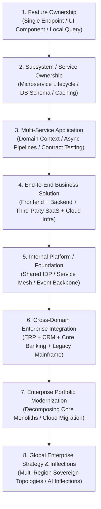

# The Architecture Experience Ladder: Scope, Blast Radius & Decision Complexity

> **"Architectural seniority is not a function of age; it is a function of the complexity of systems you have successfully delivered and the magnitude of failure you have successfully prevented."**

---

## 1. The 8-Stage Experience Ladder

---

## 2. Detailed Experience Stage Breakdown

### Stage 1: Feature Ownership
* **Typical Scope**: Designing and building a single API endpoint, queue worker, or data migration script.
* **Key Decisions**: Data structures, local validation logic, unit test coverage.
* **Blast Radius**: Local bug caught during pull request review or CI/CD pipeline.
* **Evidence Produced**: Clean pull request, unit tests, local performance benchmark.

### Stage 2: Subsystem / Service Ownership
* **Typical Scope**: Taking full operational ownership of a standalone microservice or database cluster.
* **Key Decisions**: Database table normalization, indexing strategy, cache-aside TTL, connection pooling.
* **Blast Radius**: Service downtime or memory leak impacting immediate consumer services.
* **Evidence Produced**: Low-Level Design (LLD), service runbook, Grafana alert dashboard.

### Stage 3: Multi-Service Application
* **Typical Scope**: Leading technical direction across 3–5 microservices delivering a coherent product area.
* **Key Decisions**: Synchronous vs asynchronous communication, event schema definitions, distributed tracing.
* **Blast Radius**: Inter-service dependency failure, consumer lag backpressure, data desynchronization.
* **Evidence Produced**: High-Level Design (HLD), sequence diagrams, documented ADRs.

### Stage 4: End-to-End Business Solution
* **Typical Scope**: Architecting a complete customer-facing solution spanning mobile apps, APIs, payment gateways, and data stores.
* **Key Decisions**: Multi-tier NFR budgets (p99 latency < 250ms), STRIDE threat modeling, multi-account cloud topologies.
* **Blast Radius**: Customer-facing outage, SLA violation penalties, regulatory compliance breach.
* **Evidence Produced**: Solution Architecture Document (SAD), formal NFR Matrix, Threat Model.

### Stage 5: Internal Platform / Foundational Capability
* **Typical Scope**: Architecting an Internal Developer Platform (IDP), shared telemetry backbone, or API Gateway fabric used by 10+ teams.
* **Key Decisions**: Self-service paved roads, multi-tenant isolation, automated architecture linters.
* **Blast Radius**: Platform-wide developer standstill or cascading failure affecting all engineering teams.
* **Evidence Produced**: Domain Platform Blueprint, corporate Technology Radar updates, CI fitness functions.

### Stage 6: Cross-Domain Enterprise Integration
* **Typical Scope**: Integrating disparate enterprise systems (e.g., Salesforce, SAP S/4HANA, Core Banking) across corporate boundaries.
* **Key Decisions**: API-led connectivity vs event streaming, canonical data models, guaranteed delivery.
* **Blast Radius**: Corrupted financial ledgers, stuck order-to-cash pipelines, failed regulatory audits.
* **Evidence Produced**: Enterprise Integration Design, Canonical Data Schema, Reconciliation Runbook.

### Stage 7: Enterprise Portfolio Modernization
* **Typical Scope**: Leading the multi-year decomposition of a core legacy monolith into modern cloud-native services.
* **Key Decisions**: Strangler Fig routing, dual-write synchronization, database decoupling without downtime.
* **Blast Radius**: Multi-million-dollar project failure, catastrophic data loss, executive escalation.
* **Evidence Produced**: Modernization Strategy Roadmap, TIME Portfolio Scorecard, Cutover Plan.

### Stage 8: Global Enterprise Strategy & Inflections
* **Typical Scope**: Shaping the 5–10 year technology vision and capital allocation for a Fortune 500 enterprise.
* **Key Decisions**: Cloud repatriation, enterprise AI foundational platforms, M&A acquisitions ($100M+).
* **Blast Radius**: Existential corporate obsolescence or massive competitive market disadvantage.
* **Evidence Produced**: 10-Year Technology Vision Whitepaper, Radical Simplification Blueprint, Board Memos.
