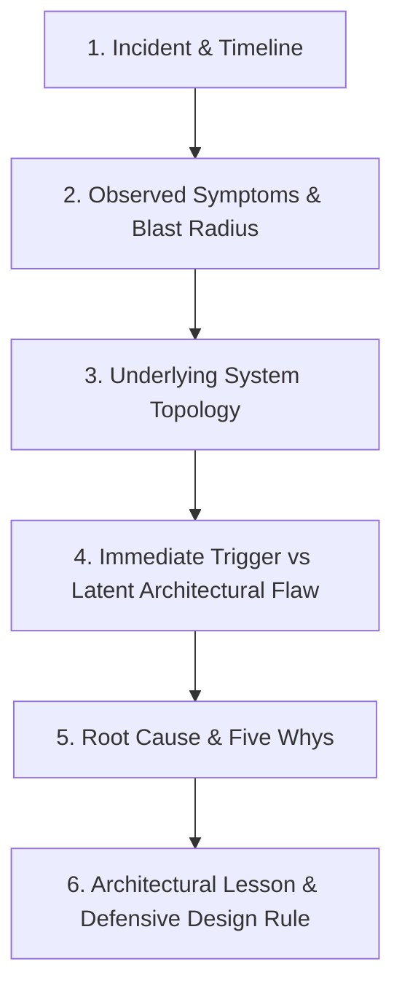

# Incidents as Architecture Training: 5 Deep Forensic Case Studies

> **"A junior engineer studies success stories; a master architect studies catastrophic failures. Production outages are the only unvarnished, empirical feedback on an architecture's true robustness."**

---

## 1. The Incident Forensic Analysis Method

When studying a major production incident, follow this structured forensic inquiry:

---

## 2. Five Deep Forensic Architecture Case Studies

### Study 1: Cascading Cache Collapse & Thundering Herd
* **The Incident**: A global retail platform suffered a 4-hour complete checkout blackout during peak morning traffic.
* **Symptoms**: Redis cluster CPU dropped to 5%; simultaneously, PostgreSQL primary database CPU spiked to 100%, connection pool exhausted, and all API gateways returned HTTP 504 Gateway Timeout.
* **The Underlying Architecture**: Cache-aside pattern where web servers query Redis; on cache miss, all servers query PostgreSQL and populate Redis.
* **The Latent Flaw**: A deployment script updated product pricing at midnight, causing the cache invalidation of 500,000 product keys simultaneously with identical 6-hour TTLs.
* **The Root Cause**: At 6:00 AM, all 500,000 keys expired at the exact same second. 20,000 concurrent web requests suffered simultaneous cache misses, unleashing a "thundering herd" directly against PostgreSQL. The database connection pool collapsed, crashing the primary node.
* **Architectural Lesson**:
  1. **Never use fixed cache TTLs**: Always add randomized jitter ($\pm 20\%$) to cache expiration times.
  2. **Implement Mutual Exclusion (Mutex) on Cache Miss**: Use Redis distributed locks or single-flight libraries so only one worker queries the database on a cache miss while other concurrent requests wait.
  3. **Probabilistic Early Expiration**: Adopt the XFetch algorithm to compute pre-emptive cache re-population before actual expiration.

---

### Study 2: Split-Brain Network Partition & Data Desynchronization
* **The Incident**: A multi-region SaaS payment gateway double-charged 12,000 enterprise accounts during a cross-region fiber-optic cut.
* **Symptoms**: Region A (US-East) and Region B (US-West) both reported operational health, but customers received duplicate transaction confirmation emails.
* **The Underlying Architecture**: Active-Active multi-region relational database with asynchronous bi-directional replication and local auto-incrementing transaction IDs.
* **The Latent Flaw**: The system lacked a distributed consensus protocol or tie-breaker witness node. When the transatlantic private network link severed, both regions assumed the other was offline.
* **The Root Cause**: Region A and Region B both promoted their local database nodes to Primary. Each region accepted writes independently, generating duplicate transaction IDs and conflicting ledger balances that required 4 days of manual database surgery to reconcile.
* **Architectural Lesson**:
  1. **Two Nodes Cannot Form a Quorum**: Distributed consensus strictly requires an odd number of voting nodes ($2F + 1$) or an external cloud arbiter.
  2. **Never Use Asynchronous Replication for Financial Ledgers**: In write-active multi-region financial platforms, use globally consensus-driven databases (e.g., Google Spanner, CockroachDB) or route all writes for a specific account partition to a single authoritative region.
  3. **Idempotency Must Be Global**: Transaction idempotency keys must be globally unique (UUIDv7) and checked across all regions.

---

### Study 3: Kafka Consumer Rebalance Storm & Head-of-Line Blocking
* **The Incident**: A logistics tracking platform experienced an 18-hour message processing backlog where delivery notifications were delayed until the next morning.
* **Symptoms**: Kafka cluster was healthy, but consumer group lag surged from 500 messages to 14,000,000 messages; consumer pods repeatedly joined and left the group every 5 minutes.
* **The Underlying Architecture**: 30-partition Kafka topic consumed by 30 containerized consumer instances performing third-party SMS webhook notifications.
* **The Latent Flaw**: A downstream SMS vendor began rate-limiting HTTP requests, increasing response latency from 80ms to 45 seconds per call.
* **The Root Cause**: Consumer threads were blocked waiting on synchronous HTTP calls. The batch processing time exceeded `max.poll.interval.ms` (300 seconds). The Kafka coordinator assumed the consumer pods had died and triggered a cluster-wide partition rebalance. During rebalancing, message processing stopped entirely. When rebalancing completed, consumers resumed, timed out again, and triggered another rebalance in an infinite loop.
* **Architectural Lesson**:
  1. **Decouple Ingestion from External I/O**: Kafka consumers must read messages from partitions rapidly and hand them off to an internal bounded worker queue or separate dispatch queue.
  2. **Never Make Synchronous External API Calls in the Main Consumer Loop**: Isolate slow external network calls behind circuit breakers and asynchronous HTTP clients.
  3. **Tune Kafka Heartbeat and Poll Timeouts**: Ensure `max.poll.interval.ms` is at least 3x the worst-case batch processing time, and set `max.poll.records` conservatively for external I/O tasks.

---

### Study 4: Expired mTLS Certificate & Global Service Mesh Blackout
* **The Incident**: A tier-1 global banking application suffered a complete global outage across all 180 microservices simultaneously.
* **Symptoms**: All Kubernetes pods were running, CPU and memory were nominal, but 100% of inter-service HTTP and gRPC calls failed with `SSL_ERROR_CERT_EXPIRED` and connection refused.
* **The Underlying Architecture**: Istio service mesh enforcing strict mutual TLS (`STRICT` mode) for all inter-pod communication with cert-manager issuing internal certificates.
* **The Latent Flaw**: The Root Certificate Authority (CA) certificate was issued with a 2-year validity period, and automatic renewal was never tested or monitored.
* **The Root Cause**: At 00:00 UTC on Sunday, the Root CA certificate expired. Every workload certificate in the cluster became instantly untrusted. Because the service mesh operated in `STRICT` mTLS mode, the Envoy sidecars rejected all traffic between every service in the enterprise.
* **Architectural Lesson**:
  1. **Treat Certificates as Ephemeral Infrastructure**: Move to automated 30-day certificate rotation cycles so that certificate issuance and renewal are continuous, battle-tested operational processes.
  2. **Alert on Certificate Expiry at 60, 30, and 7 Days**: Instrument dedicated Blackbox Prometheus metrics monitoring TLS certificate expiration dates across all endpoints.
  3. **Design an Emergency Degradation Path**: Architect a break-glass mechanism (e.g., dynamic mesh policy relaxation to `PERMISSIVE`) to allow emergency unencrypted traffic during root PKI rotation emergencies.

---

### Study 5: Runaway Cloud Auto-Scaling & FinOps Bill Shock
* **The Incident**: A media startup incurred a $260,000 AWS bill over a single weekend for an experimental image processing pipeline that normally cost $800/month.
* **Symptoms**: No user-facing outage occurred, but AWS Budget alerts notified the CFO on Monday morning that compute spend had surged by 3,200%.
* **The Underlying Architecture**: S3 bucket triggering AWS Lambda functions that launched AWS Fargate GPU containers to process uploaded video files.
* **The Latent Flaw**: The Lambda trigger was configured to write processed thumbnail images back into the same S3 bucket with a generic event prefix.
* **The Root Cause**: A deployment modified the S3 event filter from `uploads/` to the bucket root. An image upload triggered Lambda A, which generated a thumbnail and wrote it to S3, which triggered Lambda B, creating an infinite, recursive auto-scaling loop. Fargate auto-scaled to account quotas, spinning up 2,000 concurrent GPU containers processing garbage files in an infinite cycle.
* **Architectural Lesson**:
  1. **Strict Input/Output Bucket Separation**: Never write output artifacts back to the same storage container that triggers ingestion events.
  2. **Hard Auto-Scaling Maximum Limits**: Always configure hard ceiling limits on auto-scaling groups and container tasks, rather than unbounded maximums.
  3. **Automated Cloud Budget Kill-Switches**: Implement AWS Budgets actions or CloudWatch alarms that automatically pause workloads or revoke execution roles if daily spending exceeds 3x baseline.

---

## 3. How to Use These Studies in Your Practice

1. **Conduct an Architectural Post-Mortem Drill**: Review these 5 case studies with your engineering team. Ask: *"Which of our current production services shares this exact failure mode?"*
2. **Review Real-World Case Studies in the Repository**: Deep dive into real-world outage retrospectives in [`19-case-studies/`](../../19-case-studies/README.md).
3. **Incorporate into Architecture Reviews**: Use the lessons above to challenge proposals during Architecture Review Board (ARB) sessions.
