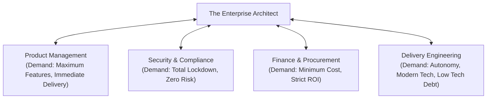

# The 12 Architectural Leadership Experiences: Influence, Consensus & Executive Presence

> **"Architectural leadership is not a title bestowed by HR; it is the demonstrated ability to navigate intense organizational friction, resolve technical deadlocks, align competing executives, and multiply the capability of hundreds of engineers."**

---

## 1. The Leadership Reality Spectrum

An architect operates at the tense intersection of four competing organizational forces:

To succeed, an architect must master these **12 non-negotiable leadership experiences**.

---

## 2. The 12 Core Architectural Leadership Experiences

### Experience 1: Mentoring and Multiplying Engineers
* **The Challenge**: A senior engineer writes brilliant code but struggles to decompose large initiatives or communicate with product managers.
* **The Leadership Playbook**:
  1. Pair with the engineer to co-author an HLD using [`16-architecture-deliverables/HLD-TEMPLATE.md`](../../16-architecture-deliverables/HLD-TEMPLATE.md).
  2. Have the engineer lead the architecture review meeting while you observe silently in the background, intervening only if the meeting derails.
  3. Conduct an immediate 1-on-1 debrief highlighting their strengths and providing actionable feedback on executive presence.

### Experience 2: Leading High-Stakes Design Reviews Without Ego
* **The Challenge**: An architecture review deteriorates into an ideological shouting match between engineers defending their personal favorite frameworks.
* **The Leadership Playbook**:
  1. Re-anchor the room immediately on the business problem and immutable NFR budgets: *"Let's pause. We are not choosing what is cool; we are determining how to satisfy 10,000 QPS under a $5,000/month budget."*
  2. Frame every disagreement as an explicit trade-off matrix on a whiteboard rather than an emotional argument.
  3. Document the consensus in an ADR using `python 21-architecture-tools/generators/adr_generator.py`.

### Experience 3: Resolving Irreconcilable Technical Deadlocks
* **The Challenge**: Two senior tech leads have reached a complete stalemate (e.g., GraphQL vs REST) and progress on a $5M initiative has stalled for 3 weeks.
* **The Leadership Playbook**:
  1. Establish a time-boxed 3-day empirical spike in [`99-experiments/`](../../99-experiments/) with objective evaluation criteria agreed to by both parties upfront.
  2. Measure concrete metrics: latency, payload serialization size, developer onboarding time, and caching overhead.
  3. Review the empirical benchmark data together. Make the final architectural decision based on data, and publicly praise both leads for their rigor.

### Experience 4: Influencing Without Managerial Authority
* **The Challenge**: You need 8 autonomous squads to adopt a standardized authentication and logging SDK, but none of the engineers report to you.
* **The Leadership Playbook**:
  1. Build a "Golden Path" boilerplate that makes adopting the standard 5x faster than writing custom code.
  2. Identify the most respected, vocal tech lead in the organization and partner with their team to co-develop and pilot the SDK.
  3. Use their pilot success as social proof to drive voluntary adoption across the remaining squads.

### Experience 5: Stakeholder Negotiation (Security vs Product vs Cost)
* **The Challenge**: Product demands an instantaneous single-click checkout; Security demands mandatory multi-factor authentication (MFA) on every purchase; Finance demands zero fraud chargebacks.
* **The Leadership Playbook**:
  1. Introduce risk-based adaptive authentication: frictionless single-click checkout for low-risk, trusted devices below $50; step-up biometric/MFA authentication for anomalous IP locations or transactions above $200.
  2. Demonstrate how adaptive architecture satisfies Security's risk policy while protecting Product's conversion rate.

### Experience 6: Technical Debt Prioritization with Finance
* **The Challenge**: The CFO and VP of Product reject an architectural refactoring proposal, demanding that 100% of engineering capacity be spent on new product features.
* **The Leadership Playbook**:
  1. Stop talking about "clean code" or "architectural purity."
  2. Quantify the Cost of Delay: *"Maintaining this legacy billing monolith causes an average of 4 hours of downtime per month, costing $160k in lost transactions and requiring $300k/year in emergency contractor support."*
  3. Frame the refactoring as an investment with a 9-month payback period, securing a permanent 20% capacity allocation for technical debt.

### Experience 7: Architecture Governance & Exception Management
* **The Challenge**: A high-profile product team demands an emergency waiver to bypass the corporate Technology Radar and deploy an unvetted NoSQL database to meet an aggressive deadline.
* **The Leadership Playbook**:
  1. Do not flatly say "No" (the Department of No anti-pattern).
  2. Issue a **Time-Boxed Architectural Exception Waiver**: approve the deployment for 90 days with explicit conditions:
     - The team assumes full on-call operational ownership.
     - The team commits to evaluating a permanent migration within 6 months.
     - Document the technical debt and risk exposure in the corporate Risk Register ([`RISK-REGISTER-TEMPLATE.md`](../../16-architecture-deliverables/RISK-REGISTER-TEMPLATE.md)).

### Experience 8: Sev-1 Incident Architectural Command
* **The Challenge**: A core platform failure is causing a multi-million-dollar outage; 30 engineers on the incident bridge are frantically arguing and guessing at root causes.
* **The Leadership Playbook**:
  1. Take architectural command of the bridge: quiet the room and establish clear roles (Triage Commander, Communications Lead, Telemetry Investigator).
  2. Implement an immediate triage hypothesis test: isolate the failing component using circuit breakers or shedding non-critical traffic.
  3. Guide the team through safe mitigation first, leaving deep forensic analysis for the subsequent blameless post-mortem.

### Experience 9: Enterprise Vendor & SaaS Contract Evaluations
* **The Challenge**: An enterprise SaaS vendor offers a slick presentation promising to solve corporate data governance with an expensive $2M multi-year contract.
* **The Leadership Playbook**:
  1. Demand a rigorous 2-week technical Proof of Value (PoV) testing actual enterprise data integration, API rate limits, and latency under load.
  2. Uncover hidden integration liabilities, vendor lock-in terms, and exorbitant data egress fees.
  3. Present an objective Build vs Buy matrix to the CIO, saving $1.5M by licensing a modular component rather than an entire unneeded suite.

### Experience 10: Cross-Squad Organizational Alignment
* **The Challenge**: Two business divisions are independently building redundant notification platforms, resulting in $800k in duplicated engineering effort.
* **The Leadership Playbook**:
  1. Facilitate a joint architecture workshop with the tech leads and directors of both divisions.
  2. Identify the 80% shared core capability (SMS, Email, Push dispatch) and the 20% division-specific business logic.
  3. Formulate a shared platform charter where one team maintains the core engine while both contribute modules, eliminating redundant headcount spend.

### Experience 11: Executive C-Suite & Boardroom Presentations
* **The Challenge**: You have 15 minutes on the Board of Directors or Executive Committee agenda to pitch a $10M cloud modernization program.
* **The Leadership Playbook**:
  1. Use the Pyramid Principle: open immediately with the recommendation and bottom-line business value.
  2. Structure the pitch:
     - Context: Our market is moving 3x faster than our release cycles.
     - Complication: Legacy infrastructure limits deployment frequency to once per quarter and costs $4M/year in maintenance.
     - Solution: Phased modernization reducing annual OpEx by $2.2M and accelerating time-to-market by 70%.
  3. Address risk proactively: outline the phase-gate stopping criteria that protect corporate capital.

### Experience 12: Reversing an Architectural Decision with Intellectual Humility
* **The Challenge**: An architecture you personally designed and advocated for 18 months ago (e.g., fine-grained microservices) is proving too complex and operational costs have ballooned.
* **The Leadership Playbook**:
  1. Set your ego aside completely.
  2. Author a transparent decision review document analyzing why the original assumptions no longer hold based on empirical production telemetry.
  3. Lead the charge to simplify the system (e.g., consolidating microservices back into a modular monolith), demonstrating that true leadership is commitment to business outcomes, not defending one's prior whiteboard drawings.
