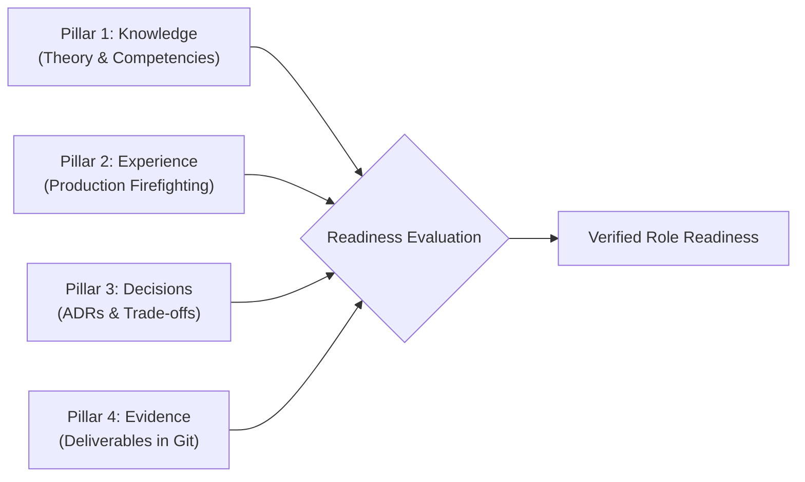

# Architecture Role Readiness Gates & Assessment Framework

> **"Promotion to an architecture role is an assumption of risk. Readiness is not determined by time spent in a chair or certifications collected, but by demonstrated operational competence, decision quality, and an objective evidence portfolio."**

Welcome to the **Readiness Assessment Framework** inside [`24-architect-mastery/`](../README.md). This module establishes rigorous, evidence-based gates to evaluate whether an engineer or architect is truly prepared to step into higher tiers of architectural responsibility.

---

## 1. Master Readiness Framework

* **[Readiness Assessment Framework](./readiness-assessment-framework.md)** — The 4-pillar gate model: Foundational Knowledge, Practical Experience, Decision Quality, and the Evidence Portfolio.

---

## 2. Role-Specific Readiness Gates

Every readiness gate contains explicit thresholds, diagnostic checklists, mandatory evidence portfolio items, and targeted remediation paths:

| Readiness Gate | Target Role Profile | Minimum Artifact Portfolio Required | Direct Link |
| :--- | :--- | :--- | :--- |
| **Senior Engineer Readiness** | Autonomous execution & operational ownership | 2 LLDs, 1 Blameless Post-Mortem, 1 Tuning Benchmark | [Read Gate](./senior-engineer-readiness.md) |
| **Lead Engineer Readiness** | Team multiplier & architectural stewardship | 2 HLDs, 1 Technical Debt Ledger, 3 ADRs | [Read Gate](./lead-engineer-readiness.md) |
| **Solution Architect Readiness** | End-to-end solution design & NFR engineering | 1 Full SAD, 1 NFR Matrix, 1 Threat Model, 5 ADRs | [Read Gate](./solution-architect-readiness.md) |
| **Technical Architect Readiness** | Platform strategy & technology governance | 1 Platform Blueprint, Tech Radar Stewardship | [Read Gate](./technical-architect-readiness.md) |
| **Enterprise Architect Readiness**| Business capability mapping & APM rationalization | 1 Capability Map, 1 TIME Scorecard, 1 Roadmap | [Read Gate](./enterprise-architect-readiness.md) |
| **Principal Architect Readiness** | Organizational leverage & long-term tech strategy | 10-Year Vision Whitepaper, Simplification Blueprint | [Read Gate](./principal-architect-readiness.md) |

---

## 3. The 4-Pillar Readiness Verification

---

## 4. Related Architecture Mastery Modules

* **[Career Progression & Transition Playbooks](../career/README.md)** — Step-by-step guides navigating each career leap.
* **[Competency Models & Matrices](../skill-matrix/README.md)** — 16-competency matrix evaluated from L0 to L5.
* **[Time-Boxed Development Plans](../development-plans/README.md)** — Actionable 90-day, 6-month, and 12-month development roadmaps.
* **[Practical Experience & Evidence](../practical-experience/README.md)** — Real-world apprentice projects and decision dilemmas.
