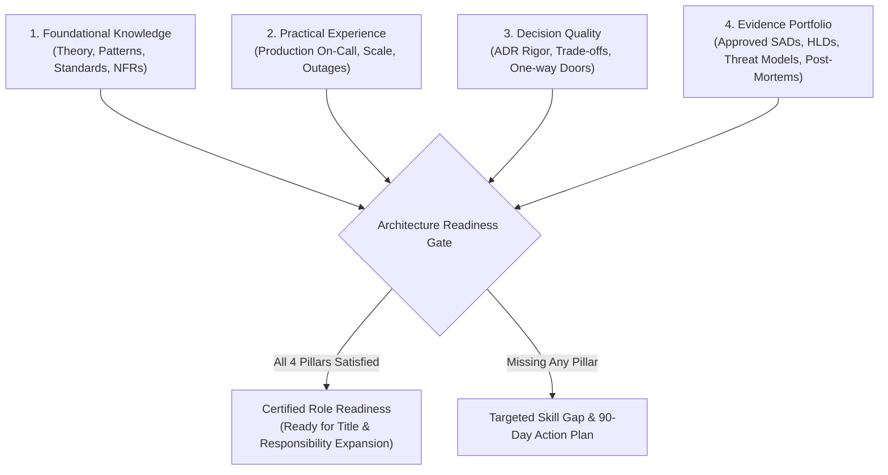

# Architecture Readiness Assessment Framework: The Multi-Pillar Gate Model

> **"Readiness for an architecture role is never demonstrated by years on a resume or certificates on a wall. It is determined by the intersection of four objective pillars: Technical & Systemic Knowledge, Practical Operational Experience, Demonstrated Decision Quality, and a Verifiable Architecture Evidence Portfolio."**

---

## 1. The 4-Pillar Readiness Model

Promoting an engineer to an architecture position based solely on coding speed or academic knowledge frequently leads to catastrophic failures in production. The **Architecture Readiness Gate** mandates evidence across four distinct pillars:

### The 4 Pillars Defined:
1. **Foundational Knowledge**: Mastery of distributed systems theory, networking, security baselines, and architectural patterns (evaluated via the [`16-Competency Master Matrix`](../skill-matrix/architect-competency-matrix.md)).
2. **Practical Experience**: Battle testing under production conditions—on-call rotations, incident post-mortems, legacy refactoring, and multi-team coordination.
3. **Decision Quality**: The ability to evaluate competing options, explicitly document what is sacrificed, and defend architectural choices under pressure using [`DECISION-MAKING-FRAMEWORK.md`](../../DECISION-MAKING-FRAMEWORK.md).
4. **Evidence Portfolio**: Concrete, written artifacts—not vague claims. Approved HLDs, SADs, ADRs, and post-mortems stored in version control.

---

## 2. Role-Specific Readiness Thresholds

To pass a readiness gate, a candidate must satisfy the minimum threshold across all four pillars:

| Target Role | Min Competency Level | Minimum Operational Experience | Minimum Decision Evidence | Minimum Artifact Portfolio Required |
| :--- | :---: | :--- | :--- | :--- |
| **Senior Engineer** | L2 across core, L3 in primary stack | 6+ months on-call; 2+ live incidents triaged | 2+ component trade-off memos | 2 approved LLDs; 1 blameless post-mortem |
| **Lead Engineer** | L3 across engineering pillars | Led 1+ multi-month epic; 1+ DR / chaos drill | 3+ documented ADRs | 2 approved HLDs; 1 technical debt roadmap |
| **Solution Architect** | L3–L4 across systems & data | Led end-to-end integration across 3+ systems | 5+ peer-reviewed ADRs; TCO model | 1 approved SAD; 1 formal NFR Matrix; 1 Threat Model |
| **Technical Architect** | L4 across platform & integration | Architected 1+ shared platform used by 3+ teams | Decommissioned 1 major legacy tech | 1 approved Platform Blueprint; Tech Radar contributions |
| **Enterprise Architect**| L4–L5 in governance & business | Led portfolio rationalization saving $1M+ | M&A due diligence; CapEx/OpEx models | 1 Business Capability Map; 1 TIME Portfolio Scorecard |
| **Principal Architect** | L5 in strategy & leadership | Guided 1,000+ engineers through major shift | Company-wide strategic technology bets | 10-Year Tech Vision; Radical Simplification Blueprint |

---

## 3. The Objective Evidence Portfolio Rule

> **"If an architectural achievement cannot be inspected in Git, it cannot be used as evidence of readiness."**

A candidate's portfolio must contain artifacts created with the repository's standard templates and CLI generators:
* **Architecture Decision Records**: Generated via `python 21-architecture-tools/generators/adr_generator.py`.
* **NFR Matrices**: Generated via `python 21-architecture-tools/generators/nfr_matrix_generator.py`.
* **Deliverable Packages**: Formatted to [`16-architecture-deliverables/`](../../16-architecture-deliverables/README.md) standards.
* **Diagrams**: Compliant with C4 Container and Component standards in [`17-diagrams/`](../../17-diagrams/README.md).

---

## 4. Role-Specific Readiness Guides

Detailed checklists and evaluation rubrics for each career tier:

1. [`senior-engineer-readiness.md`](./senior-engineer-readiness.md) — Autonomous service delivery and operational ownership.
2. [`lead-engineer-readiness.md`](./lead-engineer-readiness.md) — Team multiplier, design stewardship, and cross-team alignment.
3. [`solution-architect-readiness.md`](./solution-architect-readiness.md) — Business problem decomposition, NFR engineering, and SAD defense.
4. [`technical-architect-readiness.md`](./technical-architect-readiness.md) — Shared platforms, cross-application consistency, and technology lifecycle.
5. [`enterprise-architect-readiness.md`](./enterprise-architect-readiness.md) — Business capability mapping, portfolio rationalization, and capital allocation.
6. [`principal-architect-readiness.md`](./principal-architect-readiness.md) — Organizational leverage, existential tech strategy, and executive counsel.
