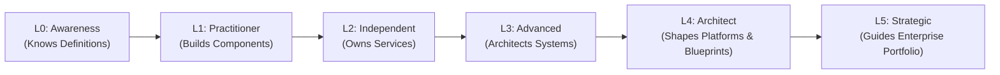

# Architect Competency Matrices, Skill Models & Assessment Rubrics

> **"Architectural capability is multidimensional. Technical mastery is a prerequisite, but architectural impact requires business acumen, leadership influence, and operational rigor."**

Welcome to the **Skill Matrix & Competency Model** directory inside [`24-architect-mastery/`](../README.md). This module provides concrete, behaviorally anchored rubrics to evaluate engineering and architectural capability across the entire technical leadership spectrum.

---

## 1. Master Competency & Skill Guides

* **[16-Competency Master Matrix (L0–L5)](./architect-competency-matrix.md)** — Exhaustive evaluation matrix mapping 6 technical tiers (Senior Engineer through Principal Architect) across 16 core competencies.
* **[Technology Breadth Matrix](./technology-breadth-matrix.md)** — Framework distinguishing superficial Knowledge vs Hands-On Experience vs Architectural Judgment across 10 modern enterprise domains.
* **[Architecture Maturity Rubric](./architecture-maturity-rubric.md)** — Diagnostic behavioral assessment across Decision Quality, Ambiguity Tolerance, Risk Mitigation, Scope, and Executive Influence.
* **[4-Quadrant Skill Matrix & Diagnostic Self-Assessment](./architect-skill-matrix-and-self-assessment.md)** — Foundation diagnostic model organizing skills across Technical Depth, Business Strategy, Leadership, and Operational Rigor.

---

## 2. The 6-Tier Capability Progression

---

## 3. Related Architecture Mastery Modules

* **[Career Progression & Transition Playbooks](../career/README.md)** — Step-by-step transition guides from Engineer to Principal Architect.
* **[Personal Operating System](../personal-operating-system.md)** — The Master Architect's operational rhythm and decision journaling.
* **[Enterprise Architecture Maturity Model](../maturity-model/enterprise-architecture-maturity-model.md)** — Organizational architecture maturity benchmarks.
* **[Architecture Review Methodology](../architecture-review/README.md)** — 7-pillar evaluation rubric for production architectures.
