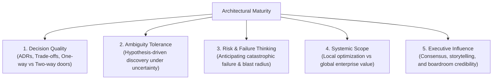

# Architecture Maturity Rubric: Behavioral Assessment Across 5 Dimensions

> **"Maturity is reflected in behavior under pressure: how an architect frames problems, tolerates ambiguity, evaluates risk, makes decisions, and communicates with stakeholders."**

---

## 1. The 5 Core Behavioral Dimensions

While technical skills define what an architect knows, architectural maturity defines **how an architect acts**. This rubric evaluates candidates across five critical behavioral dimensions:

1. **Decision Quality & Trade-Off Rigor**
2. **Ambiguity Tolerance & Problem Framing**
3. **Risk Mitigation & Failure-Mode Thinking**
4. **Scope & Systemic Perspective**
5. **Executive Influence & Conflict Resolution**

---

## 2. Multi-Tier Behavioral Rubric

| Level | 1. Decision Quality | 2. Ambiguity Tolerance | 3. Risk & Failure Thinking | 4. Scope & Perspective | 5. Executive Influence |
| :---: | :--- | :--- | :--- | :--- | :--- |
| **Level 1 (Novice)** | Chooses technologies based on familiarity or popularity; documents decisions informally or not at all. | Paralyzed by incomplete requirements; demands exact specifications before starting. | Assumes happy-path execution; treats errors as exceptional edge cases. | Focuses strictly on own code and immediate sprint tasks. | Communicates exclusively in technical jargon; struggles to justify work to non-engineers. |
| **Level 2 (Competent)** | Compares two options; understands basic pros/cons; writes basic design notes. | Asks clarifying questions; identifies obvious missing functional requirements. | Implements standard try/catch blocks and basic alerts; aware of single points of failure. | Considers upstream and downstream services within the immediate team's boundary. | Presents clear technical demos to product owners and immediate peers. |
| **Level 3 (Proficient)** | Formulates 3+ options; writes formal ADRs using [`21-architecture-tools/generators/adr_generator.py`](../../21-architecture-tools/generators/adr_generator.py); documents explicit sacrifices. | Deconstructs ambiguous business goals into measurable NFR budgets and technical hypotheses. | Designs defensive architectures: circuit breakers, rate limiters, idempotent receivers, and DLQs. | Optimizes for the entire end-to-end business solution across multiple squads. | Explains technical trade-offs to Product Managers and Directors using cost and timeline implications. |
| **Level 4 (Master)** | Distinguishes one-way from two-way doors; acts decisively on reversible decisions; conducts empirical spikes for irreversible choices. | Comfortable operating in uncharted problem spaces; designs evolutionary architectures that preserve future optionality. | Conducts pre-mortems and chaos engineering drills; designs multi-region disaster recovery and blast-radius bulkheads. | Thinks across enterprise platforms, cross-application consistency, and long-term technical debt. | Commands respect across engineering leads; aligns conflicting VPs; authors 1-page executive memos. |
| **Level 5 (Strategic)** | Makes multi-million dollar capital bets with probabilistic models; knows when to reverse decisions with intellectual humility. | Shapes corporate vision in markets undergoing disruptive transformation; transforms ambiguity into strategic competitive advantage. | Anticipates systemic, industry-wide, and regulatory risks (cyber resilience, antitrust, technological obsolescence). | Optimizes the entire corporate technology portfolio, capital allocation, and M&A integration. | Advises the CEO, CFO, and Board of Directors; shapes global industry standards and engineering culture. |

---

## 3. Detailed Dimension Rubrics & Diagnostic Questions

### Dimension 1: Decision Quality & Trade-Off Rigor
* **The Anti-Pattern**: Choosing a technology because a major tech blog wrote about it, or writing an ADR that lists only benefits while claiming "no drawbacks."
* **Diagnostic Assessment Questions**:
  1. *Can you describe a major architecture decision where you chose an option you personally disliked because it better fit the business constraints?*
  2. *What is an example of an architectural decision you made that turned out to be wrong, and how did you discover and reverse it?*
  3. *How do you distinguish between a decision that requires a 3-week proof-of-concept versus one that can be decided in 10 minutes?*

### Dimension 2: Ambiguity Tolerance & Problem Framing
* **The Anti-Pattern**: Demanding that the business provide perfect, immutable specifications before starting architecture work, or stalling indefinitely due to fear of uncertainty.
* **Diagnostic Assessment Questions**:
  1. *When an executive says 'we need an enterprise AI platform by Q3,' how do you unpack that vague mandate into concrete architecture milestones?*
  2. *How do you design a system when you know the business model will pivot within the next 18 months?*
  3. *What mechanisms do you put in place to validate architectural assumptions early?*

### Dimension 3: Risk Mitigation & Failure-Mode Thinking
* **The Anti-Pattern**: Designing whiteboard diagrams with green boxes and straight arrows, assuming network connections are instant, free, and 100% reliable.
* **Diagnostic Assessment Questions**:
  1. *If your primary database suffers a split-brain condition or total datacenter loss during peak traffic, exactly what does the user experience?*
  2. *How do you prevent a downstream dependency failure from causing a cascading outage across the entire platform?*
  3. *What is your process for conducting an architectural pre-mortem?*

### Dimension 4: Scope & Systemic Perspective
* **The Anti-Pattern**: Optimizing a single microservice's performance to extreme degrees while ignoring that the overall end-to-end transaction is bottlenecked by a legacy ERP.
* **Diagnostic Assessment Questions**:
  1. *How do your architectural choices impact the cognitive load of junior developers on other squads?*
  2. *How do you evaluate whether a capability should be built into a core shared platform versus left in a product-specific service?*
  3. *What does this architecture cost the enterprise over 5 years when factoring in labor, cloud spend, and licensing?*

### Dimension 5: Executive Influence & Conflict Resolution
* **The Anti-Pattern**: Attempting to win architectural debates by citing obscure academic papers, pulling rank, or escalating to management when peers disagree.
* **Diagnostic Assessment Questions**:
  1. *How do you persuade a product leader who wants to cut corners on security and disaster recovery to meet a marketing deadline?*
  2. *Describe a situation where two senior tech leads had irreconcilable architectural visions. How did you guide them to consensus?*
  3. *How do you communicate a severe technical debt liability to a Chief Financial Officer who does not know what a database is?*

---

## 4. Operational Self-Assessment Guide

To use this rubric for career development or performance evaluations:
1. Score yourself or your mentee across each of the 5 dimensions on the L1–L5 scale.
2. For any score above L2, **require verifiable evidence** (e.g., specific ADRs, post-mortems, design documents, or executive memos).
3. Identify the lowest-scoring dimension—this is your primary growth constraint (the Theory of Constraints applied to career development).
4. Formulate a 90-day targeted action plan to elevate that specific dimension.
