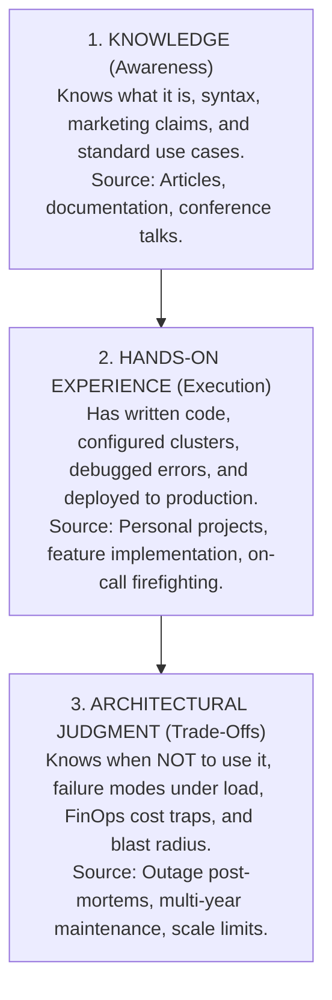

# Technology Breadth Matrix: The T-Shaped & Pi-Shaped Architect

> **"The goal of architectural breadth is NOT to master 100 different technologies. It is to develop enough structured breadth to evaluate architectural alternatives intelligently, spot hidden trade-offs, and prevent vendor or framework lock-in."**

---

## 1. The Three Tiers of Technical Competency

A common failure mode for aspiring architects is confusing superficial familiarity with architectural judgment. This matrix distinguishes three distinct tiers:

* **Knowledge**: Can explain that Kafka is a distributed event log.
* **Hands-on Experience**: Can write a Kafka producer/consumer in Java and configure topic partitions.
* **Architectural Judgment**: Knows when Kafka is an operational anti-pattern compared to PostgreSQL + RabbitMQ; understands consumer rebalance storms, disk page-cache saturation under random reads, and the total operational cost of a 10-node ZooKeeper/KRaft cluster.

---

## 2. Multi-Domain Technology Breadth Matrix

An Enterprise Solution Architect should maintain deep competence (Pi-shaped or Comb-shaped) in 2–3 core domains, while maintaining **Tier 3 (Architectural Judgment)** across all major enterprise categories:

| Domain | Key Technologies / Paradigms | Tier 1: Knowledge Expectation | Tier 2: Hands-On Expectation | Tier 3: Architectural Judgment (What You Must Know) |
| :--- | :--- | :--- | :--- | :--- |
| **Backend Runtimes** | Java (Spring/Quarkus), .NET Core, Python (FastAPI), Node.js / Go | Memory model, garbage collection types, concurrency paradigms. | Building REST APIs, connecting to DBs, writing async workers. | Memory footprint at scale, cold start latency in serverless, JIT vs AOT trade-offs, CPU core utilization under heavy I/O vs compute. |
| **Frontend & Mobile** | React, Angular, Vue, Next.js, React Native, Native iOS/Android | Virtual DOM, reactive state, component lifecycles. | Building SPAs, state management (Redux/Zustand), API integration. | Micro-frontend Module Federation blast radius, SSR vs CSR SEO/latency trade-offs, offline-first sync conflicts (CRDTs), mobile secure enclave storage. |
| **Relational Data** | PostgreSQL, MySQL, SQL Server, Oracle | ACID properties, table schemas, B-tree indexes. | Writing complex joins, foreign keys, database migrations. | Lock contention under concurrent writes, connection pool starvation, read-replica replication lag, sharding vs partitioned tables, vacuuming overhead. |
| **NoSQL & Cache** | Redis, DynamoDB, MongoDB, Cassandra, Elasticsearch | Document vs Key-Value vs Wide-Column vs Search indexes. | Key design, querying documents, setting cache TTLs. | Single-partition bottlenecks in DynamoDB, cache invalidation storms, eventual consistency split-brains, memory limits and eviction policies (LRU/LFU). |
| **Event Streaming** | Apache Kafka, RabbitMQ, AWS SQS/SNS, Azure Service Bus | Log-based streams vs message queues, pub/sub. | Publishing messages, consuming with acknowledgement, setting DLQs. | Ordering guarantees across partitions, consumer lag backpressure, head-of-line blocking, idempotency keys, poison pill message poisoning. |
| **Cloud Platforms** | AWS, Azure, Google Cloud Platform (GCP) | Core services (VPC, Compute, Storage, IAM, Managed DB). | Provisioning resources via Terraform, configuring IAM roles. | Cross-AZ and cross-region egress cost traps, cloud provider lock-in points, IAM privilege escalation vectors, managed service quotas and rate limits. |
| **Containers & Platform** | Docker, Kubernetes, Helm, ArgoCD, Istio Service Mesh | Pods, Deployments, Services, Ingress, GitOps. | Writing Dockerfiles, Helm charts, debugging crashed pods. | Sidecar resource overhead in large meshes, control plane split-brain, multi-tenant cluster noisy-neighbor starvation, GitOps drift reconciliation delays. |
| **Security & IAM** | OAuth2, OIDC, SAML 2.0, mTLS, HashiCorp Vault | Token flows, claims, asymmetric encryption, PKI. | Configuring JWT middleware, injecting secrets into pods. | Token revocation and replay attack windows, mTLS certificate renewal rotation failures, KMS throttling limits under high QPS, Zero-Trust network latency. |
| **Observability & SRE**| OpenTelemetry, Prometheus, Grafana, Datadog | Metrics, logs, traces, synthetic monitoring. | Adding instrumentation, writing PromQL queries, creating alerts. | High-cardinality metric storage explosion costs, trace sampling bias, alert fatigue, correlating trace context across asynchronous message boundaries. |
| **AI & LLM Systems** | OpenAI API, vLLM, LangChain, Milvus/Pinecone, Triton | Transformer attention, embeddings, prompt engineering. | Calling LLM APIs, building basic RAG with LangChain. | PagedAttention GPU memory fragmentation, prompt injection vulnerabilities, vector search recall vs latency trade-offs, self-hosted GPU TCO vs token-based SaaS APIs. |

---

## 3. Technology Evaluation Checklist: The 10 Architectural Questions

Before adopting or recommending any technology from this matrix, an architect must answer:

1. **What is the Concrete Problem?**: Does this solve a verified business requirement, or is it engineering boredom?
2. **What is the Team's Operational Maturity?**: Can the team debug, monitor, and operate this at 3:00 AM on Sunday?
3. **What is the Blast Radius?**: If this technology fails, does a single non-critical feature break, or does the entire enterprise halt?
4. **What is the Reversibility (Door Type)?**: Is this a two-way door (easy to swap out) or a one-way door (years of lock-in)?
5. **What are the Explicit Trade-offs?**: What are we sacrificing (latency, simplicity, consistency, budget) to gain this capability?
6. **What are the True FinOps Costs?**: What does this cost at 10x current scale including licensing, compute, network egress, and engineering support?
7. **What are the Known Failure Modes?**: How does this fail when the network degrades, memory runs out, or disk fills up?
8. **What is the Community & Ecosystem Health?**: Is this backed by a stable foundation, or is it a single-vendor open-source project at risk of license changes?
9. **Can Boring Technology Solve This?**: Could we achieve 80% of this value using our existing PostgreSQL database or standard queue?
10. **What is the Exit Strategy?**: How will we migrate away from this technology 5 years from now?

---

## 4. Cross-Repository Breadth Grounding

* **Deep Dive Runtimes**: [`03-backend/`](../../03-backend/README.md) & [`04-frontend/`](../../04-frontend/README.md)
* **Data Deep Dive**: [`06-data/`](../../06-data/README.md)
* **Integration Patterns**: [`07-integration/`](../../07-integration/README.md) & [`14-enterprise-integration/`](../../14-enterprise-integration/README.md)
* **Cloud Topologies**: [`08-cloud/`](../../08-cloud/README.md)
* **Security Baselines**: [`10-security/`](../../10-security/README.md)
* **Corporate Tech Radar**: [`TECHNOLOGY-RADAR.md`](../../TECHNOLOGY-RADAR.md)
