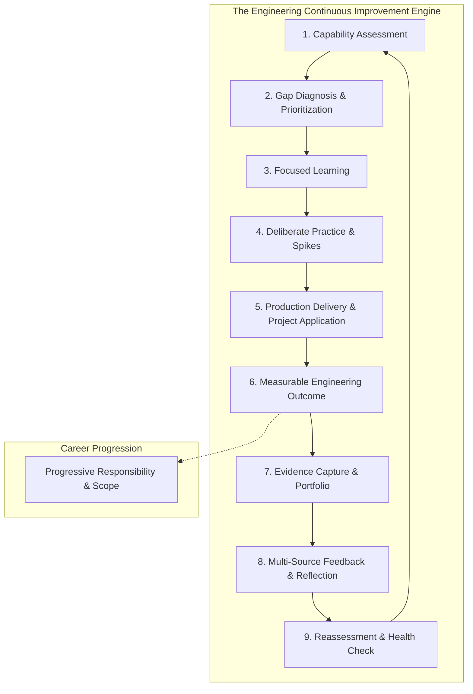
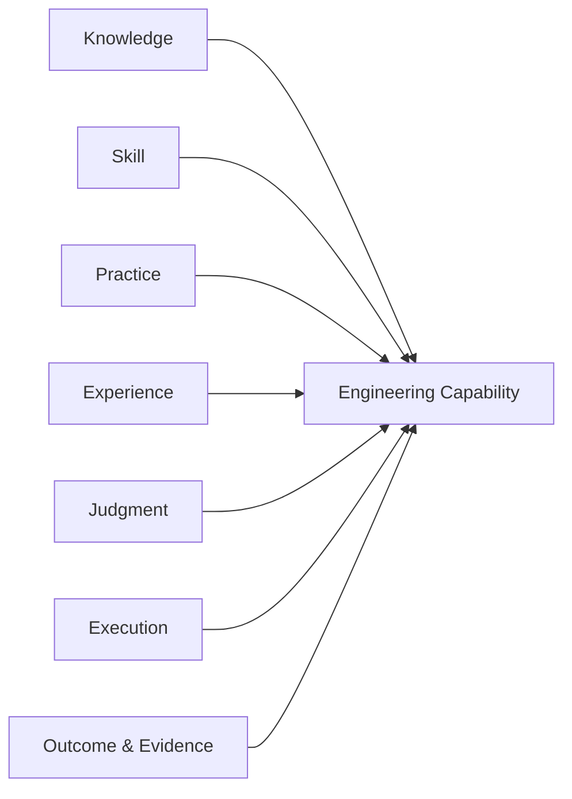
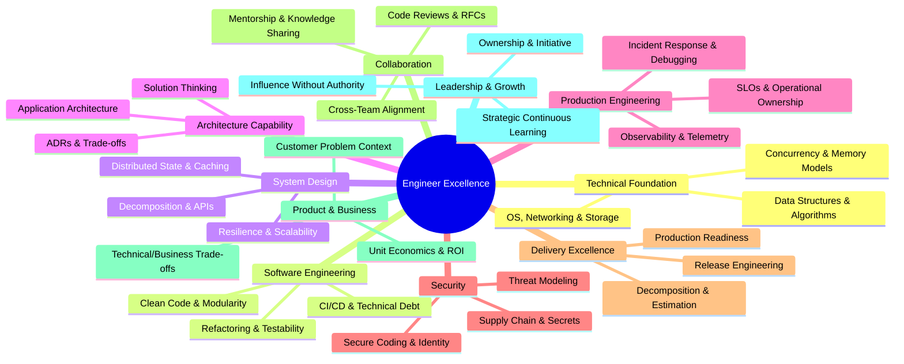
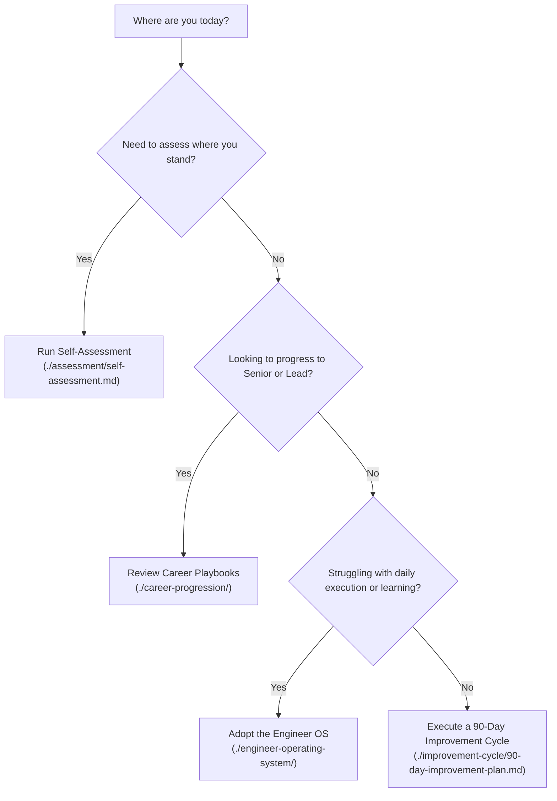

# 25. Software Engineer Excellence & Continuous Improvement Operating System

> **"Engineering capability is not measured by the certificates you hold or the years you have sat at a desk. It is measured by your ability to diagnose complex problems, execute defensible solutions, operate reliably in production, and continuously elevate the capability of your team."**

Welcome to **Domain 25 — Software Engineer Excellence**, the continuous improvement engine of the `enterprise-architecture-handbook`.

---

## 1. Mission & Philosophy

While domains `00` through `23` provide reference architectures, system patterns, and enterprise domain specifications, and `24-architect-mastery/` develops architectural judgment and strategic governance, **Domain 25 is the personal operating system for software engineers**. 

It transforms professional development from an unstructured, annual review formality into a **continuous, evidence-based engineering feedback loop**.



### What This Domain IS:
- A **practical continuous improvement operating system** built on measurable capability, deliberate practice, and production evidence.
- An **evidence-based growth framework** connecting technical mastery with business outcomes and operational ownership.
- A **bridge to technical leadership and architecture** that prepares software engineers to advance through Senior, Lead, and Architecture tracks.

### What This Domain IS NOT:
- A generic syntax or programming language tutorial (see [00-foundations](../00-foundations/) and [03-backend](../03-backend/)).
- A certification roadmap or course collector checklist.
- A LeetCode-style puzzle repository (see [20-interview-system-design](../20-interview-system-design/)).
- A duplicate of [24-architect-mastery](../24-architect-mastery/) (which focuses on architect-level judgment, executive communication, and enterprise strategy).

---

## 2. The Core Capability Formula

Engineering excellence is not simply knowing syntax. Capability is calculated as:

$$\text{Engineering Capability} = \text{Knowledge} + \text{Skill} + \text{Practice} + \text{Experience} + \text{Judgment} + \text{Execution} + \text{Outcome} + \text{Evidence}$$



| Element | Definition | Real-World Manifestation |
| :--- | :--- | :--- |
| **Knowledge** | Theoretical understanding of computer science and systems. | Explaining memory models, concurrency primitives, or network semantics. |
| **Skill** | Ability to translate knowledge into code and technical assets. | Writing idiomatic, type-safe, concurrent code with zero race conditions. |
| **Practice** | Deliberate repetition under simulated or controlled constraints. | Profiling memory leaks in sandbox environments, katas, bench-testing. |
| **Experience** | Exposure to production failure modes, scale, and operational reality. | Having navigated P1 outages, database failovers, and cascading deadlocks. |
| **Judgment** | Choosing the least bad set of trade-offs under severe constraints. | Deciding whether to adopt eventual consistency vs. distributed transactions. |
| **Execution** | Reliably shipping working, testable, maintainable systems on schedule. | Delivering a zero-downtime migration on time with zero data loss. |
| **Outcome** | Quantifiable business or operational value created by the work. | 40% reduction in P99 latency, \$120K annual cloud cost savings, zero Sev-1s. |
| **Evidence** | Verifiable technical artifacts proving capability and outcomes. | Pull request diffs, ADRs, post-mortem writeups, Grafana dashboards. |

---

## 3. The 10 Dimensions of Engineering Excellence

The framework evaluates and cultivates capability across ten foundational dimensions:



1. **[Technical Foundation](./competency-model/technical-foundations.md)**: Deep understanding of compute, memory, OS kernels, networking, concurrency, and algorithmic efficiency.
2. **[Software Engineering](./competency-model/software-engineering.md)**: Code readability, SOLID principles, testing pyramid, refactoring discipline, and technical debt stewardship.
3. **[System Design](./competency-model/system-design.md)**: Designing distributed, scalable, resilient systems with explicit trade-offs and capacity planning.
4. **[Architecture Capability](./competency-model/architecture.md)**: Progression from component design to solution architecture, writing ADRs, and boundary definition.
5. **[Production Engineering](./competency-model/production-engineering.md)**: Observability, telemetry, SLOs, production troubleshooting, and blameless post-mortems.
6. **[Security](./competency-model/security.md)**: Shift-left security, threat modeling, secret management, defense-in-depth, and supply chain integrity.
7. **[Delivery Excellence](./competency-model/delivery-excellence.md)**: Reliable scoping, incremental delivery, CI/CD automation, and release risk management.
8. **[Collaboration](./competency-model/collaboration.md)**: Rigorous code reviews, RFC design documents, technical mentorship, and cross-team synthesis.
9. **[Product & Business Thinking](./competency-model/business-thinking.md)**: Understanding customer value streams, unit economics, ROI, and commercial constraints.
10. **[Leadership & Growth](./competency-model/leadership.md)**: Extreme ownership, constructive technical influence, psychological safety, and continuous upskilling.

---

## 4. Maturity Levels (L0 to L5)

Capability across every dimension is measured on a standardized 6-level maturity rubric:

```text
L0: Awareness      → Understands vocabulary and concepts theoretically; requires guidance to apply.
L1: Assisted       → Applies principles with pair programming, peer review, and active coaching.
L2: Independent    → Autonomously executes high-quality production work within standard scopes.
L3: Advanced       → Deep mastery; solves ambiguous problems, sets patterns, and mentors others.
L4: Lead           → Directs technical strategy across teams, governs systems, and drives major initiatives.
L5: Strategic      → Defines enterprise-wide paradigms, drives organizational capability, and influences industry.
```

See [maturity-levels.md](./capability-matrix/maturity-levels.md) for full rubric definitions and behavioral anchors.

---

## 5. Domain Structure & Roadmap

```text
25-engineer-excellence/
├── README.md                           # Master manifesto and domain navigation (this file)
│
├── framework/                          # Foundational operating models
│   ├── README.md                       # Framework overview
│   ├── engineer-excellence-framework.md# The comprehensive operating model
│   ├── continuous-improvement-cycle.md # 10-step continuous improvement engine
│   ├── engineering-excellence-model.md # Capability formula and dimension breakdown
│   ├── evidence-based-development.md   # Claim-Practice-Outcome-Evidence framework
│   └── engineering-health-model.md     # Multi-dimensional capability profile & health index
│
├── competency-model/                   # 10 engineering capability dimensions
│   ├── README.md                       # Competency taxonomy overview
│   ├── competency-model.md             # Master competency architecture
│   ├── technical-foundations.md        # Dim 1: Compute, memory, concurrency, networks
│   ├── software-engineering.md         # Dim 2: Craftsmanship, testing, refactoring, debt
│   ├── system-design.md                # Dim 3: Distributed systems, scale, resilience
│   ├── architecture.md                 # Dim 4: Boundaries, ADRs, solution thinking
│   ├── production-engineering.md       # Dim 5: Observability, SLOs, incident response
│   ├── security.md                     # Dim 6: Threat modeling, identity, zero-trust
│   ├── delivery-excellence.md          # Dim 7: Release engineering, estimation, CI/CD
│   ├── collaboration.md                # Dim 8: Code reviews, RFCs, technical influence
│   ├── business-thinking.md            # Dim 9: Unit economics, value streams, product ROI
│   └── leadership.md                   # Dim 10: Ownership, mentoring, technical strategy
│
├── capability-matrix/                  # Role-level matrices and maturity rubrics
│   ├── README.md                       # Matrix index
│   ├── maturity-levels.md              # L0–L5 detailed rubric across all dimensions
│   ├── engineer-capability-matrix.md   # L1–L2 Software Engineer baseline
│   ├── senior-engineer-capability-matrix.md # L2–L3 Senior Engineer expectations
│   ├── lead-engineer-capability-matrix.md   # L3–L4 Lead Engineer expectations
│   └── role-capability-matrix.md       # Unified multi-role comparison matrix
│
├── assessment/                         # Self, peer, and organizational evaluation tools
│   ├── README.md
│   ├── self-assessment.md              # Diagnostic audit questionnaires
│   ├── peer-assessment.md              # 360-degree technical peer review rubric
│   ├── engineering-health-assessment.md# Engineering health scorecard
│   ├── capability-gap-analysis.md      # Gap identification and prioritization matrix
│   └── readiness-assessment.md         # Promotion and scope readiness rubric
│
├── evidence/                           # Verifiable artifact repository & portfolio guidelines
│   ├── README.md
│   ├── engineering-evidence-framework.md # Rules of evidence: validity, recency, depth
│   ├── evidence-types.md               # 12 evidence categories (Code, ADRs, Runbooks, etc.)
│   ├── evidence-quality.md             # Weak vs. strong evidence rubrics
│   └── engineering-portfolio.md        # How to build a defensible technical portfolio
│
├── improvement-cycle/                  # Temporal planning cadences
│   ├── README.md
│   ├── weekly-improvement.md           # Weekly deliberate practice and reflection loop
│   ├── monthly-improvement.md          # Monthly capability review & goal calibration
│   ├── quarterly-improvement.md        # OKRs and skill acquisition sprints
│   ├── 90-day-improvement-plan.md      # Canonical 90-day transformation blueprint
│   └── annual-capability-review.md     # Year-end impact and capability reassessment
│
├── development-plans/                  # Individual development plans (IDPs)
│   ├── README.md
│   ├── individual-development-plan.md  # Core IDP template and structure
│   ├── technical-development-plan.md   # Deepening system design and foundations
│   ├── leadership-development-plan.md  # Developing influence, reviews, and mentorship
│   └── engineer-to-architect-plan.md   # Strategic preparation for architecture transition
│
├── practical-experience/              # Concrete on-the-job experience milestones
│   ├── README.md
│   ├── experience-ladder.md            # Feature -> Service -> System -> Platform progression
│   ├── project-experiences.md          # High-value project profiles to seek out
│   ├── production-experiences.md       # Incidents, on-call, and performance tuning milestones
│   ├── architecture-experiences.md     # First ADRs, system migrations, and RFCs
│   └── leadership-experiences.md       # Leading initiatives, mentoring, and reviews
│
├── challenges/                         # Real-world engineering scenario spikes
│   ├── README.md
│   ├── coding/                         # Concurrent buffer, memory-efficient parsers
│   ├── system-design/                  # Idempotent payment webhook, rate limiter spike
│   ├── performance/                    # GC tuning, database query optimization spike
│   ├── reliability/                    # Circuit breakers, retry with jitter, bulkhead
│   ├── security/                       # Secure credential rotation, JWT validation spike
│   └── observability/                  # Custom metrics, distributed trace context propagation
│
├── feedback/                           # Gathering and utilizing feedback
│   ├── README.md
│   ├── feedback-framework.md           # Constructive feedback models
│   ├── peer-feedback.md                # Actionable peer review mechanisms
│   ├── design-review-feedback.md       # Handling RFC critique constructively
│   └── retrospective-framework.md      # Personal and project retrospectives
│
├── career-progression/                 # Promotion and transition playbooks
│   ├── README.md
│   ├── engineer-to-senior.md           # Moving from task executor to system owner
│   ├── senior-to-lead.md               # Moving from system owner to team multiplier
│   ├── lead-to-solution-architect.md   # Transitioning from code lead to solution architect
│   └── engineering-to-architecture.md  # The overarching mindshift from builder to designer
│
├── engineer-operating-system/          # Daily workflows and cognitive habits
│   ├── README.md
│   ├── daily-engineering-loop.md       # Morning framing, focus blocks, shutdown ritual
│   ├── weekly-engineering-loop.md      # Weekly retrospectives and backlog grooming
│   ├── problem-solving-process.md      # First-principles debugging and problem isolation
│   ├── learning-loop.md                # Reading source code, papers, and tech tracking
│   ├── decision-making.md              # Engineering trade-offs and decision journals
│   └── reflection.md                   # Deliberate journaling for continuous growth
│
└── checklists/                         # Production-grade operational checklists
    ├── README.md
    ├── engineer-checklist.md           # Definition of Done for software engineers
    ├── senior-engineer-checklist.md    # Production readiness and review checklist
    ├── lead-engineer-checklist.md      # Architectural sanity and release checklist
    └── continuous-improvement-checklist.md # Periodic health and learning checklist
```

---

## 6. How to Use This Domain



1. **Conduct an Assessment**: Start with [self-assessment.md](./assessment/self-assessment.md) to benchmark yourself across the 10 dimensions against the [maturity rubric](./capability-matrix/maturity-levels.md).
2. **Diagnose Gaps**: Identify your primary constraint (e.g., L1 in Production Engineering despite being L3 in Technical Foundations).
3. **Build an IDP**: Formulate a targeted 90-day plan using [90-day-improvement-plan.md](./improvement-cycle/90-day-improvement-plan.md).
4. **Practice & Apply**: Engage in deliberate spikes from [challenges/](./challenges/) and apply the principles to real project work.
5. **Capture Evidence**: Record your impact, metrics, and PRs in an [engineering portfolio](./evidence/engineering-portfolio.md).
6. **Cross-Link with Handbook Domains**:
   - For backend patterns $\to$ [03-backend](../03-backend/)
   - For system design $\to$ [02-system-design](../02-system-design/)
   - For observability & telemetry $\to$ [11-observability](../11-observability/)
   - For cloud architecture $\to$ [08-cloud](../08-cloud/)
   - For architectural judgment and strategy $\to$ [24-architect-mastery](../24-architect-mastery/)
