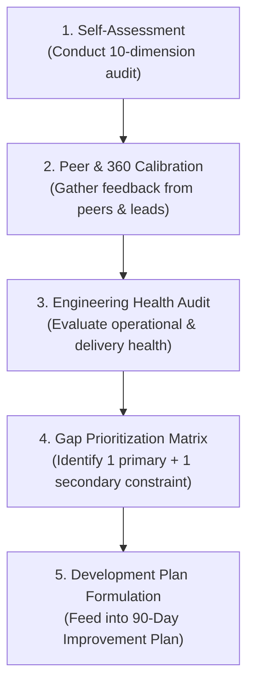

# Engineering Capability Assessment

> **"Self-assessment without diagnostic rigor is mere delusion; peer-assessment without psychological safety is politics. True assessment is the dispassionate calibration of capability against verifiable production reality."**

This directory contains the complete **Assessment & Diagnostic Engine** of **Domain 25 — Software Engineer Excellence**. It provides actionable questionnaires, peer review rubrics, health scorecards, gap prioritization matrices, and promotion readiness evaluations.

---

## Directory Documents

| Document | Focus & Scope | Core Question Answered |
| :--- | :--- | :--- |
| **[self-assessment.md](./self-assessment.md)** | Personal Diagnostic Audit | *Where do I stand today across the 10 dimensions on the L0–L5 maturity rubric?* |
| **[peer-assessment.md](./peer-assessment.md)** | 360-Degree Technical Review | *How do peers, tech leads, and cross-functional partners evaluate my execution, craft, and collaboration?* |
| **[engineering-health-assessment.md](./engineering-health-assessment.md)** | Health Scorecard | *What is the composite health of my engineering practice (technical, operational, delivery, architectural)?* |
| **[capability-gap-analysis.md](./capability-gap-analysis.md)** | Gap Prioritization Matrix | *Which capability gap is my primary constraint, and what is the highest-leverage area to improve next?* |
| **[readiness-assessment.md](./readiness-assessment.md)** | Role Readiness Gates | *Am I objectively ready to advance from Engineer to Senior, Senior to Lead, or Lead to Architect?* |

---

## The Assessment & Diagnostic Workflow

Every assessment in this directory connects directly to the [Maturity Levels Rubric](../capability-matrix/maturity-levels.md) and requires artifact-backed proof outlined in the [Evidence Framework](../evidence/engineering-evidence-framework.md).
