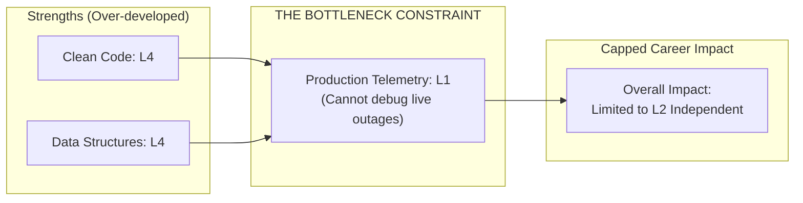
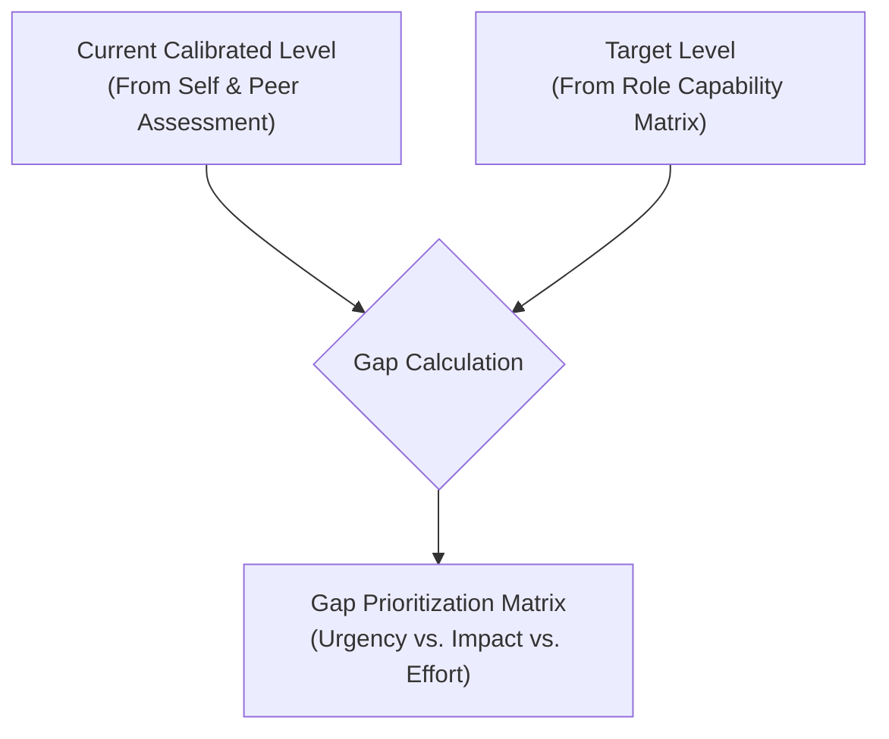

# Capability Gap Analysis & Prioritization Matrix

> **"A chain breaks at its weakest link, not where it is strongest. Your overall engineering impact is capped not by your greatest strength, but by your most neglected blind spot."**

---

## 1. Theory of Constraints in Engineering Capability

Eliyahu Goldratt’s **Theory of Constraints (ToC)** dictates that any manageable system is limited in achieving more of its goals by a very small number of constraints. In software engineering capability, this principle is absolute:



An engineer who is **L4** in coding syntax and algorithms, but **L1** in production operations, cannot be trusted to own critical production services. Improving their coding skill to L5 produces **zero marginal organizational value**. Their primary lever for explosive career growth is elevating their operational constraint from L1 to L2.

---

## 2. The Gap Calculation Formula

For each of the ten dimensions, calculate your capability gap:

$$\mathbf{Gap} = \mathbf{Target\ Level\ (Target\ Role)} - \mathbf{Current\ Calibrated\ Level}$$



### Interpretation of Gap Values:
- **$\mathbf{Gap} \le 0$**: Capability meets or exceeds target role requirements. Keep in **Maintenance Mode** (do not spend primary discretionary learning time here).
- **$\mathbf{Gap} = 1$**: Standard developmental gap. Ideal for a [90-Day Improvement Plan](../improvement-cycle/90-day-improvement-plan.md).
- **$\mathbf{Gap} \ge 2$**: Severe structural deficit. Represents an urgent blocker to promotion or a catastrophic operational risk.

---

## 3. The Gap Prioritization Matrix

When multiple gaps exist, prioritize which capability to cultivate first using the **Urgency vs. Leverage Matrix**:

```mermaid
quadrantChart
    title Gap Prioritization Matrix
    x-axis Low Architectural Leverage --> High Architectural Leverage
    y-axis Low Career Urgency --> High Career Urgency
    quadrant-1 Priority 1: The Core Breakthrough
    quadrant-2 Priority 3: Tactical Hygiene
    quadrant-3 Deprioritize: Distraction / Future
    quadrant-4 Priority 2: Strategic Investment
```

| Quadrant | Description | Action Strategy |
| :--- | :--- | :--- |
| **Quadrant 1: Core Breakthrough** *(High Leverage, High Urgency)* | A gap directly preventing promotion or currently causing production failures (e.g., L1 in System Design for a Senior candidate). | **Primary Goal (70% discretionary effort)** in upcoming 90-day cycle. |
| **Quadrant 4: Strategic Investment** *(High Leverage, Low Urgency)* | Foundational capabilities that compound over years (e.g., mastering eBPF profiling or advanced threat modeling). | **Secondary Goal (30% discretionary effort)** in upcoming 90-day cycle. |
| **Quadrant 2: Tactical Hygiene** *(Low Leverage, High Urgency)* | Small compliance or tooling gaps that need immediate patching (e.g., learning a new team CI syntax). | Fix through quick 1-week tactical sprints or pair programming. |
| **Quadrant 3: Distraction / Defer** *(Low Leverage, Low Urgency)* | Esoteric technologies unrelated to current team architecture or business goals (e.g., learning a 5th frontend framework). | **Strictly Defer**. Protect cognitive bandwidth. |

---

## 4. The Capability Gap Analysis Worksheet

Use this worksheet to document and analyze your gaps:

```markdown
### Engineering Capability Gap Analysis Worksheet

**Engineer Name**: [Candidate Name]
**Current Role**: Software Engineer (L2)
**Target Role**: Senior Software Engineer (L3)
**Evaluation Date**: Q3 2026

| Dimension | Current Level | Target Level | Gap | Priority Quadrant | Recommended Action |
| :--- | :---: | :---: | :---: | :---: | :--- |
| 1. Technical Foundations | L2 | L3 | +1 | Q4: Strategic | Deep-dive memory profiling & concurrency spikes |
| 2. Software Engineering | L3 | L3 | 0 | Maintenance | Maintain high test coverage & review standards |
| 3. System Design | L2 | L3 | +1 | Q1: Core Breakthrough | Design idempotent event-driven payment worker |
| 4. Architecture Capability | L2 | L3 | +1 | Q1: Core Breakthrough | Author 2 major RFCs and component ADRs |
| 5. Production Engineering | L1 | L3 | **+2** | **Q1: URGENT** | Primary on-call shadowing, SLO instrumentation |
| 6. Security & Privacy | L2 | L3 | +1 | Q4: Strategic | Conduct STRIDE threat model on API gateway |
| 7. Delivery Excellence | L2 | L3 | +1 | Q2: Tactical | Adopt progressive canary deployments |
| 8. Collaboration & Influence | L2 | L3 | +1 | Q4: Strategic | Lead 2 architecture review workshops |
| 9. Business & Product | L2 | L3 | +1 | Q4: Strategic | Track cloud FinOps cost for billing service |
| 10. Leadership & Growth | L2 | L3 | +1 | Q1: Core Breakthrough | Drive cross-team service migration initiative |

---

### Selected Priorities for Next 90 Days:

1. **PRIMARY CONSTRAINT (70% Focus)**:
   - **Dimension**: Dimension 5: Production Engineering (Gap: +2)
   - **Target**: Advance from L1 (Assisted) to L2/L3 (Independent On-Call & SLO Definition).
   - **Success Metric**: Define SLIs/SLOs for billing service; complete 4 weeks of secondary on-call with zero escalations; author 1 blameless post-mortem.

2. **SECONDARY CONSTRAINT (30% Focus)**:
   - **Dimension**: Dimension 3: System Design (Gap: +1)
   - **Target**: Advance from L2 to L3 (Idempotent Distributed Systems).
   - **Success Metric**: Author RFC and implement transactional outbox pattern in billing pipeline.
```

Once prioritized, transfer these two focus areas directly into your [90-Day Improvement Plan](../improvement-cycle/90-day-improvement-plan.md).
