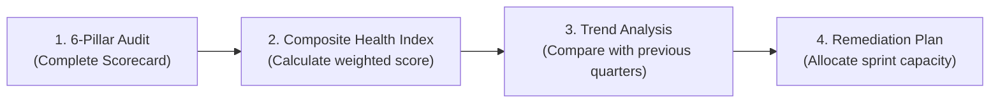
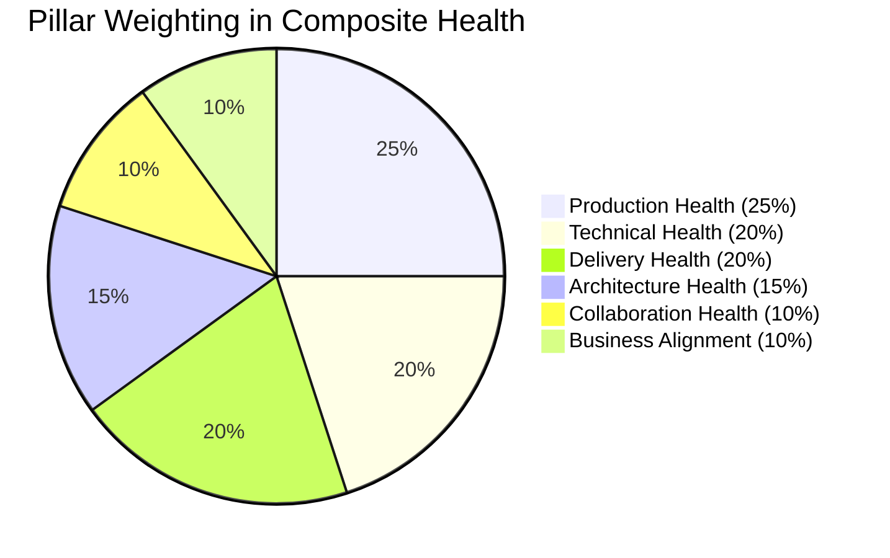

# Engineering Health Assessment Scorecard

> **"You cannot manage what you do not measure, but if you measure the wrong things, you will get exactly what you measured and ruin the engineering culture."**

---

## 1. Overview & Assessment Cadence

The **Engineering Health Assessment** evaluates an individual engineer's or squad's operational sustainability across the six pillars established in the [Engineering Health Model](../framework/engineering-health-model.md). 

It is designed to be completed **monthly** or **quarterly** to detect negative drift (such as creeping technical debt, alert fatigue, or delivery bottlenecks) before they culminate in production outages or developer burnout.



---

## 2. The 6-Pillar Health Scorecard

Score each indicator from **1 (Severe Distress)** to **5 (World-Class Health)**:

### Pillar 1: Technical & Code Health (Weight: 20%)
| Indicator | Description | Score (1–5) |
| :--- | :--- | :---: |
| **Local Feedback Loop** | Unit tests execute locally in $< 60\text{ seconds}$; developer environment spins up in $< 5\text{ minutes}$. | `[ ]` |
| **Test Quality & Coverage** | $> 80\%$ branch coverage on critical domain logic; integration tests use real dependencies via testcontainers; zero flaky tests. | `[ ]` |
| **Code Modularity** | Low cyclomatic complexity; strict separation of domain entities from frameworks; zero circular package dependencies. | `[ ]` |
| **Static Analysis Hygiene** | Linters, SAST tools, and formatters run automatically in CI with zero ignored high/critical warnings. | `[ ]` |
| **Subtotal Pillar 1**: *(Average of 4 indicators)* | | `___ / 5.0` |

### Pillar 2: Production & Operational Health (Weight: 25%)
| Indicator | Description | Score (1–5) |
| :--- | :--- | :---: |
| **SLO / Error Budget** | Services consistently operate within agreed availability and latency SLOs (e.g., 99.9% uptime, P99 $< 50\text{ms}$). | `[ ]` |
| **Telemetry Coverage** | 100% of endpoints emit structured JSON logs, Prometheus metrics (RED), and OpenTelemetry traces. | `[ ]` |
| **Alert Hygiene** | On-call engineers receive $< 3$ alerts per week outside business hours; zero un-actionable or flapping alerts. | `[ ]` |
| **Incident Response & MTTR** | Mean Time To Resolution (MTTR) is $< 30\text{ minutes}$ for Sev-1 incidents; blameless post-mortems published within 48 hours. | `[ ]` |
| **Subtotal Pillar 2**: *(Average of 4 indicators)* | | `___ / 5.0` |

### Pillar 3: Delivery & Release Health (Weight: 20%)
| Indicator | Description | Score (1–5) |
| :--- | :--- | :---: |
| **Batch Size & Lead Time** | Average PR size is $< 250\text{ lines}$; commit-to-production lead time is $< 24\text{ hours}$. | `[ ]` |
| **Trunk-Based Cadence** | Engineers merge code to `main` daily; no branches live longer than 48 hours. | `[ ]` |
| **Deployment Automation** | Deployments are 100% automated via CI/CD with zero manual SSH or manual database scripting. | `[ ]` |
| **Change Failure Rate** | Less than $5\%$ of production deployments require rollback, hotfix, or manual intervention. | `[ ]` |
| **Subtotal Pillar 3**: *(Average of 4 indicators)* | | `___ / 5.0` |

### Pillar 4: Architecture & Design Health (Weight: 15%)
| Indicator | Description | Score (1–5) |
| :--- | :--- | :---: |
| **Documentation & ADRs** | Architecture Decision Records (ADRs) exist for all major decisions; system diagrams (C4 model) are current. | `[ ]` |
| **Boundary Discipline** | Clear bounded contexts; services do not share raw database tables without strict API/event contracts. | `[ ]` |
| **Technical Debt Ratio** | $15\text{--}20\%$ of team sprint capacity is actively allocated to refactoring and debt retirement. | `[ ]` |
| **Evolutionary Seams** | Systems are structured with seams and interfaces allowing major component replacements without full rewrites. | `[ ]` |
| **Subtotal Pillar 4**: *(Average of 4 indicators)* | | `___ / 5.0` |

### Pillar 5: Collaboration & Cultural Health (Weight: 10%)
| Indicator | Description | Score (1–5) |
| :--- | :--- | :---: |
| **PR Review Velocity** | Peer pull requests receive constructive, high-signal reviews within $< 18\text{ hours}$. | `[ ]` |
| **Pedagogical Culture** | Reviews explain *why* alternatives are suggested; engineers actively mentor junior and mid-level peers. | `[ ]` |
| **Psychological Safety** | Outages and failed experiments are analyzed blamelessly; dissenting technical opinions are welcomed. | `[ ]` |
| **Cross-Team Alignment** | API contracts and dependencies with upstream/downstream squads are negotiated without organizational conflict. | `[ ]` |
| **Subtotal Pillar 5**: *(Average of 4 indicators)* | | `___ / 5.0` |

### Pillar 6: Business Alignment & FinOps (Weight: 10%)
| Indicator | Description | Score (1–5) |
| :--- | :--- | :---: |
| **Unit Economics Awareness** | Engineers track cloud cost per transaction or active user; cloud infrastructure is right-sized. | `[ ]` |
| **Customer Problem Focus** | Engineers can articulate the customer problem and business value of their current sprint tickets. | `[ ]` |
| **Pragmatic Trade-offs** | Engineering choices reflect business urgency; technical debt is accepted deliberately when justified. | `[ ]` |
| **Subtotal Pillar 6**: *(Average of 4 indicators)* | | `___ / 5.0` |

---

## 3. Calculating the Composite Health Index (CHI)

$$\mathbf{CHI} = (P_1 \times 0.20) + (P_2 \times 0.25) + (P_3 \times 0.20) + (P_4 \times 0.15) + (P_5 \times 0.10) + (P_6 \times 0.10)$$



### Interpretation & Action Triggers:
- **4.5 – 5.0 (Optimal Health)**: High-performing, sustainable engineering system. Maintain paved roads and share practices with other teams.
- **3.5 – 4.4 (Healthy with Vulnerabilities)**: Solid performance, but 1–2 pillars require attention (e.g., low delivery score due to slow CI pipelines). Allocate 10% of sprint capacity to address the constraint.
- **2.5 – 3.4 (Stressed / At Risk)**: Significant systemic friction. Technical debt, alert fatigue, or delivery delays are degrading team output. Mandate a focused remediation sprint.
- **$< 2.5$ (Critical Distress)**: High probability of cascading outages, severe burnout, and engineer attrition. Halt non-essential feature development to stabilize production and delivery pipelines.

---

## 4. Quarterly Health Remediation Template

```markdown
### Engineering Health Action Plan — Q3 2026

**Target Area**: Pillar 2: Production Health (Score: 2.8 / 5.0)
**Primary Bottleneck**: Alert fatigue from flapping background worker queue alerts.

#### Corrective Actions:
1. Re-instrument worker queue telemetry using RED metrics (Prometheus).
2. Rewrite alerting rules to trigger on SLO breach (queue processing delay $> 15\text{m}$) rather than instantaneous queue size spikes.
3. Author a step-by-step auto-scaling runbook for worker pods.

**Owner**: Lead Engineer / SRE Partner
**Review Date**: End of Sprint 42
**Target Outcome**: Reduce weekly off-hours pages from 14 to $< 2$.
```
