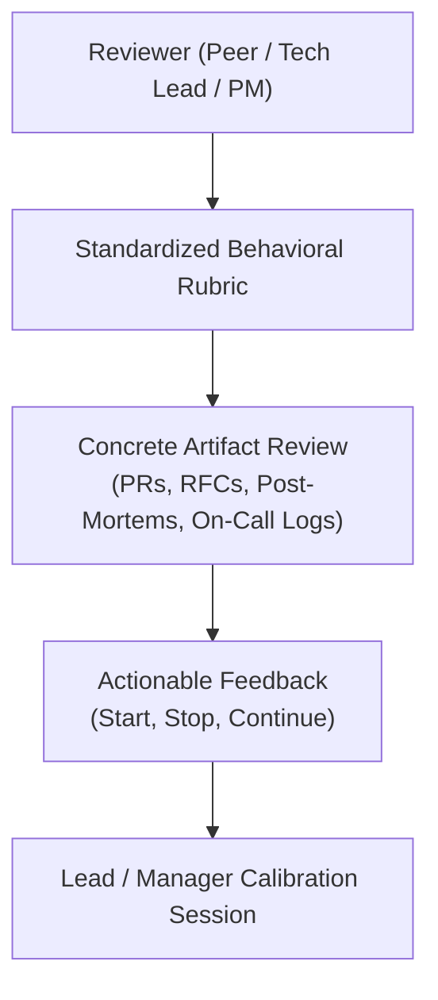
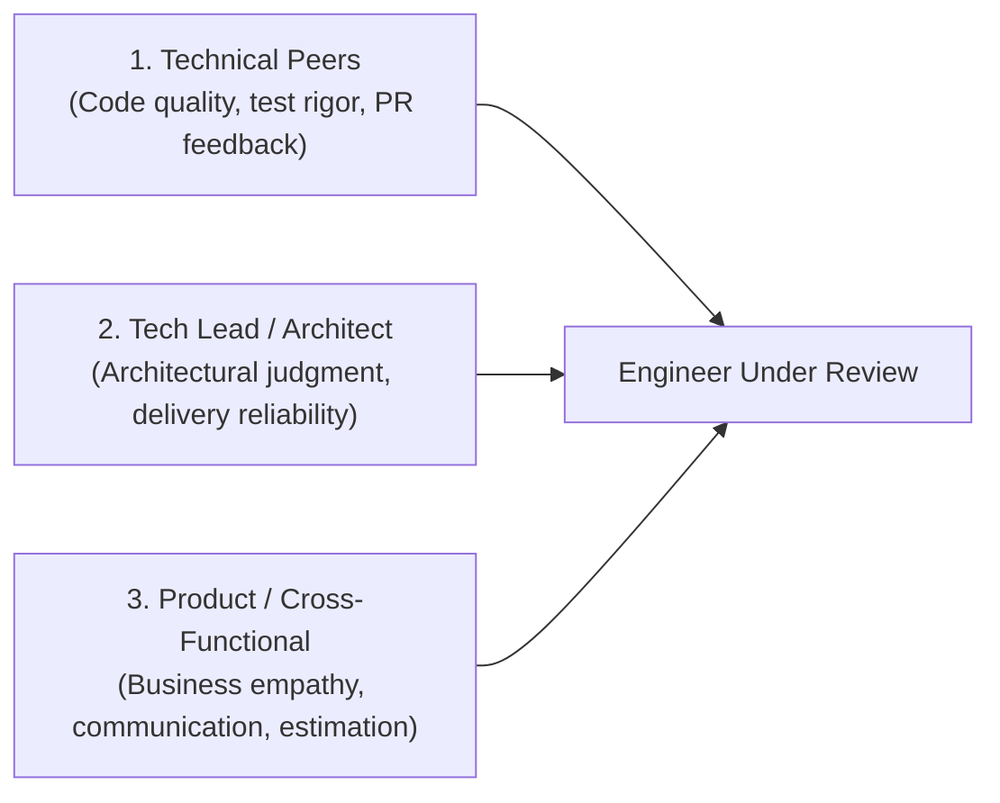

# Engineering Peer Assessment & 360 Review Rubric

> **"A developer's self-perception is often an aspiration; peer review is the reflection of your true operational and architectural impact on the team."**

---

## 1. Principles of Technical Peer Review

Peer assessment in software engineering is frequently corrupted by one of two failure modes:
1. **The Popularity Contest**: Giving top scores to friendly peers without evaluating technical rigor, code quality, or operational ownership.
2. **The Weaponized Review**: Using peer review to punish teammates over minor disagreements, stylistic preferences, or personal friction.

The **Engineering Peer Assessment Rubric** grounds peer feedback in observable engineering behaviors, code artifacts, and operational impact.



---

## 2. The 360-Degree Reviewer Matrix

An engineer should be evaluated across three complementary perspectives:



---

## 3. The Peer Evaluation Questionnaire

Reviewers score the engineer across five core operational quadrants (1 = Strongly Disagree, 5 = Strongly Agree), providing concrete artifact examples for scores below 3 or above 4:

### Quadrant 1: Craft, Testing & Code Quality
- **Q1.1**: The engineer’s code is clean, modular, well-tested, and easy to understand without verbal explanation.
- **Q1.2**: The engineer rarely introduces regressions, unhandled edge cases, or broken builds into `main`.
- **Q1.3**: The engineer designs clean, testable interfaces rather than monolithic tightly coupled blocks.
- *Evidence / Comments*: *(e.g., "In PR #342, Sarah cleanly extracted the payment gateway interface, allowing us to mock it easily in integration tests.")*

### Quadrant 2: Architecture & Problem Solving
- **Q2.1**: The engineer addresses root causes rather than applying superficial band-aids to complex bugs.
- **Q2.2**: The engineer authors clear, defensible ADRs or RFCs before undertaking non-trivial technical changes.
- **Q2.3**: The engineer simplifies architecture where possible, actively avoiding premature over-engineering.
- *Evidence / Comments*: *(e.g., "Alex's RFC on caching saved us from an unnecessary Redis cluster by proving an in-memory Caffeine cache met our SLA.")*

### Quadrant 3: Production & Operational Ownership
- **Q3.1**: The engineer takes active ownership of services in production, proactively monitoring dashboards and alerts.
- **Q3.2**: During production outages, the engineer remains calm, communicates clearly, and focuses on rapid mitigation.
- **Q3.3**: The engineer writes actionable runbooks and thoroughly instruments their code with logs, metrics, and traces.
- *Evidence / Comments*: *(e.g., "During the Postgres deadlock incident, David commanded the triage channel and rolled back the offending migration in 8 minutes.")*

### Quadrant 4: Delivery Discipline & Execution
- **Q4.1**: The engineer decomposes complex epics into small, incrementally deliverable pull requests ($< 250$ lines).
- **Q4.2**: The engineer provides realistic estimates, raises blockers early, and reliably ships on schedule.
- **Q4.3**: The engineer practices trunk-based development, avoiding long-lived, divergent feature branches.
- *Evidence / Comments*:

### Quadrant 5: Collaboration, Mentorship & Culture
- **Q5.1**: The engineer provides thorough, constructive, and educational feedback on peer pull requests.
- **Q5.2**: The engineer actively unblocks teammates, shares domain knowledge, and mentors less experienced engineers.
- **Q5.3**: The engineer is receptive to feedback, handles dissent professionally, and commits to team decisions.
- *Evidence / Comments*:

---

## 4. Qualitative Qualitative Prompts: Start, Stop, Continue

To make peer feedback immediately actionable, every review must conclude with three specific prompts:

```markdown
### Actionable Peer Feedback Summary

**Engineer Under Review**: [Name]
**Reviewer Role**: [Peer Engineer / Tech Lead / Product Manager]

#### 1. What should this engineer CONTINUE doing? (Superpowers)
*Highlight specific behaviors that elevate the team.*
> "Continue driving high-signal code reviews. Your comments on PR #812 catching the race condition in the worker pool taught the entire team how to use sync.RWMutex properly."

#### 2. What should this engineer STOP doing? (Friction Points)
*Highlight habits that slow down delivery or create friction.*
> "Stop keeping PRs open for 5 days while adding extra features. Split the refactoring from the feature so we can review and deploy incrementally."

#### 3. What should this engineer START doing? (Growth Opportunities)
*Highlight stretch opportunities for advancement to the next maturity level.*
> "Start taking the lead on drafting RFCs for our service migrations. You have the technical depth; now practice driving cross-squad consensus."
```

---

## 5. Peer Review Synthesis & Triangulation

Managers and Tech Leads should synthesize peer feedback alongside self-assessments to identify blind spots:

```mermaid
quadrantChart
    title The Johari Window of Engineering Capability
    x-axis Low Self-Rating --> High Self-Rating
    y-axis Low Peer-Rating --> High Peer-Rating
    quadrant-1 Blind Spot (High Self, Low Peer)
    quadrant-2 Hidden Strength (Low Self, High Peer)
    quadrant-3 Clear Gap (Low Self, Low Peer)
    quadrant-4 Proven Mastery (High Self, High Peer)
```

- **Blind Spot (High Self, Low Peer)**: The engineer believes they are advanced in System Design, but peers report frequent bugs and uncoordinated API breaking changes. $\to$ *High-priority coaching intervention.*
- **Hidden Strength (Low Self, High Peer)**: The engineer rates themselves L1 in leadership, but peers actively cite their mentoring and clear documentation as vital to their success. $\to$ *Encourage engineer to take on formal tech lead responsibilities.*
