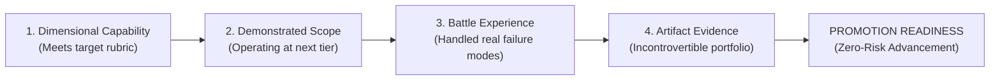

# Career & Role Readiness Assessment

> **"A promotion is not a reward for past loyalty; it is a formal acknowledgment that an engineer has already been performing at the next level consistently, predictably, and with verifiable evidence for at least six months."**

---

## 1. The Readiness Principle

In high-performing engineering organizations, promotions are never speculative. An organization cannot afford to promote an engineer to Senior or Lead based on an unverified hope that their capability will magically expand after receiving the title. 

Readiness is evaluated through the **Readiness Formula**:

$$\mathbf{Readiness} = \mathbf{Capability\ (L0\text{--}L5)} \times \mathbf{Scope} \times \mathbf{Experience} \times \mathbf{Judgment} \times \mathbf{Evidence}$$



---

## 2. The 3 Canonical Promotion Gates

### Gate 1: Software Engineer $\to$ Senior Software Engineer (L2 $\to$ L3)
- **Primary Transition**: From **Feature Executor** to **Subsystem Owner & Force Multiplier**.
- **Scope Expansion**: From single classes/endpoints to entire microservices and domain pipelines in production.
- **Critical Proof Requirement**:
  - Independent operational ownership of a production service over 6+ months.
  - Demonstrated ability to resolve extreme ambiguity without senior handholding.
  - Successfully acted as Incident Commander or Lead Investigator during a Sev-1 outage.
  - Authored at least 1 accepted RFC and component ADR.
  - Verifiable evidence of mentoring at least 1 junior/mid engineer to independence.

### Gate 2: Senior Engineer $\to$ Lead / Staff Engineer (L3 $\to$ L4)
- **Primary Transition**: From **Subsystem Master** to **Multi-Team Technical Leader & Paved Road Architect**.
- **Scope Expansion**: From a single squad's backlog to cross-cutting platform standards across 3+ squads.
- **Critical Proof Requirement**:
  - Steered a major technical initiative spanning multiple teams with zero organizational authority.
  - Built or championed a paved road / golden path adopted across 5+ services.
  - Authored cross-cutting technical standards (e.g., event envelope format, authentication migration).
  - Sponsored and coached at least two engineers to Senior Engineer promotion.
  - Delivered measurable business ROI ($50K+ FinOps savings or major scalability unlock).

### Gate 3: Lead Engineer $\to$ Solution / Technical Architect (L4 $\to$ Domain 24)
- **Primary Transition**: From **Code & Platform Leader** to **Enterprise System Designer & Strategic Advisor**.
- **Scope Expansion**: From engineering implementation to multi-year technology roadmaps, executive alignment, and enterprise systems-of-systems.
- **Connection to Domain 24**: The candidate transitions to the governance, trade-off, and executive communication frameworks detailed in [24-architect-mastery/readiness/](../../24-architect-mastery/readiness/).

---

## 3. Readiness Evaluation Rubric: The 4 Pillars

To assess readiness, the candidate and their engineering manager evaluate performance across four foundational pillars:

```mermaid
quadrantChart
    title The 4 Pillars of Role Readiness
    x-axis Internal Technical Rigor --> External Organizational Impact
    y-axis Operational Execution --> Strategic Design
    quadrant-1 Pillar 2: Architectural Scope & ADRs
    quadrant-2 Pillar 1: Craft & Systemic Depth
    quadrant-3 Pillar 3: Production & Operational Ownership
    quadrant-4 Pillar 4: Leadership & Multiplier Effect
```

| Pillar | Software Engineer (L2) Benchmark | Senior Engineer (L3) Benchmark | Lead / Staff Engineer (L4) Benchmark |
| :--- | :--- | :--- | :--- |
| **Pillar 1: Craft & Depth** | Writes clean, tested code; low bug escape rate; understands data structures. | Solves complex concurrency, memory leaks, and performance regressions. | Establishes company-wide language, runtime, and linting standards. |
| **Pillar 2: Architectural Scope** | Implements clean architecture within features; drafts local ADRs. | Owns subsystem architecture; writes comprehensive RFCs and ADRs. | Governs multi-service topologies, paved roads, and cross-team contracts. |
| **Pillar 3: Production Ownership** | Instruments logs/metrics; secondary on-call; resolves standard alerts. | Defines SLOs/error budgets; acts as Incident Commander; authors post-mortems. | Architects observability platforms; leads chaos drills; drives down MTTR across squads. |
| **Pillar 4: Multiplier Effect** | Gives constructive PR reviews; shares learnings with team. | Mentors junior/mid engineers; defuses technical conflicts; leads workshops. | Drives multi-team consensus; builds developer platforms; sponsors promotions. |

---

## 4. Promotion Readiness Dossier & Sign-Off Template

Before submitting a candidate to an engineering promotion committee, this dossier must be assembled:

```markdown
### Engineering Promotion Readiness Dossier

**Candidate**: [Candidate Name]
**Current Role**: Senior Software Engineer (L3)
**Target Role**: Lead / Staff Software Engineer (L4)
**Sponsoring Lead / Manager**: [Manager Name]
**Evaluation Window**: Q1–Q3 2026

---

#### 1. Scope Verification
- [x] Candidate has been operating consistently at the target role scope for $\ge 6\text{ months}$.
- [x] Primary scope of impact encompasses 3 squads (Checkout, Payments, Fraud).

#### 2. Dimensional Competency Audit
- [x] All 10 dimensions meet or exceed L4 benchmark in [Role Capability Matrix](../capability-matrix/role-capability-matrix.md).
- [x] Zero remaining structural gaps ($\mathbf{Gap} \le 0$).

#### 3. Core Evidence Artifacts (Clickable Links)
1. **Cross-Team RFC**: [RFC-089: Standardized Event Streaming Envelopes](https://github.com/company/rfcs/blob/main/rfc-089.md) — Aligned 3 squads; eliminated 100% of deserialization runtime errors.
2. **Paved Road Scaffolding**: [Service-Starter-CLI v2.0](https://github.com/company/service-starter) — Adopted by 6 production services; reduced onboarding spin-up from 2 weeks to 20 minutes.
3. **Major Incident Leadership**: [Post-Mortem INC-1092: Redis Cluster Partition](https://company.atlassian.net/wiki/spaces/ENG/pages/9021/inc-1092) — Commanded incident; implemented circuit-breaker fallbacks preventing \$1.2M in dropped cart transactions.
4. **FinOps Optimization**: [Cloud Telemetry Audit Q2](https://grafana.internal.net/d/finops-2026) — Re-architected multi-region egress; eliminated \$92,000 in annual AWS data transfer fees.
5. **Mentorship & Sponsorship Record**: Testimonials from 2 engineers whose promotions from L2 to L3 were sponsored and coached by the candidate.

#### 4. Committee Recommendation & Sign-Off
- **Sponsoring Manager**: Approved — [Signature / Date]
- **Domain Architect / Staff Peer**: Approved — [Signature / Date]
- **VP of Engineering**: Ratified — [Signature / Date]
```
