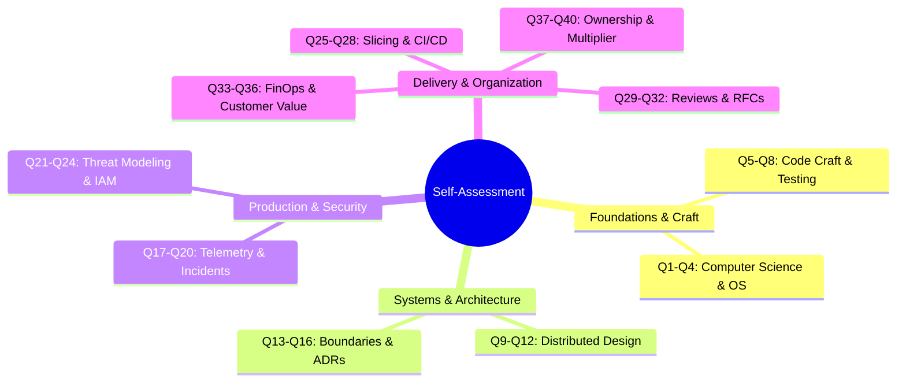

# Engineering Self-Assessment Guide

> **"The first principle is that you must not fool yourself—and you are the easiest person to fool."** — Richard Feynman

---

## 1. Purpose & Calibration Principles

The **Engineering Self-Assessment** is an unvarnished audit of your current engineering capability across the ten excellence dimensions. It is not an exercise in optimism or promotional self-advocacy. Its sole purpose is to establish an **accurate, calibrated baseline** from which deliberate improvement can occur.

### The Anti-Inflation Calibration Rules:
1. **The Evidence Rule**: You cannot score yourself at L2 or above in any dimension without linking to at least one concrete, verifiable artifact (Git PR diff, accepted ADR, production Grafana dashboard, post-mortem).
2. **The Production Reality Rule**: If you have never observed, diagnosed, or debugged your system under live production load, your maximum score in *Production Engineering* is **L1**.
3. **The Recency Rule**: Evidence older than 18 months does not substantiate current maturity unless actively sustained in current daily practice.
4. **The Consistency Rule**: A single successful heroic crunch does not indicate L3 maturity; L3 requires consistent, repeatable execution without stress or chaos.

---

## 2. The 40-Question Diagnostic Audit

Rate yourself on each question from **0 (Never / Unaware)** to **5 (Strategic Mastery / Organization-Wide)**.



### Dimension 1: Technical Foundations
- **Q1 [Memory & CPU]**: Can you explain stack vs. heap allocation, memory alignment, and CPU cache-line effects in your primary programming language?
- **Q2 [Concurrency]**: Can you write multithreaded or asynchronous code with zero race conditions, deadlocks, or lock contention?
- **Q3 [OS & I/O]**: Do you understand context switching, file descriptor exhaustion, and non-blocking I/O (`epoll`)?
- **Q4 [Algorithms & Complexity]**: Do you instinctively evaluate both asymptotic Big-O bounds and mechanical cache locality when choosing data structures?

### Dimension 2: Software Engineering
- **Q5 [Clean Code & SOLID]**: Does your code consistently express clear business intent with low cyclomatic complexity ($< 3$ nesting levels)?
- **Q6 [Testing Pyramid]**: Do you write comprehensive unit and integration tests (using testcontainers / fakes) before asking for a code review?
- **Q7 [Refactoring Discipline]**: Can you safely refactor entangled legacy code without altering external behavior or introducing regressions?
- **Q8 [Technical Debt]**: Do you actively catalog, quantify, and negotiate sprint capacity to retire critical technical debt?

### Dimension 3: System Design
- **Q9 [API Contracts]**: Do you design backward-compatible, strictly schema-validated APIs with built-in idempotency keys?
- **Q10 [Decomposition]**: Can you decompose a complex business domain into clear bounded contexts and microservices/modular monoliths?
- **Q11 [Distributed State]**: Do you understand CAP/PACELC trade-offs and design asynchronous event sagas instead of distributed 2PC transactions?
- **Q12 [Resilience]**: Do you design systems with circuit breakers, rate limiters, bulkheads, and jittered exponential backoffs?

### Dimension 4: Architecture Capability
- **Q13 [Boundary Enforcement]**: Do you enforce strict hexagonal/clean architecture layers separating domain models from databases and frameworks?
- **Q14 [ADR Authoring]**: Do you write clear Architecture Decision Records documenting alternatives, trade-offs, and consequences for major choices?
- **Q15 [NFR Engineering]**: Can you translate vague business requests into testable latency, availability, and capacity budgets?
- **Q16 [Evolutionary Architecture]**: Do you design architectural seams and automated fitness functions to prevent architectural decay over time?

### Dimension 5: Production Engineering
- **Q17 [Telemetry Instrumentation]**: Do you proactively instrument services with structured JSON logs, Prometheus metrics (RED/USE), and distributed traces?
- **Q18 [SLOs & Error Budgets]**: Have you defined customer-facing SLIs/SLOs and actionable alerting policies for your service?
- **Q19 [Incident Response]**: Can you serve effectively as an Incident Commander or Lead Forensic Investigator during high-pressure Sev-1 outages?
- **Q20 [Production Debugging]**: Can you use thread dumps, heap profilers, or eBPF tools to diagnose live memory leaks and latency regressions?

### Dimension 6: Security & Privacy
- **Q21 [Threat Modeling]**: Do you conduct STRIDE threat modeling before writing code for sensitive or public-facing systems?
- **Q22 [OWASP Immunization]**: Is your code inherently protected against SQL injection, IDOR, SSRF, XSS, and broken access controls?
- **Q23 [IAM & Secrets]**: Do you enforce zero-trust identity (mTLS/JWT) and dynamic secrets rotation via dedicated vaults?
- **Q24 [Supply Chain]**: Do you audit transitive dependencies for CVEs and maintain automated SBOM/SCA security gates in CI?

### Dimension 7: Delivery Excellence
- **Q25 [Vertical Slicing]**: Can you decompose large, ambiguous customer epics into thin, full-stack vertical slices deliverable in 1–2 days?
- **Q26 [Estimation]**: Do you provide realistic, risk-adjusted estimates using historical reference classes rather than wishful thinking?
- **Q27 [Trunk-Based Delivery]**: Do you merge short-lived branches into `main` daily, maintaining a deployable trunk at all times?
- **Q28 [Progressive Rollout]**: Do you release features safely using feature flags, canary deployments, and automated rollback triggers?

### Dimension 8: Collaboration & Influence
- **Q29 [Code Review Rigor]**: Do your PR reviews focus on architectural boundaries, failure modes, and pedagogy rather than stylistic trivia?
- **Q30 [RFC Process]**: Can you author a persuasive Request for Comments (RFC) and build consensus across conflicting engineering viewpoints?
- **Q31 [Mentorship]**: Have you actively mentored a junior or mid-level engineer, accelerating their technical capability and autonomy?
- **Q32 [Technical Diplomacy]**: Can you disagree constructively with data during design phases, and fully commit once a decision is finalized?

### Dimension 9: Product & Business Thinking
- **Q33 [Domain Empathy]**: Do you deeply understand user workflows and customer friction points, using ubiquitous business language in your code?
- **Q34 [Unit Economics]**: Do you know the marginal cloud infrastructure cost per processed transaction or active user for your service?
- **Q35 [Cost of Delay]**: Do you weigh delivery speed against technical perfection, pragmatically accepting well-contained technical debt when necessary?
- **Q36 [Build vs. Buy]**: Can you evaluate the 3-year Total Cost of Ownership (TCO) between building custom software and adopting commercial SaaS/OSS?

### Dimension 10: Leadership & Growth
- **Q37 [Extreme Ownership]**: Do you take full accountability for system outcomes, refusing to blame requirements, dependencies, or junior teammates?
- **Q38 [Initiative & Paved Roads]**: Do you fix broken shared tools, flaky tests, and developer friction points without waiting for management permission?
- **Q39 [Influence Without Authority]**: Can you inspire and mobilize engineers across multiple squads behind an architectural vision?
- **Q40 [Continuous Learning]**: Do you maintain a structured reading habit of technical papers, RFCs, and post-mortems outside sprint tickets?

---

## 3. Scoring & Baseline Interpretation

Calculate your average score per dimension ($\frac{\sum Q_i}{4}$):

```mermaid
radar-chart
    title Engineering Baseline Profile
    axis Foundations, Software Eng, System Design, Architecture, Production, Security, Delivery, Collaboration, Business, Leadership
```

| Average Score | Calibrated Level | Interpretation |
| :---: | :---: | :--- |
| **0.0 – 0.9** | **L0: Awareness** | Theoretical familiarity; requires close senior guidance to execute production work. |
| **1.0 – 1.9** | **L1: Assisted** | Executes tasks within defined bounds with active pairing and review. |
| **2.0 – 2.9** | **L2: Independent** | Autonomous execution of standard features, testing, and production operations. |
| **3.0 – 3.9** | **L3: Advanced** | Senior mastery; leads complex subsystems, mentors peers, owns incidents. |
| **4.0 – 4.7** | **L4: Lead** | Staff/Lead level; drives cross-team architecture, standards, and paved roads. |
| **4.8 – 5.0** | **L5: Strategic** | Principal level; defines enterprise-wide paradigms and industry standards. |

---

## 4. Next Step: Gap Prioritization

Once your baseline is scored:
1. Export your scores into the [Capability Gap Analysis Matrix](./capability-gap-analysis.md).
2. Cross-reference your results with your target role in the [Role Capability Matrix](../capability-matrix/role-capability-matrix.md).
3. Select your **1 Primary** and **1 Secondary** focus areas for your upcoming [90-Day Improvement Plan](../improvement-cycle/90-day-improvement-plan.md).
