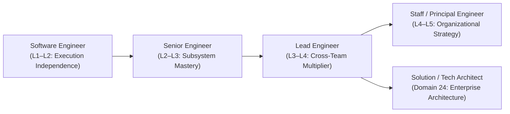

# Engineering Capability Matrix

> **"A career ladder without explicit behavioral anchors and evidence requirements is an invitation to bias, politics, and tenure-based stagnation."**

This directory contains the **Role Capability Matrices and Maturity Rubrics** of **Domain 25 — Software Engineer Excellence**. It provides objective, transparent, and evidence-anchored benchmarks for assessing engineering competency across every stage of professional development.

---

## Directory Documents

| Document | Focus & Scope | Core Question Answered |
| :--- | :--- | :--- |
| **[maturity-levels.md](./maturity-levels.md)** | L0 to L5 Rubric | *What do Awareness (L0), Assisted (L1), Independent (L2), Advanced (L3), Lead (L4), and Strategic (L5) mean across all 10 dimensions?* |
| **[engineer-capability-matrix.md](./engineer-capability-matrix.md)** | Software Engineer (L1–L2) | *What is required to achieve complete independence in shipping production software?* |
| **[senior-engineer-capability-matrix.md](./senior-engineer-capability-matrix.md)** | Senior Engineer (L2–L3) | *How does an engineer transition from feature execution to subsystem ownership and team mentorship?* |
| **[lead-engineer-capability-matrix.md](./lead-engineer-capability-matrix.md)** | Lead Engineer (L3–L4) | *What defines multi-team technical leadership, paved roads, and cross-cutting architectural delivery?* |
| **[role-capability-matrix.md](./role-capability-matrix.md)** | Unified Multi-Role Matrix | *How do capability expectations evolve side-by-side from Engineer to Senior, Lead, and Architect?* |

---

## The Role Progression Trajectory

Every matrix in this directory is built on the [10 Excellence Dimensions](../competency-model/competency-model.md) and requires verifiable, artifact-backed evidence rather than years-of-experience checklists.
