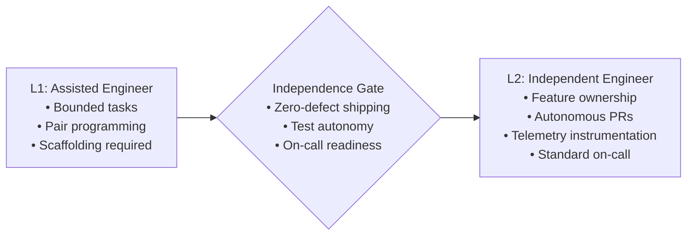

# Software Engineer Capability Matrix (L1 to L2)

> **"The defining milestone of a Software Engineer is independence: the ability to receive an ambiguous ticket, clarify its requirements, design a clean implementation, write comprehensive tests, ship it safely to production, and own its operational telemetry without requiring constant senior supervision."**

---

## 1. Role Scope & Operating Benchmark

The **Software Engineer (L1 $\to$ L2)** tier is the foundation of the engineering organization. 
- **L1 (Associate / Junior Engineer)**: Operates primarily in **Assisted Mode**. Requires established scaffolding, detailed PR feedback, and active pair programming to navigate architectural edge cases.
- **L2 (Software Engineer)**: Operates in **Independent Mode**. This is the core workhorse level of software engineering. An L2 engineer receives feature requirements, independently designs the implementation, writes clean, modular, tested code, deploys to production behind feature flags, and monitors telemetry.



---

## 2. Target Competency Profile: Software Engineer (L2 Baseline)

To be recognized as a fully qualified, autonomous Software Engineer, an individual must achieve at least **L2 (Independent)** across the core craft and delivery dimensions:

| Dimension | Target Level | Primary Behavioral Expectation |
| :--- | :---: | :--- |
| **1. Technical Foundations** | **L2** | Autonomously selects optimal collections based on Big-O space/time trade-offs; handles basic concurrency (mutexes, async/await, goroutines) safely; profiles memory allocations to avoid obvious leaks. |
| **2. Software Engineering** | **L2** | Writes modular, self-documenting code with high-coverage unit and integration tests; applies SOLID principles; conducts thorough peer code reviews; designs clean, testable interfaces. |
| **3. System Design** | **L2** | Designs RESTful / gRPC APIs with strict schema validation; models relational and NoSQL schemas; implements idempotency, caching, and rate limiting following established patterns. |
| **4. Architecture Capability** | **L2** | Implements clean architecture (separating domain logic from databases/frameworks); authors clear Architecture Decision Records (ADRs) for component-level trade-offs. |
| **5. Production Engineering** | **L2** | Instruments services with structured JSON logs, Prometheus metrics, and distributed tracing spans; participates in on-call rotations; diagnoses standard production incidents using logs and metrics. |
| **6. Security & Privacy** | **L2** | Writes code inherently immune to OWASP Top 10 (SQLi, IDOR, XSS); enforces strict input validation; manages secrets via Vault / Secrets Manager; never hardcodes credentials. |
| **7. Delivery Excellence** | **L2** | Decomposes stories into thin vertical slices; merges short-lived branches daily (trunk-based development); deploys via feature flags; maintains passing CI builds. |
| **8. Collaboration & Influence** | **L2** | Provides thoughtful, constructive feedback on peer pull requests; writes clear technical documentation and incident runbooks; communicates blockers proactively. |
| **9. Business & Product Thinking** | **L2** | Clarifies ambiguous requirements with Product Managers before writing code; identifies edge cases in business workflows; monitors the basic infrastructure cost of their services. |
| **10. Leadership & Growth** | **L2** | Demonstrates complete end-to-end ownership of assigned features; unblocks self independently; proactively fixes small broken tools or tests; shares learning with team. |

---

## 3. Daily & Weekly Responsibilities

### What an L2 Software Engineer Does Daily:
1. **Pulls from Main & Ships Small**: Works on short-lived feature branches, submitting 1–2 small, focused pull requests ($< 250\text{ lines}$) daily rather than giant multi-day mega-PRs.
2. **Writes Unit & Integration Tests First**: Never submits a PR without accompanying automated test coverage (aiming for $> 80\%$ branch coverage on core business logic).
3. **Inspects Production Dashboards**: Regularly checks Grafana/Datadog dashboards for their service, verifying error rates, latency spikes, and deployment health.
4. **Conducts High-Signal Reviews**: Spends 30–60 minutes daily thoroughly reviewing peer PRs, verifying correctness, testing boundaries, and readability.

### What an L2 Software Engineer Owns:
- **Scope of Ownership**: Single **Feature** or **Component** level.
- **On-Call Status**: Secondary on-call responder for team services, capable of mitigating standard incidents using runbooks.

---

## 4. Graduation Gate: Transitioning from L1 to L2

To formally advance from L1 (Assisted) to L2 (Independent), the engineer must demonstrate consistent performance against the following **Independence Rubric**:

```markdown
### L1 -> L2 Independence Checklist

- [ ] **Autonomous Execution**: Can take a moderately complex user story from kickoff to production deployment without requiring senior guidance on code structure or syntax.
- [ ] **Test Autonomy**: Writes robust unit and integration tests using test doubles (fakes/mocks) without assistance; does not rely on QA engineers to catch basic edge cases.
- [ ] **Production Readiness**: Deploys code to staging and production safely, verifies telemetry immediately post-deploy, and safely cleans up feature flags.
- [ ] **On-Call Capability**: Successfully completed shadowing on-call; capable of triaging alerts, identifying failing endpoints, and executing runbook rollbacks independently.
- [ ] **PR Review Contribution**: Regularly leaves constructive, actionable comments on peer pull requests that improve code quality or catch bugs.
```

---

## 5. Required Evidence Portfolio (L2 Software Engineer)

To substantiate readiness for the L2 baseline, the engineer must provide links to:

1. **Feature Delivery Diff**: Link to 3 merged PRs demonstrating clean domain separation, robust automated tests, and zero post-release regressions.
2. **Component-Level ADR**: 1 accepted Architecture Decision Record written by the engineer evaluating a component trade-off (e.g., in-memory cache vs. Redis for a specific workflow).
3. **Telemetry Instrumentation**: Screenshot and link to a production Grafana dashboard showing custom Prometheus metrics and structured logging instrumented by the engineer.
4. **Runbook Contribution**: Link to a newly authored or substantially updated operational incident runbook for a service owned by the team.
