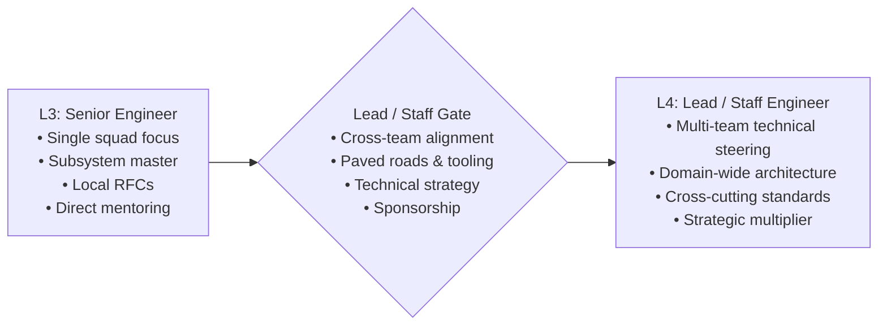

# Lead Software Engineer Capability Matrix (L3 to L4)

> **"A Lead Software Engineer does not manage people; they lead technology, architecture, and engineering standards. Their primary responsibility is ensuring that multiple teams of engineers can ship high-quality software safely, coherently, and at scale without stepping on each other's toes."**

---

## 1. Role Scope & Operating Benchmark

The **Lead Software Engineer (L3 $\to$ L4)** tier—often referred to in tech organizations as **Staff Software Engineer** or **Technical Lead**—marks the expansion of technical authority beyond a single squad:
- **L3 (Senior Engineer)**: Master of a single subsystem or service; leads initiatives within their squad; mentors engineers directly.
- **L4 (Lead / Staff Engineer)**: Steers technical direction, architectural consistency, and engineering standards **across multiple teams or an entire domain**. They build paved roads (golden paths), eliminate systemic organizational friction, establish technical standards, and bridge engineering execution with multi-quarter product strategy.



---

## 2. Target Competency Profile: Lead Engineer (L4 Benchmark)

A Lead Software Engineer operates at **L4 (Lead)** across systemic, architectural, and organizational dimensions:

| Dimension | Target Level | Primary Behavioral Expectation |
| :--- | :---: | :--- |
| **1. Technical Foundations** | **L4** | Establishes language, runtime, and framework standards across squads; sets memory profiling and zero-allocation benchmarks for high-throughput services. |
| **2. Software Engineering** | **L4** | Sets organization-wide engineering standards, static analysis rules, and testing frameworks; drives major cross-service architectural refactorings. |
| **3. System Design** | **L4** | Drives cross-service architectural topology; establishes company-wide standards for API contracts, event streaming schemas, and resilience patterns; leads distributed disaster recovery drills. |
| **4. Architecture Capability** | **L4** | Defines platform blueprints and paved roads across teams; ensures alignment with enterprise architecture; directs legacy modernizations and multi-team strangler migrations. |
| **5. Production Engineering** | **L4** | Architects company-wide observability infrastructure; establishes chaos engineering game days; slashes alert noise and MTTR across multiple engineering squads. |
| **6. Security & Privacy** | **L4** | Architects organizational security standards and IAM governance; establishes secure-by-default software frameworks; leads security reviews for high-risk platform initiatives. |
| **7. Delivery Excellence** | **L4** | Optimizes engineering delivery velocity across multiple teams; establishes company-wide release engineering standards; eliminates systemic delivery bottlenecks and build friction. |
| **8. Collaboration & Influence** | **L4** | Drives technical consensus across disparate engineering teams; unifies fractured standards into coherent paved roads; coaches senior engineers into technical leadership roles. |
| **9. Business & Product Thinking** | **L4** | Shapes product technical strategy across a business line; aligns multi-quarter engineering roadmaps with revenue goals; executes major FinOps cost-reduction initiatives. |
| **10. Leadership & Growth** | **L4** | Drives cross-team technical strategy and standards; resolves high-stakes technical disagreements; builds organizational paved roads; sponsors high-potential engineers for promotion. |

---

## 3. Key Responsibilities & Daily Operating Rhythms

### What a Lead Software Engineer Owns:
- **Scope of Ownership**: **Domain / Multi-Team Platform** (e.g., the entire Checkout & Order Processing domain spanning 4 squads).
- **Paved Roads & Developer Velocity**: Creates shared libraries, service templates, and automated tooling that make doing the right architectural thing the path of least resistance.
- **Cross-Team Architectural Alignment**: Runs cross-squad architecture review councils; identifies duplicated effort or incompatible API schemas across squads early.
- **Engineering Sponsorship**: Actively identifies high-potential Senior Engineers and sponsors them for stretch architectural assignments and promotion.
- **Bridge to Architecture Track**: Serves as the key implementation liaison to Solution Architects and Enterprise Architects (linking Domain 25 to [24-architect-mastery/](../../24-architect-mastery/)).

---

## 4. Graduation Gate: Transitioning from L3 to L4

Advancement to Lead / Staff Engineer requires demonstrating proven organizational impact:

```markdown
### L3 -> L4 Lead Readiness Checklist

- [ ] **Cross-Team Impact**: Has successfully steered a major technical initiative spanning 3+ squads, achieving alignment without organizational authority.
- [ ] **Paved Road Creation**: Has built or championed a shared platform, tool, or template adopted across multiple teams that measurably accelerated delivery.
- [ ] **Cross-Cutting Architecture**: Has authored and driven an architectural standard (e.g., event envelope schema, authentication token migration) accepted across the department.
- [ ] **Systemic Debt Elimination**: Has identified and eliminated a major piece of systemic technical debt or stability risk affecting multiple services.
- [ ] **Senior Sponsorship**: Demonstrable track record of helping at least two engineers achieve promotion to Senior Software Engineer (L3).
- [ ] **Strategic FinOps / Business Impact**: Has led a technical efficiency or architectural optimization initiative delivering measurable business ROI ($50K+ annual savings or major scalability unlock).
```

---

## 5. Required Evidence Portfolio (Lead Engineer)

1. **Cross-Team RFC & Technical Strategy**: An accepted technical RFC defining a multi-squad architecture standard, accompanied by minutes of review meetings demonstrating how contentious edge cases were resolved.
2. **Paved Road / Tooling Adoption Telemetry**: Metrics and repository analytics showing the widespread internal adoption of a developer tool, starter kit, or shared library across 5+ production services.
3. **Cross-Squad Post-Mortem & Remediation**: A post-mortem from a systemic multi-service cascading outage, showing how the Lead designed cross-cutting circuit breakers and bulkheads that prevented recurrence.
4. **Engineering Sponsorship Dossier**: Testimonials and promotion packets for engineers sponsored and coached by the candidate, verifying the candidate's force-multiplier impact.
