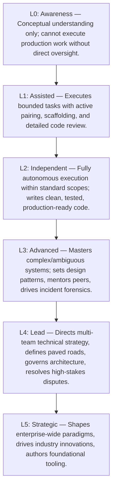

# Engineering Maturity Levels (L0 to L5)

> **"Maturity is not how much you know; it is how predictably you can turn uncertainty into reliable, production-hardened software without breaking systems or burning out teams."**

---

## 1. The Standardized 6-Stage Maturity Rubric

The `enterprise-architecture-handbook` establishes six standardized capability stages across all engineering dimensions:

---

## 2. Master Competency Maturity Rubric: All 10 Dimensions

The table below provides explicit behavioral anchors for each level across the ten excellence dimensions:

| Dimension | L0: Awareness | L1: Assisted | L2: Independent | L3: Advanced | L4: Lead | L5: Strategic |
| :--- | :--- | :--- | :--- | :--- | :--- | :--- |
| **1. Technical Foundations** | Understands basic data structures (arrays, maps); ignores memory/OS. | Uses standard libraries; understands Big-O; writes basic thread-safe code under supervision. | Selects data structures by space/time trade-offs; handles basic concurrency; profiles memory allocations. | Masters zero-allocation hot paths; eliminates subtle race conditions; tunes GC and non-blocking I/O. | Defines language and runtime standards; sets company memory/profiling benchmarks. | Contributes to language runtimes, OS kernels, or low-level storage engines. |
| **2. Software Engineering** | Writes monolithic procedures; variable names cryptic; tests absent. | Writes unit tests with guidance; follows team styling; refactors small methods safely. | Autonomously writes clean, modular, tested code; conducts thorough code reviews; designs clean interfaces. | Architects large, evolvable subsystems; refactors complex legacy code without regressions; mentors in TDD. | Sets engineering standards, static analysis rules, and testing frameworks across multiple teams. | Defines industry paradigms for code maintainability, compiler tooling, or formal verification. |
| **3. System Design** | Builds simple CRUD with 1 database; assumes network and DB never fail. | Implements endpoints to existing API schemas; adds caches/queues under supervision. | Designs robust APIs and microservices; implements idempotency, caching, rate limiting, and schema models. | Architects high-throughput distributed systems; designs event pipelines; models capacity and latency budgets. | Drives cross-service architectural topology; establishes company API, event, and resilience standards. | Pioneers novel distributed architectures; designs platforms handling millions of RPS globally. |
| **4. Architecture Capability** | Mixes SQL into UI/controllers; unaware of ADRs or system layering. | Adheres to application patterns (MVC/Hexagonal); drafts small ADRs with guidance. | Autonomously structures modular code using clean architecture; writes clear ADRs; defines subsystem seams. | Architects multi-service solutions; leads trade-off evaluations; builds automated architectural fitness functions. | Defines platform blueprints and paved roads across teams; drives strangler legacy modernizations. | Defines enterprise architectural strategy; leads technical due diligence for M&A and enterprise platforms. |
| **5. Production Engineering** | Treats production as a black box; prints unstructured text to stdout. | Adds basic metrics/logs; follows runbooks during on-call under supervision. | Autonomously instruments structured logs, metrics, traces; participates in on-call; resolves standard incidents. | Defines SLIs/SLOs and error budgets; acts as Incident Commander for Sev-1s; authors blameless post-mortems. | Architects company observability infrastructure; leads chaos game days; slashes alert noise and MTTR. | Defines industry standards for operational reliability and telemetry frameworks. |
| **6. Security & Privacy** | Hardcodes credentials; trusts client input; unaware of OWASP Top 10. | Fixes flagged SAST vulnerabilities; implements authentication endpoints with guidance. | Writes secure code immune to OWASP Top 10; implements RBAC and input validation; manages secrets via Vault. | Conducts STRIDE threat modeling; designs zero-trust inter-service mTLS/JWT; resolves security advisories. | Architects organizational security standards and IAM governance; leads high-risk security reviews. | Defines global security frameworks and enterprise cryptographic policies at industry scale. |
| **7. Delivery Excellence** | Works on massive, multi-week branches; estimates by wishful thinking. | Breaks tasks into smaller tickets; writes clean commits; triggers automated deploys. | Decomposes stories into thin vertical slices; practices trunk-based development; deploys via feature flags. | Architects high-speed CI/CD pipelines; designs progressive canary rollouts; forecasts multi-month epics accurately. | Optimizes delivery velocity across teams; sets release engineering standards; eliminates systemic delivery waste. | Defines industry continuous delivery paradigms; designs platforms supporting thousands of daily deploys. |
| **8. Collaboration & Influence** | Works in isolation; views code reviews as personal criticism; avoids docs. | Participates constructively in code reviews; communicates blockers; pairs with seniors. | Gives high-signal code reviews; writes clear docs/runbooks; collaborates seamlessly with QA and Product. | Authors widely accepted RFCs; mentors junior/mid engineers to independence; defuses technical disputes. | Drives technical consensus across disparate squads; unifies fractured standards into paved roads. | Shapes company-wide engineering culture; establishes foundational RFC and governance processes. |
| **9. Business & Product Thinking** | Views PMs as "ticket assigners"; unaware of business revenue or cloud costs. | Understands user story acceptance criteria; implements business logic accurately. | Clarifies ambiguous requirements; identifies edge cases before coding; monitors basic service cloud costs. | Challenges low-ROI features; designs systems optimized for unit economics; champions build vs. buy trade-offs. | Shapes technical strategy across a business line; aligns roadmaps with revenue; executes FinOps savings. | Influences enterprise business models; leverages emerging technology to create new revenue streams. |
| **10. Leadership & Growth** | Passive; blames others when deadlines slip or bugs escape; avoids learning. | Takes personal ownership of assigned tasks; active in retros; seeks learning. | Owns features end-to-end; unblocks self; proactively fixes broken tools; shares learnings with peers. | Leads complex multi-person technical initiatives; models extreme ownership during outages; mentors peers. | Drives cross-team technical vision; resolves contentious debates; builds paved roads; sponsors promotions. | Sets technical vision and cultural tone for the entire company; serves as advisor to C-suite and Board. |

---

## 3. How to Use the Maturity Rubric

1. **Individual Benchmarking**: Use the behavioral anchors to conduct an honest self-appraisal. A level is only achieved if the engineer exhibits the behaviors consistently and can present verifiable evidence.
2. **Eliminating Inflation**: If an engineer exhibits L3 behaviors in *Software Engineering* (clean code, refactoring) but behaves at L1 in *Production Engineering* (unaware of production telemetry, cannot debug live incidents), their overall profile must reflect this asymmetry. They are an **L3/L1 Hybrid**, not an unqualified L3 Senior Engineer.
3. **Targeted Growth**: The rubric makes the path to the next level crystal clear. To advance from L2 to L3 in *Delivery Excellence*, the engineer must move from simply using feature flags to designing progressive canary rollout pipelines and forecasting multi-month epics.
