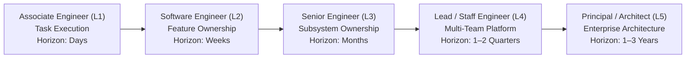

# Unified Role Capability Matrix

> **"A title does not change the laws of physics or computer science. What changes as you advance is your scope of ownership, your time horizon, your tolerance for ambiguity, and the degree to which you multiply other human beings."**

---

## 1. Unified Career Progression Spectrum

As a software engineer grows within an engineering organization, their day-to-day focus shifts from **tactical execution** to **systemic ownership**, **team enablement**, and **enterprise strategy**:

---

## 2. Master Cross-Role Comparison Matrix

| Attribute | Associate Engineer (L1) | Software Engineer (L2) | Senior Engineer (L3) | Lead / Staff Engineer (L4) | Principal / Architect (L5) |
| :--- | :--- | :--- | :--- | :--- | :--- |
| **Primary Scope** | Bounded tasks, bug fixes, small endpoints. | End-to-end features and local components. | Entire subsystems, services, and domain pipelines. | Multi-team domain, platform paved roads. | Enterprise systems, cross-company technical vision. |
| **Time Horizon** | 1 to 3 days (current sprint tasks). | 1 to 3 weeks (sprint deliverables). | 1 to 3 months (quarterly epics). | 6 to 12 months (multi-quarter initiatives). | 1 to 3 years (strategic architectural roadmaps). |
| **Ambiguity Level** | Low: Requirements are clear; implementation details specified. | Moderate: Requirements clear; implementation details open. | High: Problem statement open; requirements must be discovered. | Extreme: Navigates competing organizational priorities. | Unbounded: Identifies future problems the business does not yet see. |
| **Time Breakdown (Code / Design / Strategy)** | 85% Code 10% Design 5% Review | 70% Code 20% Design 10% Review | 45% Code 35% Design 20% Mentoring/Review | 25% Code 45% Architecture 30% Alignment | 10% Code/Prototypes 50% Architecture 40% Strategy |
| **On-Call Role** | Shadowing; follows step-by-step runbooks. | Secondary responder; resolves standard alerts. | Primary responder; Incident Commander for Sev-1s. | Escalation point; leads cross-service outage forensics. | Reviews structural reliability; eliminates systemic failure modes. |
| **Primary Artifact** | Merged PRs with unit tests. | Clean feature PRs, component ADRs, dashboards. | Subsystem RFCs, blameless post-mortems, refactoring diffs. | Cross-team technical standards, paved road CLIs, strategic RFCs. | Enterprise architecture blueprints, multi-year technology roadmaps. |
| **Key Partner** | Assigned Senior Mentor. | Product Owner, QA, Squad Peers. | Product Manager, Staff Engineer, Tech Lead. | Engineering Directors, Product Directors, Architects. | VP of Engineering, CTO, C-Suite Executives. |

---

## 3. Dimensional Maturity Progression by Role

The table below defines the target maturity level (L1 to L5) expected for each role across the 10 dimensions:

| Dimension | Associate (L1) | Engineer (L2) | Senior (L3) | Lead / Staff (L4) | Principal / Architect (L5) |
| :--- | :---: | :---: | :---: | :---: | :---: |
| **1. Technical Foundations** | L1 | L2 | L3 | L4 | L5 |
| **2. Software Engineering** | L1 | L2 | L3 | L4 | L4–L5 |
| **3. System Design** | L1 | L2 | L3 | L4 | L5 |
| **4. Architecture Capability** | L0–L1 | L2 | L3 | L4 | L5 |
| **5. Production Engineering** | L1 | L2 | L3 | L4 | L4–L5 |
| **6. Security & Privacy** | L1 | L2 | L3 | L4 | L4–L5 |
| **7. Delivery Excellence** | L1 | L2 | L3 | L4 | L4 |
| **8. Collaboration & Influence** | L1 | L2 | L3 | L4 | L5 |
| **9. Business & Product Thinking** | L1 | L2 | L3 | L4 | L5 |
| **10. Leadership & Growth** | L1 | L2 | L3 | L4 | L5 |

---

## 4. The Anti-Pattern of the "Inflated Senior"

A common organizational pathology is granting Senior (L3) titles based on tenure rather than capability. The **Inflated Senior** exhibits:
- L2-level code execution with zero subsystem architectural ownership.
- Total panic during production outages; inability to command Sev-1 incidents.
- No interest in mentoring peers or writing RFCs.
- Defensive reactions to code reviews; treats architecture as personal territory.

The **Unified Role Capability Matrix** prevents this failure mode by demanding artifact-backed evidence across all 10 dimensions before role transitions are approved.

---

## 5. Transitioning from Lead Engineer to Architect

For engineers operating at **L4 (Lead / Staff)** who wish to transition into dedicated Solution Architecture, Technical Architecture, or Enterprise Architecture:
- Refer to [lead-to-solution-architect.md](../career-progression/lead-to-solution-architect.md).
- Proceed to **Phase 10: Architect Mastery** in [24-architect-mastery/](../../24-architect-mastery/), specifically:
  - [career/](../../24-architect-mastery/career/)
  - [skill-matrix/](../../24-architect-mastery/skill-matrix/)
  - [readiness/](../../24-architect-mastery/readiness/)
