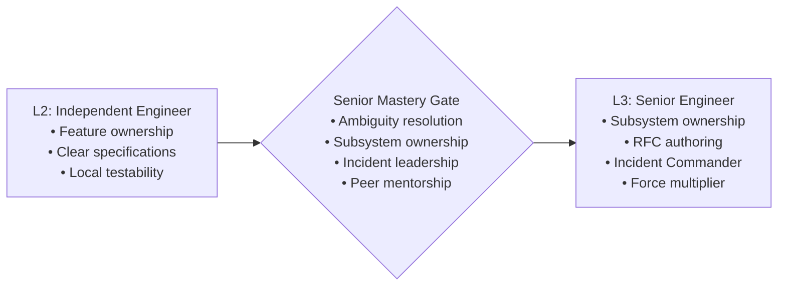

# Senior Software Engineer Capability Matrix (L2 to L3)

> **"A Senior Engineer is not defined by typing speed or framework trivia. A Senior Engineer is defined by their ability to navigate extreme ambiguity, own entire subsystems in production, design evolvable architectures, and multiply the effectiveness of the engineers around them."**

---

## 1. Role Scope & Operating Benchmark

The **Senior Software Engineer (L2 $\to$ L3)** tier represents the transition from local task execution to **systemic ownership and team multiplication**:
- **L2 (Independent Engineer)**: Owns features and components; executes autonomously within defined architectures.
- **L3 (Senior Engineer)**: Owns entire **Subsystems** and **Services** in production. Solves highly ambiguous, open-ended technical challenges, defines subsystem design patterns, conducts deep incident post-mortems, guides product managers on technical feasibility, and actively elevates peers through mentorship and RFC reviews.



---

## 2. Target Competency Profile: Senior Engineer (L3 Benchmark)

A Senior Software Engineer is expected to operate at **L3 (Advanced)** across the primary engineering dimensions:

| Dimension | Target Level | Primary Behavioral Expectation |
| :--- | :---: | :--- |
| **1. Technical Foundations** | **L3** | Masters zero-allocation critical paths; diagnoses subtle race conditions, memory leaks, thread contention, and GC pauses using profilers; optimizes high-throughput network I/O. |
| **2. Software Engineering** | **L3** | Architects complex, highly maintainable subsystems; safely refactors entangled legacy code without regressions; mentors peers in test-driven design; champions code review standards. |
| **3. System Design** | **L3** | Architects high-throughput distributed systems; designs resilient event-driven pipelines; models capacity and latency budgets; navigates CAP consistency/availability trade-offs. |
| **4. Architecture Capability** | **L3** | Architects multi-service solutions; authors comprehensive ADRs and RFCs; leads technical trade-off evaluations; implements automated architectural fitness functions in CI/CD. |
| **5. Production Engineering** | **L3** | Defines SLIs/SLOs and error budget policies; acts as Incident Commander for critical Sev-1 outages; authors blameless post-mortems; diagnoses insidious production performance regressions. |
| **6. Security & Privacy** | **L3** | Conducts STRIDE threat modeling for new architectures; designs zero-trust inter-service authentication (mTLS, JWT); establishes automated CI security gates; handles vulnerability remediations. |
| **7. Delivery Excellence** | **L3** | Decomposes multi-month epic initiatives into thin, deployable vertical milestones; architects high-speed CI/CD pipelines; designs canary rollout and automated rollback strategies. |
| **8. Collaboration & Influence** | **L3** | Authors widely accepted RFCs for complex initiatives; mentors junior and mid-level engineers to independence; defuses technical disputes constructively; leads architectural reviews. |
| **9. Business & Product Thinking** | **L3** | Challenges low-ROI feature requests constructively; designs systems optimized for unit economics; champions build vs. buy evaluations; partners with product management as an equal. |
| **10. Leadership & Growth** | **L3** | Leads complex multi-person technical initiatives; models extreme ownership during outages; drives team-level continuous improvement; unblocks systemic delivery bottlenecks. |

---

## 3. Key Responsibilities & Daily Operating Rhythms

### What a Senior Software Engineer Owns:
- **Scope of Ownership**: **Subsystem / Service Tier** (e.g., the entire Billing & Payments ingestion pipeline, or the User Identity & Session subsystem).
- **Ambiguity Resolution**: Takes broad, ambiguous goals (*"Our payment processing latency is too high and drops transactions during peak sales"*) and transforms them into concrete RFCs, architectural designs, and decomposed sprint backlogs.
- **Incident Command**: Serves as primary on-call Incident Commander, directing response efforts during major outages, coordinating communication, and authoring post-mortems.
- **Mentorship & Multiplier**: Actively pairs with L1 and L2 engineers, conducts detailed pedagogical PR reviews, and runs internal technical workshops.

---

## 4. Graduation Gate: Transitioning from L2 to L3

To qualify for advancement to Senior Engineer, an engineer must demonstrate mastery across the **Senior Engineering Readiness Rubric**:

```markdown
### L2 -> L3 Senior Readiness Checklist

- [ ] **Subsystem Ownership**: Has demonstrated complete operational and architectural ownership of a production service/subsystem over at least 6 months with high reliability.
- [ ] **Navigating Ambiguity**: Has taken at least two highly ambiguous, multi-week initiatives from vague requirements to successful production launch with zero regressions.
- [ ] **RFC / Architectural Authorship**: Has authored at least one accepted major RFC/ADR that required evaluating multiple competing technologies and aligning multiple engineers.
- [ ] **Incident Leadership**: Has acted as Incident Commander or Lead Forensic Investigator for at least one critical production incident, authoring a published blameless post-mortem.
- [ ] **Peer Elevation**: Demonstrable evidence of mentoring at least one junior/mid engineer, accelerating their technical growth and autonomy.
- [ ] **Production Telemetry Mastery**: Has defined and implemented SLIs/SLOs and actionable alerting for their subsystem, eliminating alert noise.
```

---

## 5. Required Evidence Portfolio (Senior Engineer)

To prove L3 readiness, the candidate must assemble a verified portfolio:

1. **System Design RFC & ADR**: An accepted High-Level Design (HLD) or RFC for a major subsystem, complete with capacity models, sequence diagrams, and an ADR documenting rejected alternatives.
2. **Blameless Incident Post-Mortem**: A published post-mortem from a Sev-1 incident detailing root cause, contributing factors, and permanent architectural remediation items.
3. **Legacy Refactoring / Performance Case**: A documented technical case study showing how the engineer refactored a complex, error-prone legacy module or optimized a hot path, backed by flamegraphs and telemetry.
4. **Mentorship Impact Statement**: Verifiable feedback from 2+ peer engineers detailing how the candidate's code reviews, pair programming, and architectural guidance helped them level up.
