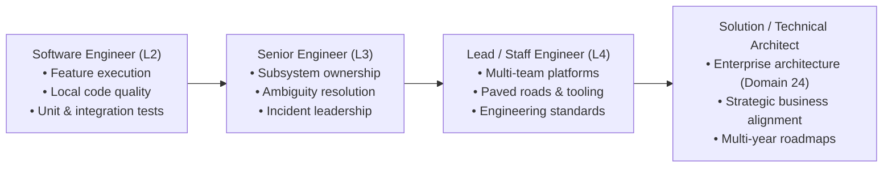

# Engineering Career Progression Playbooks

> **"Advancement is not an entitlement conferred by the passage of calendar time; it is the natural consequence of expanding your scope of ownership, resolving higher orders of ambiguity, and multiplying team output."**

This directory contains the **Career Progression Playbooks** of **Domain 25 — Software Engineer Excellence**. 

While [24-architect-mastery/career/](../../24-architect-mastery/career/) provides playbooks for dedicated architecture roles (Solution, Technical, Enterprise, and Principal Architects), this directory focuses specifically on **the engineering craft journey**: moving from an independent individual contributor to a subsystem master, a multi-team technical lead, and ultimately preparing for the architectural leap.

---

## Directory Documents

| Playbook | Transition Scope | Core Focus & Themes |
| :--- | :--- | :--- |
| **[engineer-to-senior.md](./engineer-to-senior.md)** | Software Engineer $\to$ Senior (L2 $\to$ L3) | Subsystem ownership, navigating ambiguity, incident command, and peer mentorship. |
| **[senior-to-lead.md](./senior-to-lead.md)** | Senior $\to$ Lead / Staff Engineer (L3 $\to$ L4) | Multi-team technical direction, paved roads (golden paths), standards, and sponsorship. |
| **[lead-to-solution-architect.md](./lead-to-solution-architect.md)** | Lead Engineer $\to$ Solution Architect | The direct bridge to Domain 24: shifting from code implementation to solution design. |
| **[engineering-to-architecture.md](./engineering-to-architecture.md)** | The Overarching Mindset Shift | The evolutionary transition: Code $\to$ Component $\to$ Service $\to$ Solution $\to$ Enterprise. |

---

## The Progressive Scope of Ownership

Every progression playbook in this directory establishes explicit behavioral benchmarks, failure modes to avoid, and required evidentiary deliverables.
