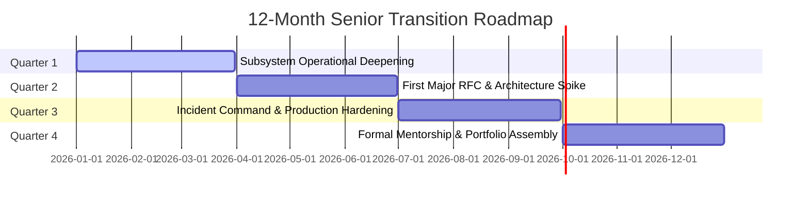

# Progression Playbook: Software Engineer to Senior Engineer (L2 to L3)

> **"A Junior Engineer needs instructions; an Independent Engineer needs requirements; a Senior Engineer needs a problem statement."**

---

## 1. The Fundamental Inflection Point

The transition from **Software Engineer (L2)** to **Senior Software Engineer (L3)** is the most critical qualitative shift in an engineer's career. It represents the transformation from someone who reliably executes well-defined tasks to someone who **takes ownership of ambiguous problems, owns entire subsystems in production, and elevates team capability**.

```mermaid
flowchart LR
    subgraph L2Focus["L2: Independent Engineer"]
        direction TB
        A1["How do I build this feature?"]
        A2["Ticket has clear acceptance criteria"]
        A3["Owns local files & pull requests"]
        A4["Follows runbooks during on-call"]
    end

    subgraph Shift["The Senior Transformation"]
        direction TB
        B1["Ambiguity Resolution"]
        B2["Subsystem Ownership"]
        B3["Production Command"]
        B4["Peer Multiplication"]
    end

    subgraph L3Focus["L3: Senior Engineer"]
        direction TB
        C1["What is the right problem to solve?"]
        C2["Discovers & defines requirements"]
        C3["Owns services, schemas & SLOs"]
        C4["Commands Sev-1 incident response"]
    end

    L2Focus --> Shift --> L3Focus
```

---

## 2. The 5 Core Senior Transitions

| Dimension | Software Engineer (L2) | Senior Software Engineer (L3) |
| :--- | :--- | :--- |
| **1. Ambiguity Handling** | Needs clear user stories with defined inputs, outputs, and edge cases. | Takes a vague business pain (*"Cart checkout is dropping orders"*) and discovers the true requirements. |
| **2. Architectural Scope** | Implements classes and endpoints within established patterns. | Architects multi-service subsystems, writes RFCs, and authors component ADRs. |
| **3. Production Reality** | Monitors alerts; escalates unfamiliar production failures to seniors. | Acts as Incident Commander for Sev-1s; diagnoses complex memory/concurrency leaks. |
| **4. Technical Debt** | Complains about messy legacy code in retrospectives. | Systematically isolates legacy seams, writes characterization tests, and refactors safely. |
| **5. Team Multiplier** | Focuses on personal velocity and closed sprint points. | Conducts pedagogical code reviews; mentors junior engineers; unblocks teammates. |

---

## 3. The 12-Month Senior Transition Roadmap

### Quarter 1: Subsystem Operational Deepening
- Master the domain models, database queries, and third-party dependencies of your squad’s core service.
- Implement comprehensive Prometheus metrics and structured logging across unmonitored endpoints.
- Shadow on-call shifts; update 3 outdated runbooks.

### Quarter 2: First Major RFC & Architecture Spike
- Identify a major architectural bottleneck or tech debt item in your team’s service.
- Author an RFC proposing an architectural solution; document evaluated alternatives in an ADR.
- Lead an asynchronous review; incorporate peer critique; ship the solution incrementally behind a feature flag.

### Quarter 3: Incident Command & Production Hardening
- Step up as primary on-call responder.
- Serve as Incident Commander during a production incident; lead the team to rapid mitigation.
- Author and publish a blameless post-mortem with automated regression tests.

### Quarter 4: Mentorship & Portfolio Assembly
- Establish a formal 6-month mentorship pairing with an L1/L2 engineer.
- Assemble your [Promotion Readiness Dossier](../assessment/readiness-assessment.md) backed by four Tier 3 CPOE evidence entries.
- Review the dossier with your Engineering Manager and secure formal promotion committee scheduling.

---

## 4. Classic Traps & Failure Modes

- **The "Hero Coder" Trap**: Trying to prove Senior readiness by working 70 hours a week and hoarding critical code, creating an organizational bottleneck.
- **The "Over-Engineering" Trap**: Introducing complex distributed systems (Kafka, Kubernetes, microservices) to solve simple problems in an attempt to look "senior."
- **The "Perfectionist" Trap**: Refusing to ship code because it isn't aesthetically perfect, ignoring commercial deadlines and cost of delay.
