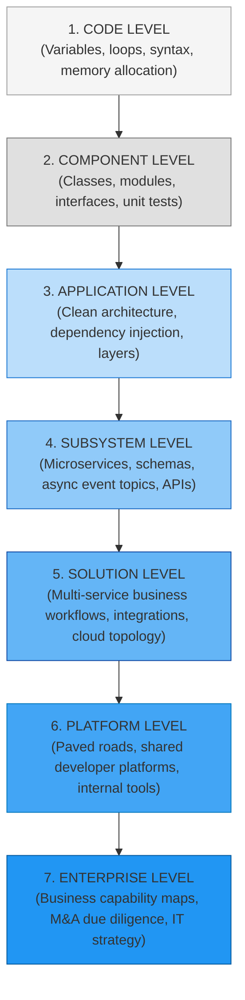
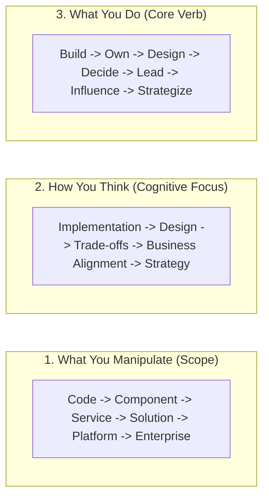

# The Engineering-to-Architecture Evolutionary Journey

> **"Architecture is not an escape from programming; it is the natural evolution of engineering craft when the system grows too large to fit inside a single human skull."**

---

## 1. The Multi-Scale Evolution of Engineering Scope

The journey from a novice programmer writing isolated functions to an enterprise architect guiding multi-billion-dollar corporate transformations is a continuous, multi-decade expansion of cognitive scope and system boundaries:

---

## 2. The Three Parallel Progression Streams

Engineering growth occurs simultaneously across three parallel axes:

| Level | Scope of Artifact | Cognitive Question | Core Action Verb | Primary Failure Mode |
| :--- | :--- | :--- | :--- | :--- |
| **Junior IC** | Function / Method | *"Does this syntax compile and pass the test?"* | **Build** | Syntactic bugs, off-by-one errors. |
| **Independent IC** | Class / Component | *"Is this module clean, testable, and maintainable?"* | **Own** | Spaghetti code, leaky abstractions. |
| **Senior IC** | Service / Subsystem | *"How will this service scale and handle production failure?"* | **Design & Operate** | Scalability bottlenecks, incident panic. |
| **Lead / Staff IC** | Platform / Domain | *"How do we make 4 squads 2x faster with less friction?"* | **Lead & Multiply** | Siloed architecture, developer friction. |
| **Solution Architect** | Multi-System Solution | *"What is the least bad set of architectural trade-offs?"* | **Decide & Defend** | Analysis paralysis, over-engineering. |
| **Enterprise Architect** | Enterprise Portfolio | *"How does technology enable our 5-year business strategy?"* | **Align & Strategize** | Ivory-tower dictates, business irrelevance. |

---

## 3. The Symbiosis Between Engineering & Architecture

Engineering and architecture are not antagonistic forces. They are mutually dependent halves of the same discipline:
- **Without engineering craft**, architecture degenerates into disconnected PowerPoint diagrams that cannot survive production reality.
- **Without architectural judgment**, engineering degenerates into high-velocity chaos, accumulating catastrophic technical debt and unmaintainable complexity.

Domain 25 (*Software Engineer Excellence*) and Domain 24 (*Architect Mastery*) form the complete operating engine of the modern software practitioner.
