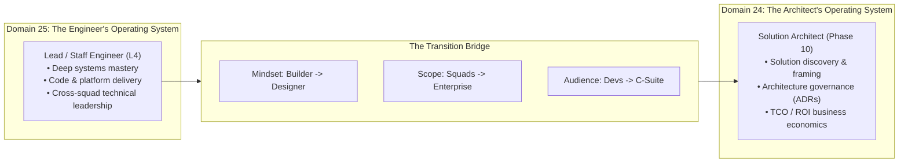

# Progression Playbook: Lead Engineer to Solution Architect

> **"A Lead Engineer builds the platform right; a Solution Architect ensures we are building the right system to solve the enterprise business problem."**

---

## 1. The Bridge to Phase 10: Architect Mastery

This playbook marks the formal boundary crossing from **Domain 25 (Software Engineer Excellence)** into **Domain 24 (Architect Mastery)**. 

While Domain 25 cultivates the engineering craftsmanship, production debugging, and delivery discipline required to become a premier technical leader, **Domain 24 cultivates executive communication, business strategy alignment, enterprise governance, and multi-year technology roadmaps**.

---

## 2. Core Differences: Lead Engineer vs. Solution Architect

| Dimension | Lead Software Engineer (L4) | Solution Architect (Domain 24) |
| :--- | :--- | :--- |
| **Primary Accountability** | Technical execution, developer velocity, and platform reliability. | Defensible solution architecture, enterprise alignment, and risk mitigation. |
| **Code Engagement** | 25–40% writing production code and reviewing PRs. | 5–10% building architecture spikes; 0% daily sprint PRs. |
| **Decision Horizon** | 6 to 18 months (platforms, frameworks, runtimes). | 2 to 5 years (enterprise modernization, vendor contracts, M&A). |
| **Primary Stakeholders** | Software Engineers, Engineering Managers, Product Managers. | VP of Engineering, CTO, CIO, CFO, Legal, Procurement, Security Councils. |
| **Key Currency** | Working software shipped with zero regressions. | Accepted ADRs, defensible trade-offs, low TCO, and enterprise governance. |

---

## 3. The 3 Steps to Crossing the Architectural Threshold

### Step 1: Shift from "How to Build" to "What to Trade Off"
- Stop immediately proposing technical solutions during discovery meetings.
- First, quantify the Non-Functional Requirements (NFRs), business drivers, and commercial constraints using the techniques in [24-architect-mastery/requirements/](../../24-architect-mastery/requirements/).
- Frame decisions through the master trade-off library in [24-architect-mastery/trade-offs/](../../24-architect-mastery/trade-offs/).

### Step 2: Master Executive Communication & Storytelling
- Replace technical jargon with business risk, return on investment (ROI), and cost of delay.
- Master the C-suite communication frameworks in [24-architect-mastery/executive-communication/](../../24-architect-mastery/executive-communication/).
- Structure architecture presentations using problem-first narrative arcs from [24-architect-mastery/architecture-storytelling/](../../24-architect-mastery/architecture-storytelling/).

### Step 3: Complete the Formal Transition Playbook
- Read and execute the authoritative transition roadmap in [24-architect-mastery/career/lead-engineer-to-solution-architect.md](../../24-architect-mastery/career/lead-engineer-to-solution-architect.md).
- Validate readiness against the master criteria in [24-architect-mastery/readiness/lead-engineer-readiness.md](../../24-architect-mastery/readiness/lead-engineer-readiness.md).
