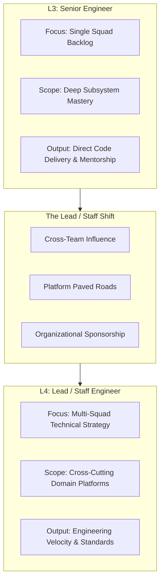
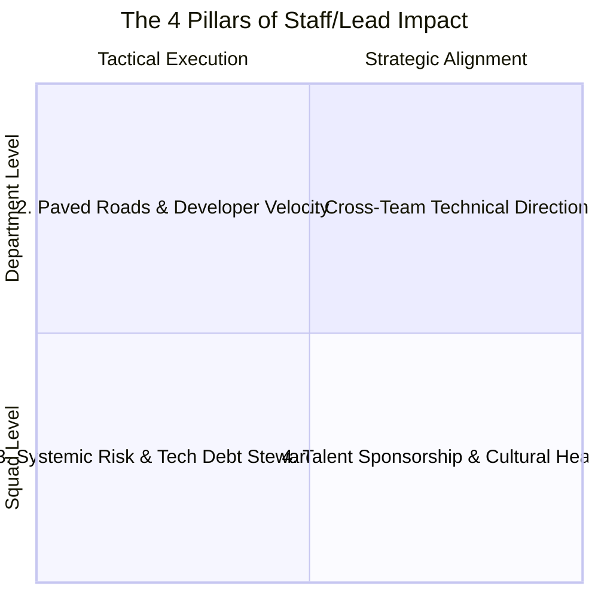

# Progression Playbook: Senior Engineer to Lead / Staff Engineer (L3 to L4)

> **"A Senior Engineer makes themselves essential; a Lead Engineer builds paved roads, documentation, and automated guardrails so that their team can operate flawlessly without them."**

---

## 1. The Multi-Team Horizon

The transition from **Senior Software Engineer (L3)** to **Lead / Staff Software Engineer (L4)** marks the shift from local squad excellence to **cross-squad technical steering, developer enablement, and strategic architecture**:

---

## 2. Core Differences: Senior vs. Lead Engineer

| Dimension | Senior Engineer (L3) | Lead / Staff Engineer (L4) |
| :--- | :--- | :--- |
| **Sphere of Influence** | Single squad and adjacent collaborators. | 3+ squads across a business domain or core platform. |
| **Primary Output** | Working services, high-signal PRs, subsystem RFCs. | Paved road tooling, shared libraries, cross-cutting standards. |
| **Communication Focus** | Technical peers, squad Product Manager, SREs. | Engineering Directors, Domain Architects, Product Directors. |
| **Problem Horizon** | 1 to 3 months (current & upcoming quarter). | 6 to 18 months (multi-quarter technological roadmap). |
| **Mentorship Style** | Direct 1-on-1 coaching of junior/mid engineers. | Sponsoring Senior engineers for promotion; coaching tech leads. |

---

## 3. The 4 Pillars of Staff/Lead Impact

### Pillar 1: Cross-Team Technical Direction
- Authors foundational RFCs defining cross-squad standards (e.g., standardizing event schema versioning, API gateway authentication, or error envelopes).
- Unifies fractured technical approaches across teams without relying on executive mandates.

### Pillar 2: Paved Roads & Developer Velocity
- Treats developer productivity as a product.
- Identifies friction points (e.g., slow local Docker environments, flaky CI builds, manual infrastructure setup) and builds automated starter kits, CLIs, and shared libraries.

### Pillar 3: Systemic Risk & Technical Debt Stewardship
- Audits systemic failure modes across multiple services (e.g., cascading failure risks, shared database bottlenecks, unencrypted internal traffic).
- Negotiates dedicated capacity across squads to execute structural modernization.

### Pillar 4: Talent Sponsorship & Cultural Health
- Actively identifies high-potential Senior Engineers and sponsors them for stretch architectural assignments.
- Champions blameless incident culture, psychological safety, and high-trust engineering norms.

---

## 4. Traps to Avoid as a Lead Engineer

- **The "Ivory-Tower Dictator"**: Sitting in isolation drafting 50-page architecture documents that ignore real developer friction and operational realities.
- **The "Senior+ Coder" Trap**: Trying to prove Lead impact by simply writing 2x more code than anyone else, creating massive bottleneck dependencies.
- **The "Meeting Collector" Trap**: Attending 35 hours of meetings a week with zero tangible technical output, becoming an administrative coordinator rather than a technical leader.
