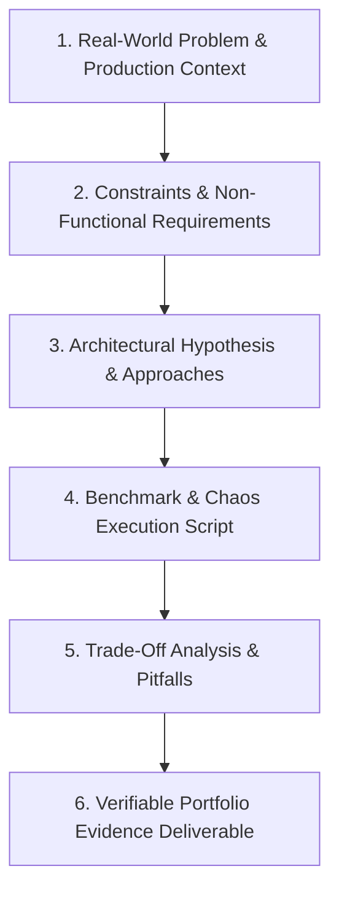

# Real-World Engineering Scenario Spikes & Challenges

> **"Do not practice software engineering like a student cramming for an exam. Practice like a flight pilot in a flight simulator: deliberately injecting catastrophic conditions into sandbox systems until recovery becomes second nature."**

This directory houses the **Real-World Engineering Challenges & Scenario Spikes** of **Domain 25 — Software Engineer Excellence**. 

Unlike LeetCode or competitive programming puzzle banks—which test isolated algorithmic trivia in synthetic single-threaded memory—these challenges simulate **real-world production failure modes, architectural trade-offs, concurrency hazards, and high-throughput bottlenecks**.

---

## Directory Documents

| Document | Challenge Focus | Core Real-World Scenarios |
| :--- | :--- | :--- |
| **[coding-challenges.md](./coding-challenges.md)** | Craft & Mechanical Sympathy | Zero-allocation byte buffer parser, thread-safe MPSC ring buffer, lock-free LRU cache. |
| **[system-design-challenges.md](./system-design-challenges.md)** | Distributed State & Idempotency | Idempotent payment webhook pipeline, distributed sliding-window rate limiter, transactional outbox. |
| **[performance-challenges.md](./performance-challenges.md)** | Benchmarking & Profiling | CPU cache-line false sharing elimination, memory leak forensic spike, SQL $N+1$ query refactoring. |
| **[reliability-challenges.md](./reliability-challenges.md)** | Fault Tolerance & Chaos | Circuit breaker with bulkhead isolation, retry storm & jitter simulation, cascading partition recovery. |
| **[security-challenges.md](./security-challenges.md)** | Defensive Engineering | JWT algorithm confusion exploit mitigation, dynamic secret rotation with zero downtime, STRIDE spike. |
| **[observability-challenges.md](./observability-challenges.md)** | Telemetry & Forensics | Distributed trace context propagation across queues, Prometheus RED metrics, high-cardinality debugging. |

---

## Canonical Challenge Architecture

Every challenge follows a strict, repeatable engineering spike structure:

These challenges are designed to be built in local sandbox repositories during your [Weekly Improvement Loop](../improvement-cycle/weekly-improvement.md) and [90-Day Improvement Cycles](../improvement-cycle/90-day-improvement-plan.md).
