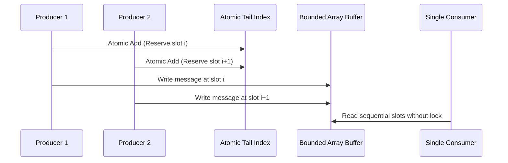

# Practical Coding Challenges & Mechanical Sympathy Spikes

> **"A high-level language runtime can hide memory allocations from your code, but it cannot hide the garbage collection stop-the-world pauses from your P99 latency SLA."**

---

## Challenge 1: The Zero-Allocation Binary Protocol Parser


### 1. Real-World Production Context
A high-throughput IoT gateway receives 50,000 telemetry packets per second over TCP. The existing JSON/string parser allocates temporary objects on every message, causing the Go/Java garbage collector to pause execution for 120ms every 30 seconds, violating the downstream P99 SLA of $< 15\text{ms}$.

### 2. Constraints & Non-Functional Requirements (NFRs)
- **Allocation Budget**: Exactly **0 bytes / 0 heap allocations** per parsed message in the hot path.
- **Throughput**: Must process $\ge 100,000\text{ messages/sec}$ on a single core.
- **Safety**: Must handle truncated packets, corrupted header bytes, and buffer overflows safely without panics or memory corruption.

### 3. Implementation Blueprint & Architecture
1. **Pre-allocated Buffer Pool**: Utilize `sync.Pool` or fixed-size ring buffers to reuse byte arrays.
2. **Zero-Copy Slicing**: Use sub-slices (or pointer offsets) rather than copying byte buffers into new memory blocks.
3. **Struct Memory Layout**: Align struct fields along 8-byte boundaries to prevent compiler padding waste and optimize CPU cache-line alignment.

### 4. Benchmark & Verification Harness
```bash
# Go benchmark command
go test -bench=. -benchmem -benchtime=5s

# Expected Target Result
BenchmarkZeroCopyParser-8   5000000    28.4 ns/op    0 B/op    0 allocs/op
```

### 5. Verifiable Evidence Deliverable
A GitHub sandbox repository containing the parser, automated fuzz testing (`go test -fuzz`), and memory allocation benchmark reports proving 0 B/op.

---

## Challenge 2: The Lock-Free Multiple-Producer Single-Consumer (MPSC) Ring Buffer



### 1. Real-World Production Context
A logging library is called by hundreds of concurrent worker threads. The existing implementation uses a global mutex around a shared queue; under 64 concurrent cores, 85% of CPU time is wasted on thread context switching and lock contention.

### 2. Constraints & NFRs
- **Zero Mutexes**: Must coordinate producers and the consumer entirely via atomic operations (`compare-and-swap`, memory barriers).
- **False Sharing Defense**: Struct variables must be padded with 64 bytes of cache-line padding to prevent false sharing across CPU cores.
- **Bounded Capacity**: Must reject or apply backpressure when the buffer reaches maximum capacity ($65,536\text{ slots}$) without dropping memory bounds.

### 3. Key Architectural Trade-Offs
- *Lock-Free vs. Lock-Based*: Lock-free algorithms avoid priority inversion and context switching, but busy-wait atomic spinning can burn CPU if producers frequently encounter a full buffer.

### 4. Verifiable Evidence Deliverable
A benchmark suite comparing `sync.Mutex` vs. `sync.RWMutex` vs. the Lock-Free MPSC buffer under 8, 16, 32, and 64 concurrent threads, accompanied by a race detection report (`-race`).

---

## Challenge 3: High-Concurrency Sharded LRU Cache

### 1. Real-World Production Context
A high-traffic web service caches database query results in-memory. A single global LRU cache protected by a read-write lock experiences severe read lock contention because updating the LRU doubly-linked list on every cache hit requires exclusive write locks.

### 2. Implementation Strategy
1. **Hash Striping / Sharding**: Divide the cache into $N$ independent sub-caches (e.g., 32 or 64 shards), hashing keys to specific shards:
   $$\text{Shard Index} = \text{Hash}(Key) \pmod{N}$$
2. **Promote Separation**: Separate cache read operations from eviction updates using an asynchronous read-buffer channel to batch LRU list updates.

### 3. Verifiable Evidence Deliverable
A working sharded cache implementation demonstrating a $6\times$ throughput increase over a standard locked LRU cache under 90% read / 10% write synthetic workloads.
